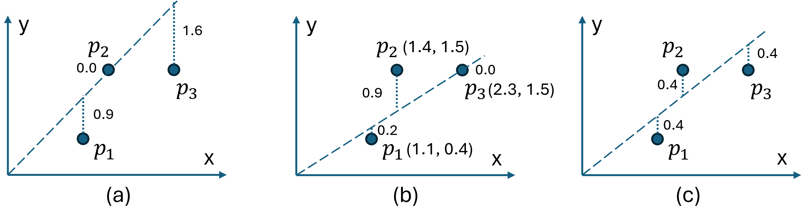
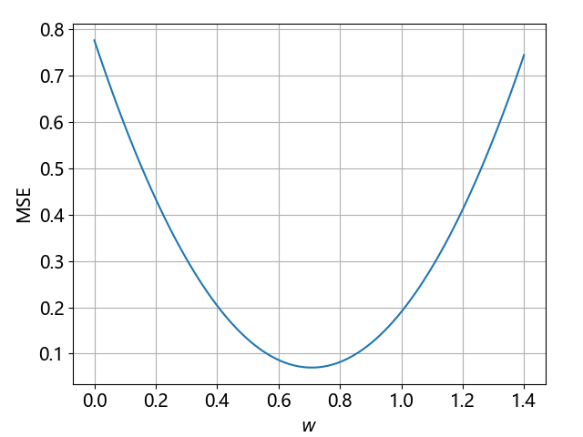
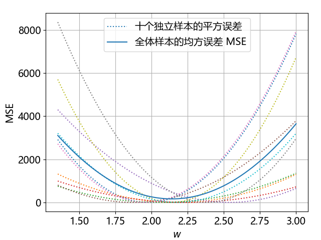

## 1.2 损失函数

图 1.1.2 中的三个数学模型哪一个更准确呢？这就引出了误差和损失函数的概念。均方误差损失函数是机器学习中的常用损失函数，本小节中我们将学习它的工作原理。

### 1.2.1 误差

误差（error）是真实值 $y$ 与预测值 $z$ 之间的差距。对于图 1.1.2 中的三条回归直线，它们在 $x=100$ 平米的预测值分别为 235、215、200，假设真实值是 215，则它们的误差分别是：

- 直线 A，$235-215=20$；
- 直线 B，$215-215=0$；
- 直线 C，$200-215=-15$。

我们希望误差越小越好，20 显然比 0 大，那 20 和 -15 哪个大呢？为了去掉正负号带来的麻烦，我们通常会用**绝对值误差**（absolute error）：

$$
\text{error} = |z - y| 
\tag{1.2.1}
$$

但是式（1.2.1）不能求导，而求导是神经网络求解的数学基础，所以我们会使用**平方误差**（square error）：

$$
\text{error} = \frac{1}{2}(z - y)^2 
\tag{1.2.2}
$$

这样既能避免正负号问题，又可以求导，前面的  $\frac{1}{2}$ 在求导后会被消掉。

### 1.2.2 损失函数

在图 1.2.1 中有三张图，每张图中各有三个样本点和一条回归直线，并标明了它们各自的绝对误差。虚线所示并非点到直线的垂直距离，而是在 $y$ 轴方向上的直线距离，这样的计算量比较小。



图 1.2.1 三条回归线带来的误差

可以看到：
- 子图（a）中，当 $p_2$ 的误差为 0 时，$p_1$ 和 $p_3$ 的误差都很大；
- 子图（b）中，当 $p_3$ 的误差为 0 时，$p_2$ 误差较大；
- 子图（c）中，三个点的误差都差不多大。

这就提示我们，单独看任意一个点的误差都不行，必须保证全局的误差最小才行。为了描述全局误差，引入了**损失函数**（loss function）的概念。“损失”就是所有样本的“误差”的总和，即：

$$
loss = \frac{1}{m} \sum_{i=1}^m \text{error}_i 
\tag{1.2.3}
$$ 

其中，$m$ 为样本数。在各种资料中经常看到的中英文词汇有：误差、偏差、损失、代价、error，cost，loss，......意思都差不多，在本书中，使用**损失函数**这个词，用 loss 来表示。所以如果说“某个样本的损失”是不对的，只能说“某个样本的误差”。如果误差用式（1.2.2）的平方误差，那么损失函数为**均方误差**（mean square error，MSE）：

$$
loss=\text{MSE}(z,y) = \frac{1}{2m} \sum_{i=1}^m (z - y)^2 
\tag{1.2.4}
$$

其中，$m$ 是样本个数，$loss$ 是所有样本的平方误差的平均值再除以 2。具体到图 1.2.1 中，三张子图的 MSE 值分别是：

- 子图（a），$loss=(0.9^2+0^2+1.6^2)/6=0.56$；
- 子图（b），$loss=(0.2^2+0.9^2+0^2)/6=0.14$；
- 子图（c），$loss=(0.4^2+0.4^2+0.4^2)/6=0.08$。

由于子图（c）的 loss 值最小，所以它更接近真实的回归线，但目前还不能确定它是否为最佳解。不过我们可以通过一个简单的遍历来找到最佳解，如【代码：H1_2_MSE.py】所示，先计算均方误差的函数：

```python
# 计算均方误差
def MSE(X, w):
    z = X[:,0] * w
    mse = np.sum((z - X[:, 1]) ** 2) / X.shape[0] / 2
    return mse
```

图 1.2.1 中三个样本点的坐标为$[1.1,0.4]、[1.4,1.5]、[2.3,1.5]$。真实的回归直线的斜率应该在 0 到 1.4 之间，把 $[0,1.4]$ 这个区域做 100 等分后得到 100 个 $w$ 值，然后计算每个 $w$ 值对应的斜线与三个样本点的 $y$ 值之间的损失函数，这样可以得到 100 个 loss 值，最后通过遍历找到其中的最小值。

```python
if __name__=="__main__":
    X = np.array([[1.1, 0.4], [1.4, 1.5], [2.3, 1.5]])
    W = np.linspace(0, 1.4, 100)  # 100 等分
    MSEs = []  # 存储 100 个不同的 MSE 值
    for w in W:
        mse = MSE(X, w)
        MSEs.append(mse)

    min_MSE = min(MSEs)  # 最小值
    min_idx = MSEs.index(min_MSE) # 最小值的索引
    w = W[min_idx] # 最小值对应的 w
```
打印输出如下：

```
最小均方误差: 0.0698，最佳 w: 0.7071
```
最后把这 100 个 loss 值连成一条线，得到图 1.2.2。



图 1.2.2 loss 值与斜率 $w$ 之间的关系

可以看到这是一个凸函数（在有些资料中叫做凹函数），极值在 $w=0.7$ 附近，这是通过遍历方法得到结果，但是在实践中不可取。如果可以用某种方法得到图 1.2.2 中曲线的极值点，就可以找到使得均方损失函数 MSE 为最小的 $w$ 值，也就找到了最佳回归直线。而找凸函数的极值可以使用**梯度下降**方法，将在第 1.4 节中讲解。

图 1.2.3 中展示本章第 1.1 节中的十个样本的平方误差和总体均方误差。



图 1.2.3 十个样本的平方误差和均方误差

图中 10 条点状线是 10 个样本在 $1.35 < w < 3.0$ 之间的平方误差图，而实线是它们的平均值，即均方误差 MSE。运行【代码：H1_2_MSE_all.py】显示此图。
