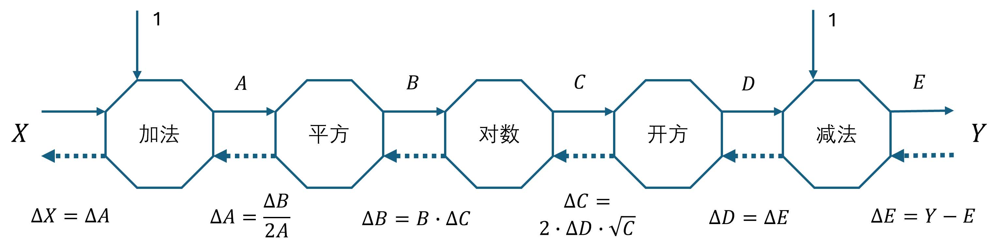

## 1.3 反向传播

在神经网络编程模型中，**反向传播**（back propagation，BP）是一个重要的组成部分，它负责回传误差，与梯度下降法结合，用于训练神经网络。当网络结构越来越复杂的时候，反向传播过程也越来越复杂，但是其具体方法并不是很复杂。

下面我们先介绍反向传播的概念。

### 1.3.1 通俗地理解反向传播

比如有两个人甲和乙，甲让乙猜一袋苹果的价格。乙：“10元”，甲：“太低了”；乙：“20元”，甲：“太高了”；乙：“15元”，甲：“差不多”......

在以上过程中：乙第一次猜 10 元，是根据生活经验给出的一个初始值，相当于初始化一个神经网络；甲的第一次反馈是“太低了”，是因为甲用 10 元与真实价格做比较，得到误差，然后告诉乙下一次猜测的方向和变化幅度。

所以，简单地说，反向传播就是把下游的误差信号以“某种方式”回传给上游的计算节点，使其能够有依据地修改自己的参数值，以满足最终输出值的准确性要求。而“某种方式”在数学上一般是指导数，因为导数的定义是：

$$
f'(x_0) = \lim_{\Delta x \to 0} \frac{\Delta y}{\Delta x}= \lim_{\Delta x \to 0} \frac{f(x_0 + \Delta x) - f(x_0)}{\Delta x} 
\tag{1.3.1}
$$

它反应了自变量 $x$ 和因变量 $y$ 之间的变化关系，$x$ 的微小变化 $\Delta x$ 会引起 $y$ 的变化 $\Delta y$。

### 1.3.2 简单的例子

以下面的简单函数为例：

$$
y=x^2
\tag{1.3.2}
$$

假设我们并不会开平方的操作，并且知道在 $x_0=1.99$ 时，$y=3.9601$。那么 $x$ 为多少时才能使得 $y = 4$ 呢？

根据导数：

$$
y'=\frac{\Delta y}{\Delta x}=2x
\tag{1.3.3}
$$

解出 $\Delta x$ 的表达式：

$$
\Delta x = \frac{\Delta y}{2x}
\tag{1.3.4}
$$

其中，$\Delta y = 4-3.9601=0.0399$，所以 $\Delta x = \frac{0.0399}{2 \times 1.99}\approx 0.01$，那么 $y=(x_0+\Delta x)^2=(1.99+0.01)^2=4$，问题得解。

### 1.3.3 复杂的例子

下面我们看一个复杂例子。有一个方程组如下：

$$
\begin{cases}
A = X+1
\\
B = A^2
\\
C = \ln B
\\
D = \sqrt{C}
\\
E = D - 1
\end{cases}
\tag{1.3.5}
$$

$X=2$ 时，$A=2+1=3，B=3^2=9，C=\ln 9=2.1972，D=\sqrt{2.1972}=1.4823，E=1.4823-1=0.4823$。而我们的目标是 $E=0.5$，请问此时 $X$ 等于多少？

首先对式（1.3.5）中的每一个子式求导，然后表达为增量形式，如：

$$
\begin{cases}
A = X+1 & \to \frac{dA}{dX} = 1, & \Delta X = \Delta A
\\
B = A^2 & \to \frac{dB}{dA} = 2A, & \Delta A = \frac{\Delta B}{2A}
\\
C = \ln B & \to \frac{dC}{dB} = \frac{1}{B}, & \Delta B = B \cdot \Delta C
\\
D = \sqrt{C} & \to \frac{dD}{dC} = \frac{1}{2\sqrt{C}}, & \Delta C = 2\sqrt{C} \cdot \Delta D
\\
E = D - 1 & \to  \frac{dE}{dD} = 1, & \Delta D = \Delta E
\end{cases}
\tag{1.3.6}
$$

则有：

$$
\Delta X = \Delta A=\frac{\Delta B}{2A}=\frac{B \cdot \Delta C}{2A}=\frac{B\cdot 2\sqrt{C} \cdot \Delta D}{2A} = \frac{B\cdot \sqrt{C} \cdot \Delta E}{A}
\tag{1.3.7}
$$

而 $\Delta E = 0.5-0.4823=0.0177$，带入式（1.3.7），得到：

$$
\Delta X = \frac{9 \times \sqrt{2.1972} \times 0.0177}{3} \approx 0.0787
\tag{1.3.8}
$$

代回式（1.3.5）做验证：$X=2+0.0787=2.0787，A=2.0787+1=3.0787，B=3.0787^2 \approx 9.4784，C=\ln 9.4784 \approx 2.249，D=\sqrt{2.249} \approx 1.4996，E=1.4996-1=0.4996 \approx 0.5$。

问题得解。如果想得到更高的精度，可以用 $0.5-0.4996=0.0004$ 作为误差再做一次迭代。

### 1.3.3 计算图

实际上，式（1.3.7）使用了链式求导法则，即：

$$
\frac{dE}{dX} = \frac{dE}{dD} \frac{dD}{dC} \frac{dC}{dB} \frac{dB}{dA} \frac{dA}{dX}=1 \cdot \frac{1}{2\sqrt{C}} \cdot \frac{1}{B} \cdot 2A \cdot 1 = \frac{A}{B \sqrt{C}} = \frac{\Delta E}{\Delta X}
\tag{1.3.9}
$$

误差 $\Delta E$ 通过以下路径 $\Delta D \to \Delta C \to \Delta B \to \Delta A \to\Delta X$，最后回传给了 $\Delta X$，如图 1.3.1 所示。

图 1.3.1 计算图

其中，$Y = 0.5$ 是标签值，实线箭头表示前向计算，虚线箭头表示反向传播，每个八边形叫做计算符（operator），整张图叫做**计算图**（compute graph）。在“加法”和“减法”上面的“1”表示有其它元素参与计算。每个计算符都需要实现前向计算（forward）和反向传播（backward）两个方法。

神经网络中的计算图一般很复杂，但是没有环，是有向无环图。而且神经网络中的反向传播虽然也是使用链式求导，但是具体做法与此有所不同。这是因为在神经网络中通常有矩阵乘法存在，如式（1.3.7）中，如果 $A$ 是一个矩阵就比较麻烦，因为矩阵没有除法，只能求逆，但是求逆的运算量非常大，而且有时候根本没有逆矩阵，所以只能使用第 1.4 节中要讲的梯度下降法来求解。
