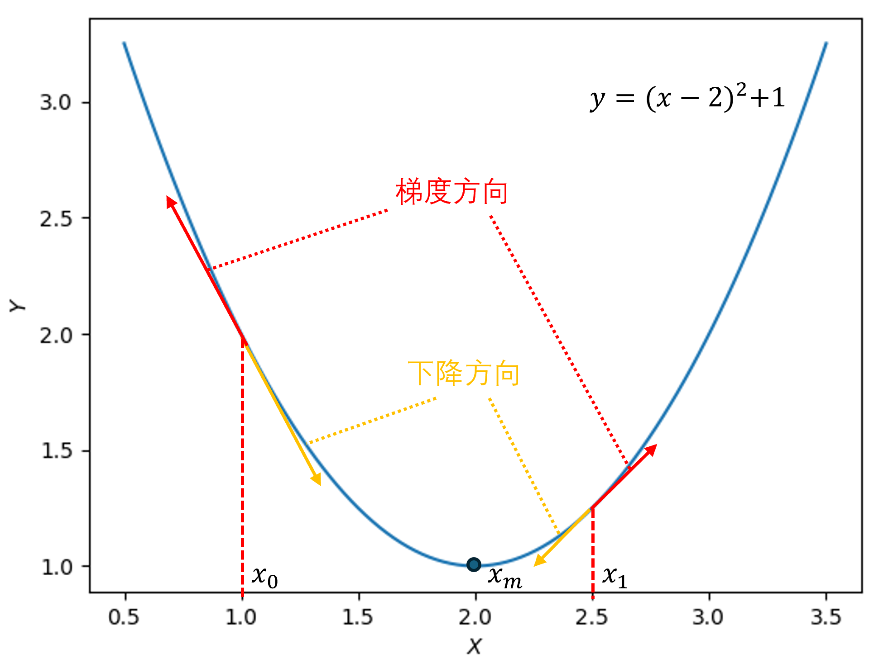
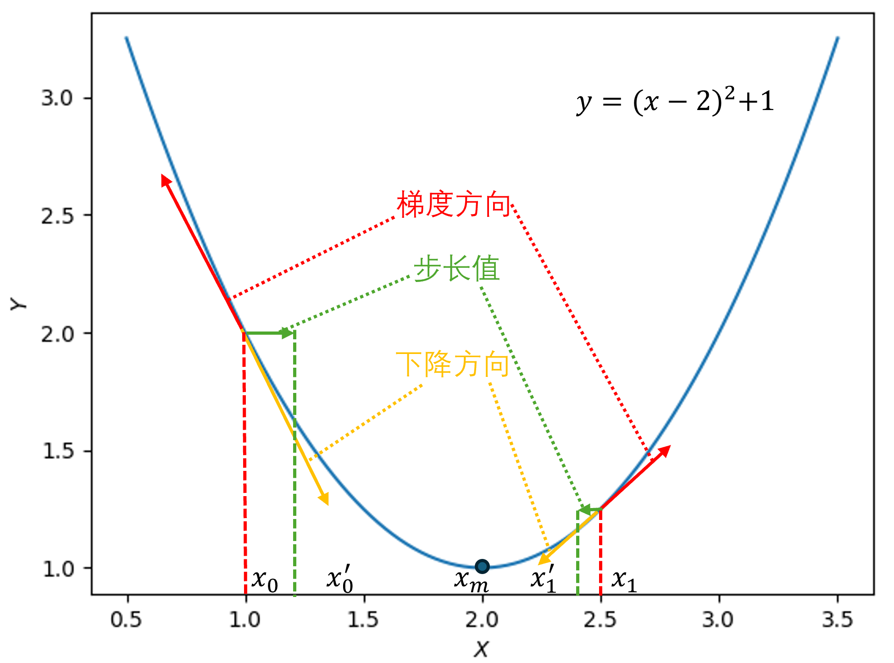
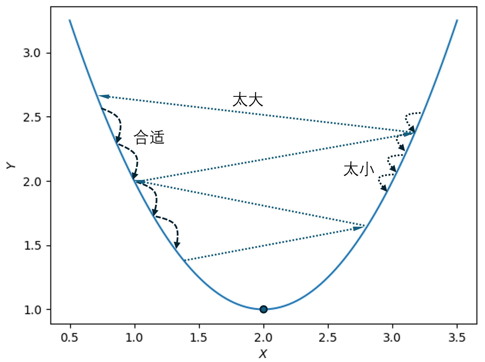
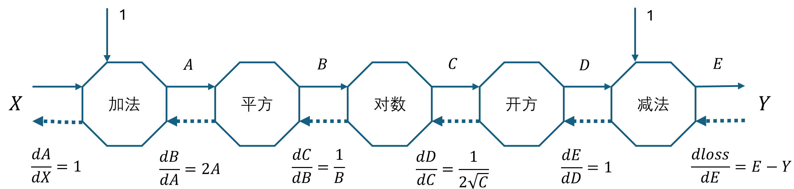

## 1.4 梯度下降

反向传播需要首先计算函数的导数，在单变量的实值函数中，导数可以简单地理解为梯度。在神经网络出现之前，就有用梯度下降的极值求解方法，而神经网络本身也是求损失函数的最小值，所以在神经网络求解时广泛使用梯度下降方法。

### 1.4.1 通俗地理解梯度下降

人类在登山时，会选择坡度较缓的路径，以节省体力和降低风险。在从山顶下山时也是如此。但是水流总会选择最陡峭的路径，即下山最快的路径，从山顶流下形成小溪，这就是梯度下降。当遇到坑洼地区时，会汇聚成池塘或者湖泊，这就是局部最优。当水量增加溢出池塘时，还会向更低洼的地区流动，最终汇入大海，这就是全局最优。

### 1.4.2 一元函数的梯度

假设有一个函数 $y=(x-2)^2+1$，则梯度就是该函数曲线上每个点的斜率，所以梯度是一个矢量。如图 1.4.1 所示。



图 1.4.1 一元函数的梯度

由于 $y'=2(x-2)$，当：
- 当 $x=x_0=1.0$ 时，$y'=-2$。其中，负号表示梯度方向向左，2 是梯度大小。
- 当 $x=x_1=2.5$ 时，$y'=+1$。其中，正号表示梯度方向向右，1 是梯度大小。

现在我们把 $y$ 看作是损失函数（loss），梯度用符号 $\nabla$ 表示，损失函数的梯度就是 $\nabla loss(\theta)$，其中 $\theta$ 表示参数，具体到本例中参数是 $x$：

- $\nabla loss(x=1)=-2$；
- $\nabla loss(x=2.5)=1$。

### 1.4.3 梯度下降过程

梯度下降的主要目的是求极值点，通常为最小极值点。相应地，用梯度上升来求最大极值点。

所谓**下降**，就是与梯度的方向相反。以图 1.4.1 为例，在 $x_0$ 点首先求得梯度为 $-2$，表明是向左。而“下降”意味着我们需要向右走，才能越来越靠近最小极值点 $x_m$。如果用数学符号表示，则是用**减号**表示下降。

$$
x' = x - \nabla loss(x) \tag{1.4.1}
$$

式（1.4.1）表示了以 $x$ 为参数的梯度下降计算方法，通过当前的 $x$ 及梯度值得到下一个位置的 $x'$（不是导数），以便最终到达极值点 $x_m=2.0$ 的位置。我们实际计算一下图 1.4.1 中的两个具体例子。

- 当 $x=x_0$ 时，$x'_0 = x_0 - \nabla loss(x_0)=1-(-2)=3$，跑到了极值点 $x_m$ 的右侧。
- 当 $x=x_1$ 时，$x'_1 = x_1 - \nabla loss(x_1)=2.5-1=1.5$，跑到了极值点 $x_m$ 的左侧。

这说明只用当前位置和梯度两个数值，并不能到达极值点。于是，聪明的数学家们引入了步长值 $\eta$，把式（1.4.1）改成了这样：

$$
x' = x - \eta \cdot \nabla loss(x) \tag{1.4.2}
$$

如同人类下山一样，每一步的距离可大可小，比如在平缓的地方一步可以是 0.5 米，而在陡峭的地方一步是 0.2米。如果把正常步伐 0.5 米看作是 1 的话，那么 0.2 米就是 0.4，0.1 米就是 0.2，......，这个比例就是步长值。$\eta$ 一般的取值范围在 $(0,1]$ 之间，式（1.4.1）相当于 $\eta=1$。

设 $\eta=0.1$，重新计算图 1.4.1 中的梯度下降结果：

- 当 $x=x_0$ 时，$x'_0 = x_0 - 0.1 \cdot \nabla loss(x_0)=1-0.1 \cdot (-2)=1.2$，从左侧逼近极值点 $x_m$。
- 当 $x=x_1$ 时，$x'_1 = x_1 - 0.1 \cdot \nabla loss(x_1)=2.5-0.1 \cdot 1=2.4$，从右侧逼近极值点 $x_m$。

如图 1.4.2 所示。



图 1.4.2 一元函数的梯度下降


所以，**梯度下降包括三要素：当前点；方向；步长**。一般地，梯度下降的公式为：

$$
\theta_{n+1} = \theta_{n} - \eta \cdot \nabla loss(\theta_n) \tag{1.4.3}
$$

其中，$\theta$ 表示参数，在本例中就是 $x$，下标 $n$ 表示用迭代方法计算。图 1.4.3 展示了步长对梯度下降效果的影响。



图 1.4.3 一元函数的梯度下降中不同的步长导致的学习效果

### 1.4.4 算法验证

下面我们采用迭代计算的方法来得到图 1.4.2 中的极值点。【代码：H1_4_SingleVar.py】如下：


```python
if __name__=="__main__":
    x_0 = 1.0
    eta = 0.1
    for i in range(100):
        x_1 = x_0 - eta * 2 * (x_0 - 2)  # 式（1.4.3）
        x_0 = x_1
    print(x_0)
```
结果为：
```
1.9999999997962963
```
非常接近于 2，说明算法正确。读者可修改不同的学习率来体会过程，可以先设置一个误差如 `eps=0.001`，只要在这个误差之内就算是达到要求，然后比较不同学习率所需要的步数。

### 1.4.5 用梯度下降法解决问题

下面我们用梯度下降法来解决第 1.3 节中的问题，如图 1.4.4 所示。



图 1.4.4 用梯度下降法解决 1.3 节中的问题

首先确定使用平方误差：

$$
loss = \frac{1}{2}(E-Y)^2
\tag{1.4.4}
$$

在图 1.4.4 中反向计算每一个环节的输出对输入的（偏）导数：

$$
\begin{aligned}
&\frac{\partial loss}{\partial E}=E-Y, \qquad \frac{\partial E}{\partial D}=1, \qquad \frac{\partial D}{\partial C}=\frac{1}{2\sqrt{C}}, \\
&\frac{\partial C}{\partial B}=\frac{1}{B}, \qquad \frac{\partial B}{\partial A}=2A, \qquad \frac{\partial A}{\partial X}=1
\end{aligned}
\tag{1.4.5}
$$

用链式法则把它们串联起来：

$$
\begin{aligned}
\frac{\partial loss}{\partial X}&=\frac{\partial loss}{\partial E}\frac{\partial E}{\partial D}\frac{\partial D}{\partial C}\frac{\partial C}{\partial B}\frac{\partial B}{\partial A}\frac{\partial A}{\partial X}
=(E-Y)\cdot 1 \cdot \frac{1}{2\sqrt{C}} \frac{1}{B} \cdot 2A \cdot 1
\\
&=\frac{A(E-Y)}{B\sqrt{C}}
\end{aligned}
\tag{1.4.6}
$$

带入具体数值计算：

$$
X = X - \eta \cdot \frac{A(E-Y)}{B\sqrt{C}}=2-1\times \frac{3 \times (0.4823-0.5)}{9\sqrt{2.1972}} \approx 2.004
\tag{1.4.7}
$$

可见，当步长为 1 时，迭代一次后得到的 $X$ 的更新幅度要比式（1.3.4）的 $X=2.0787$ 小很多，意味着需要迭代多次。运行【代码：H1_4_SingleVar.py】可以得到以下输出：

```
-----0------
X = 2
E = 0.4823038073675112
-----1------
X = 2.0039794344777215
E = 0.48319782081313933
......
-----99------
X = 2.079562000066275
E = 0.49985824603681106
```
迭代 100 次后，$E$ 为 0.4998。可以体会到，反向传播虽然可以解决矩阵求逆的问题，但是它的效率还是比较低的。在本例中可以通过设置较大的学习率来提高效率，但是在真正的神经网络训练中，大的学习率很可能导致网络训练不收敛。
