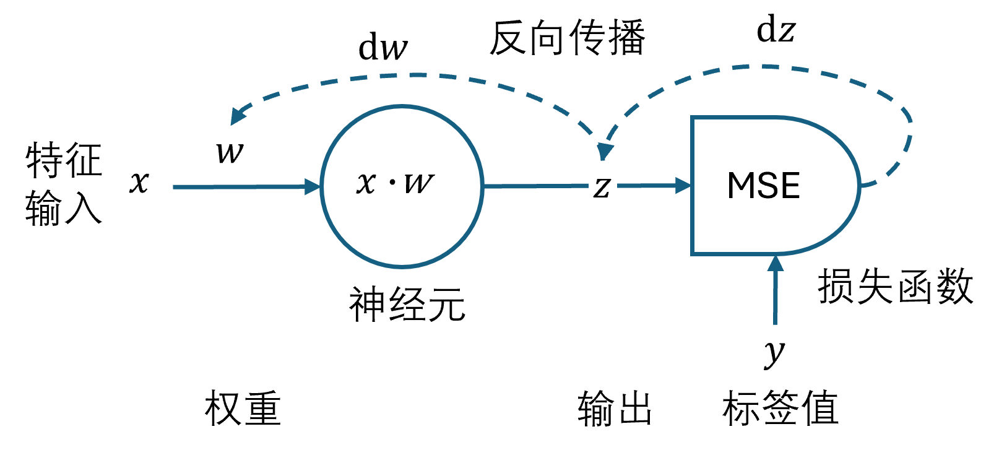
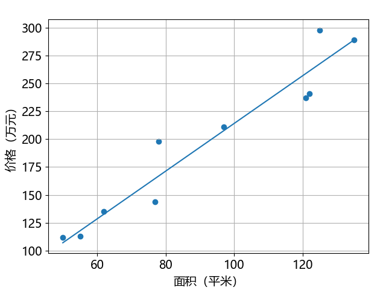

## 1.6 神经网络

学习了误差函数、反向传播、梯度下降这三大概念后，我们可以开始用最简单的神经网络模型解决问题了。

### 1.6.1 神经网络模型

梯度下降法可以搞定损失函数的求极值问题，下面我们把它包装成仅包含一个神经元的神经网络模型，而神经元是神经网络的基础。见图 1.6.1。



图 1.6.1 一维特征的线性回归神经网络模型

这个网络只有一个神经元，而且只有一个权重，为什么还称之为“神经网络”？因为后面接了损失函数，而且使用反向传播进行训练，所以这是一个“麻雀虽小五脏俱全”的神经网络。也有资料称之为**感知机**（perception），是神经网络的鼻祖。在本书中统称为神经网络。

下面的【代码：common.NeuralNet_1.py】中实现了一个最简单的神经网络类。

```python
# 神经网络类 1
class NeuralNet_1(object):
    def __init__(self, dataLoader, w, lr=0.01):
        self.data_loader = dataLoader
        self.w = w      # 权重值
        self.lr = lr    # 学习率
```

### 1.6.2 前向计算

在本章的问题中，每个样本只有一个特征值 $x$，在经过一个权重（weight）值 $w$ 相乘后，得到预测值 $z$。我们使用单样本方式。

$$
z_i = x_i \cdot w \tag{1.6.1}
$$

```python
    # 前向计算
    def forward(self, x):
        return x * self.w # 式（1.6.1）
```        

敏感的读者可能发现了式（1.6.1）和式（1.4.1）的区别，就是 $x$ 与 $w$ 的顺序颠倒了。当二者都是标量或者二者之一是标量时，它们的顺序无所谓。当二者都是向量时，它们的顺序与各自的向量定义方式有关，即行向量或列向量。我们在第 2 章中再解释这个问题。

对于本章的回归问题，我们采用 MSE 损失函数：

$$
loss = \frac{1}{2} (z_i - y_i)^2 \tag{1.6.2}
$$

在一些标准框架实现中，每次训练的迭代都要计算一次损失函数，在我们这里不需要。因为反向传播的工作不是通过计算损失函数进行的，而是对损失函数求导完成的。

### 1.6.3 反向传播

首先计算 $z_i$ 的梯度 $\text{d}z$，但只作为中间变量，避免重复计算：

$$
{\partial loss \over \partial{z_i}} = z_i-y_i \to \text{d}z \tag{1.6.3}
$$

首先计算 $w$ 的梯度：

$$
{\partial loss \over \partial{w}} = \frac{\partial loss}{\partial{z_i}}\frac{\partial{z_i}}{\partial{w}}=(z_i-y_i)x_i \to \text{d}w \tag{1.6.4}
$$

对应到图 1.6.1 中，虚线表示链式求导。第一步对 $z$ 的求导结果是 $z-y$，第二步对 $w$ 的求导结果是 $x$，二者相乘的结果一般称作 $\text{d}w$，表示 $w$ 的梯度更新值。$loss$ 越小，该值就越小，那么反向传播的力度就越小。

接着使用梯度下降算法：

$$
w = w - \eta \cdot \text{d}w \tag{1.6.5}
$$

在梯度下降中，$\eta$ 叫做步长值。在神经网络中，它有一个新名字叫**学习率**（learning rate）。从前面的试验中我们已经对它有了初步的认识，在神经网络中，它是一个重要的超参（hyperparameter，超级参数），它会极大地影响训练过程和结果。

```python
    # 反向传播
    def backward(self, x, y, z):
        dz = z - y
        dw = dz * x  # 式（1.6.3）
        self.w = self.w - self.lr * dw  # 式（1.6.4）
```

### 1.6.4 网络训练

网络训练的步骤如下。

（1）搭建神经网络模型，定义网络结构和损失函数，初始化权重参数。

（2）输入样本 $x$，进行前向计算，得到预测值 $z$。

（3）把预测值 $z$ 与标签值 $y$ 作比较，计算误差，并把误差从后向前依次反向传播到前端网络。

（4）根据梯度下降法和学习率更新权重值。

（5）回到第（2）步，所有样本都使用一次后叫做一轮（epoch）。当 loss 值收敛后，可以结束训练，保存权重值 $w$ 做为参数，用于推理（inference）或叫做预测（prediction）。

下面的代码片段是训练函数，具有双重循环，外循环是轮数，内循环是一个 epoch 内样本迭代。

```python
    # 网络训练
    def train(self, epoch):
        for i in range(epoch):
            train_x, train_y = self.data_loader.shuffle_data()
            for x, y in zip(train_x, train_y):
                z = self.forward(x)
                self.backward(x, y, z)
```

### 1.6.5 网络推理

网络推理的步骤如下。

（1）加载 1.6.1 中定义的神经网络结构及其训练好的权重参数。

（2）输入要预测的样本，该样本的特征值的顺序、取值范围必须与训练时的样本一致。

（3）通过前向计算得到预测值 $z$，完成网络推理。

下面的代码片段是推理函数，可以看到，推理就是前向计算。

```python
    # 网络推理
    def predict(self, x):
        return self.forward(x)
```

### 1.6.6 数据管理器

以下为数据管理器【代码：common.DataLoader.py】。

```python
# 本类适用于第 1 章的数据和代码
class DataLoader(object):
    def __init__(self, file_path):
        self.file_path = file_path
    # 加载数据
    def load_data(self, dir_name=None):
        self.data = np.loadtxt(self.file_path)
        return self.data
    # 打乱数据
    def shuffle_data(self):
        idx = np.random.permutation(self.data.shape[1])
        train_x = self.data[0][idx]
        train_y = self.data[1][idx]
        return train_x, train_y
```
### 1.6.7 主程序入口

以下代码为主程序入口【代码：H1_5_NN_client.py】。

```python
if __name__ == '__main__':
    # 准备数据
    print("加载数据...")
    file_name = "train.txt"
    file_path = os.path.join(os.path.dirname(os.path.abspath(__file__)), file_name)
    data_loader = DataLoader(file_path)
    data_loader.load_data()
    print("训练神经网络...")
    lr = 0.000001  # 学习率
    w = 0  # 初始化权重值
    epoch = 1000  # 训练轮数
    nn = NeuralNet_1(data_loader, w, lr)  # 初始化神经网络模型
    nn.train(epoch)  # 训练
    print("w =", nn.w)
    print("预测...")
    area = 100
    price = nn.predict(area)  # 预测
    print("%f平米的房屋价格为%f万元" %(area, price))
```

运行结果如下：

```
加载数据...
训练神经网络...
权重值 w = 2.1407368473815427
预测...
100.000000平米的房屋价格为214.073685万元
```
预测结果是 100 平米的房子大概为 214 万元，问题解决！图 1.6.1 展示了回归线。



图 1.6.1 通过训练得到的回归线

从这条线的位置可以看到：有 4 个样本点（大致）压线；有 2 个样本点在线上方且距离较远；有 4 个样本点在在线下方，与上方的两个点形成误差平衡关系。
