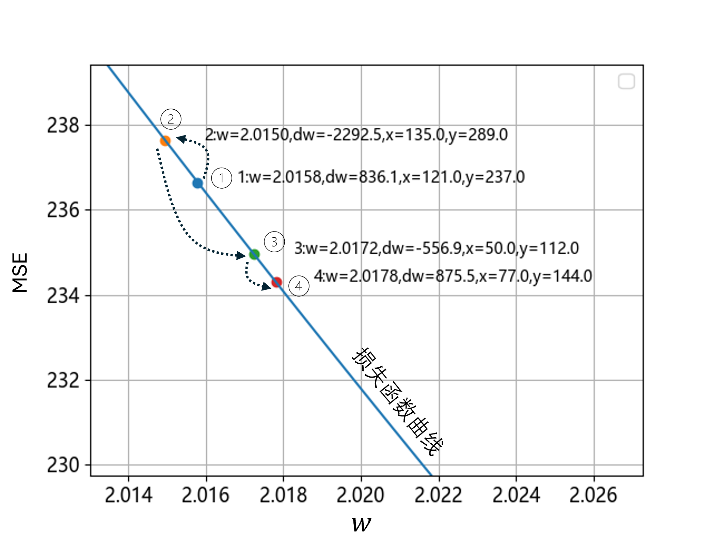
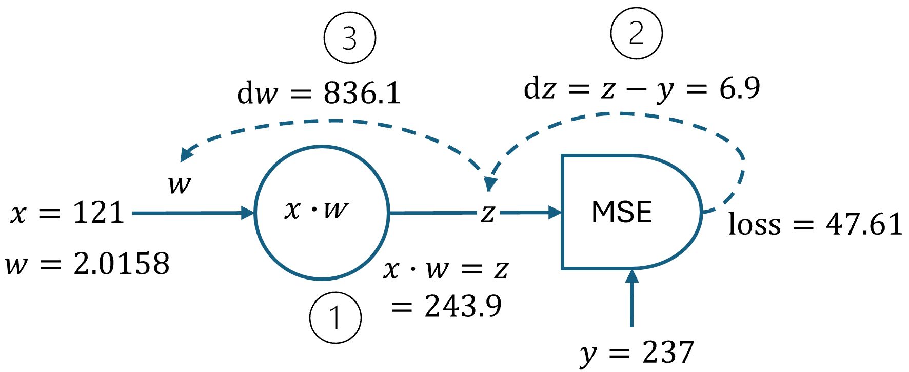
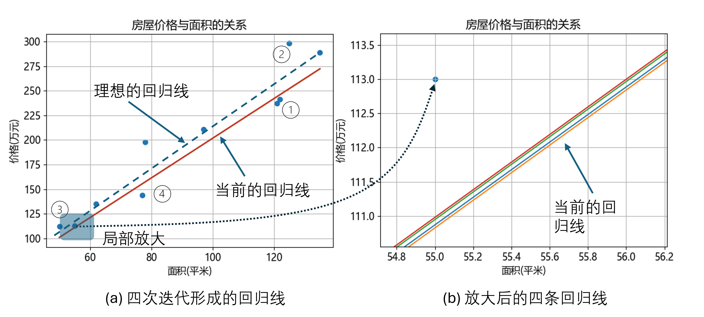
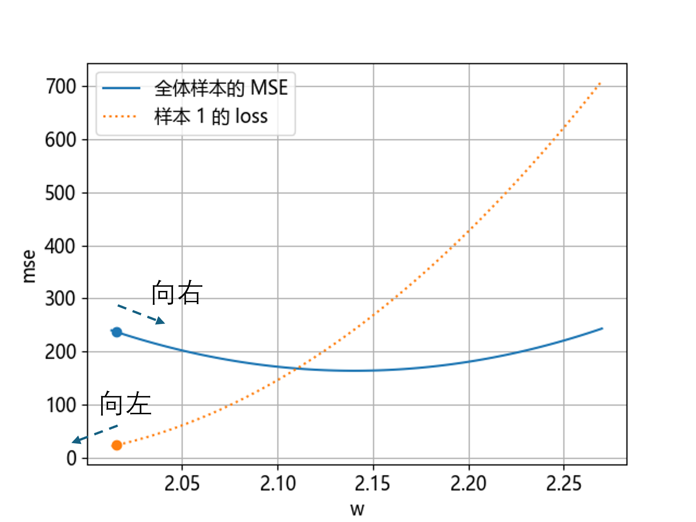

## 1.7 工作原理【电子资源】

在有很多样本的情况下，神经网络经过多次迭代才能得到令人满意的结果，它的具体工作原理和工作过程是什么呢？下面我们会用具体实例讲解反向传播的工作过程。

### 1.7.1 反向传播迭代过程刨析

在图 1.7.1 中展示了在训练过程中第 30 轮开始的 4 步迭代的过程。

图 1.7.1 四个样本连续迭代的梯度更新

笔者试验了很多次，取出其中比较典型的一次来做说明。图 1.7.1 中的各个元素解释如下：

- “斜线”其实是向下弯曲的损失函数曲线的一部分，局部放大后看上去像是直线；
- 四个样本点在损失函数上的位置有序号标记，1~4 表示迭代顺序，后面还标有当前的 $w、dw、x、y$ 值；
- 虚线箭头表示了每次迭代的起点和终点。

四次迭代过程如下。

- 第一个点：$w_1=2.0158$ 时，样本 $x=121，y=237$，$z=x\cdot w=243.9，z-y=6.9$，梯度 $dw_1=(z-y)\cdot x=836.1$。图 1.7.2 给出了具体的数值计算过程，请读者自行核对以便加深理解，其中圆圈内的数字表示计算顺序。

图 1.7.2 第一个点的数值计算过程（前向+反向）

- 第二个点：由于第一个点的梯度 $dw_1$ 为正数，所以向上移动，$w_2=w_1-\eta \cdot dw_1=2.0150，dw_2=-2292.5$，得到负梯度后，**向下移动**到第三个点。

- 第三个点：$w_3=w_2 - 0.000001 \cdot (-2292.5)=2.0172$，梯度为 $dw_3=-556.9$，所以下一次迭代应该**向下移动**。

- 第四个点：$w_4=w_3 - 0.000001 \cdot (-556.9)=2.0178$，梯度为 $dw_4=875.5$，所以下一次迭代应该**向上移动**。

### 1.7.2 两个疑问

我们将通过解决以下两个疑问来更加深刻地理解神经网络的工作原理。

#### 1. 疑问一

第一个疑问是：为什么第二个点在第一个点的上方呢？如果按照梯度下降理论，从第一个点开始应该沿着坡度向下走才对呀？原因如下。

由于图 1.7.1 中的四个 $w$ 值代表四条回归直线，所以可以把它们绘制在图 1.7.3 中以观察它们的差别。其中左图中的虚线直线是理想的回归线，四个圆圈内的数字表示四次迭代时用于训练的四个样本点。

图 1.7.3 四步迭代训练得到的四条回归线

图 1.7.3 图例说明：

- 在（a）子图中，四条直线（实线）所代表的当前的回归线几乎重叠，因为 $w_1=2.0158$ 和 $w_2=2.0150$ 这两个斜率的差距非常小，另外两根直线也是如此。
- （b）子图是（a）子图左下角阴影部分放大 100 多倍，这时可以看到四根分开的直线了，（a）子图中左下角第二个样本点距离这些直线最近，放大后在（b）子图的左上方。

这个疑问与当前回归线与样本点的相对位置有关：

- 第一个样本点在当前回归线的下方，它要把回归线**拉向自己**以降低误差，所以 $dw=836.1$ 是个正数，在更新梯度时会让 $w$ 变小，它希望下一个 $w_2$ 应该比当前的 $w_1$ 还要小，所以在图 1.7.1 中是**向上移动**；

- 第二个和第三个样本点在当前回归线的上方，它们也要把当前回归线**拉向自己**使得下一个 $w$ 值变大，所以在图 1.7.1 中是**向下移动**。

所以，理想的回归线（图 1.7.3（a）中的虚线）的位置是所有样本点不断博弈的结果，这也是单样本训练方法的缺陷，总会有对优化有负作用的步骤存在，来回拉锯，使得整个训练轮数特别的长。

#### 2. 疑问二

第二个疑问是：为什么图 1.7.2 中的 $loss=47.61$，而图 1.7.1 中点 1 的纵坐标值 $\text{MSE}=236.7$？

这是因为独立样本的平方误差是这样计算的：

$$
loss = \frac{1}{2}(z-y)^2=\frac{1}{2}(243.9-237)^2=47.61
\tag{1.7.1}
$$

而均方误差是用全体样本点一起计算得到的平均值：$loss=\frac{1}{2m} \sum_i loss_i$。图 1.7.4 展示了样本 1 的 $loss$ 与全体样本 MSE 的对比。

图 1.7.4 全体样本的均方误差与样本 1 的平方误差

可以看到两种对立的情况发生：

- 在全体样本的 MSE 曲线上，$w=2.0158$ 所对应的点的梯度下降方向是**向右**；
- 在独立样本 1 的 loss 曲线上，$w=2.0158$ 所对应的点的梯度下降方向是**向左**。

这就导致了用样本 1 做训练时，其梯度下降方向与最优方向相反。

其实上面两个疑问可以归结为同一原因：**独立样本点与全体样本的误差曲线趋势在某些时候是相反的**。把图 1.2.3 的底部放大也可以帮助读者理解这一点。这就会引出来另外一个问题：如何克服这个缺点，让梯度下降更顺利一些？这是我们第 2 章中要学习的内容：多样本梯度下降法。
