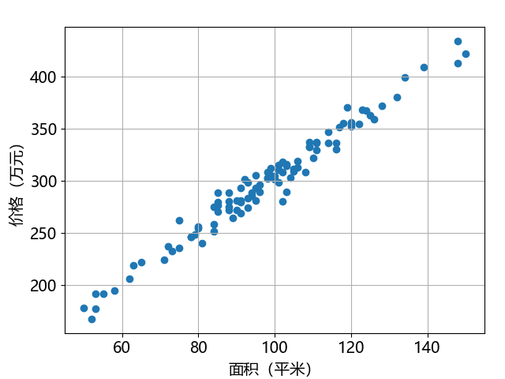
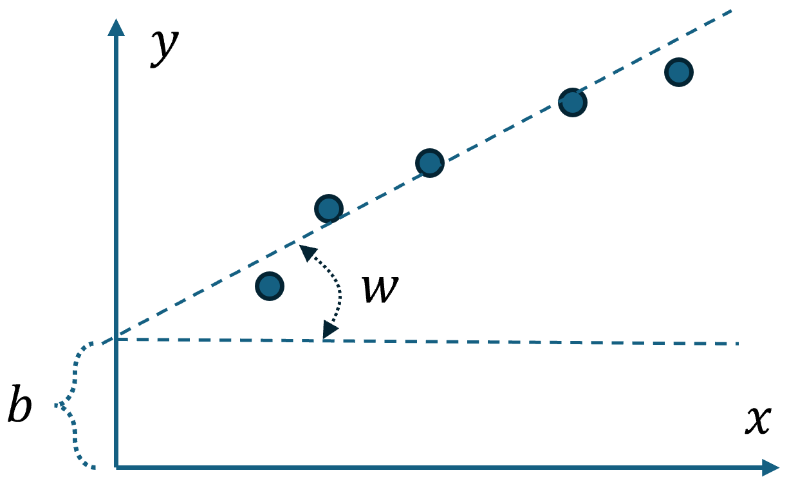

## 2.1 问题与建模

董大白去一个居住在二线城市的朋友那里旅游，讨论起当地的房价问题，他的朋友统计了 100 套房屋的价格，并咨询董大白在老家买房的经验。数据如表 2.1.1 所示（只展示了前十个样本）。

表 2.1.1 部分房屋价格与面积的样本

|样本|1|2|3|4|5|6|7|8|9|10|
|:-:|-|-|-|-|-|-|-|-|-|-|
|**面积（平米）**|71|88|99|124|101|96|85|85|81|96|
|**价格（万元）**|224|275|312|367|310|296|288|270|240|296|

**问题：如果董大白的朋友想在当地买一套 120 平米左右的房子，大概需要多少钱？**

另外，据董大白的朋友说，从一个官方的消息中得知，由于一些特殊政策，这个二线城市的一套房屋价格要在市场价格的基础上**增加一个固定的数字**，叫做“xx附加费”，以万元为单位。

### 问题分析

这同样是回归问题，由于数据维数较低，我们依然可以可视化这些样本，运行【代码：H2_1_ShowData.py】得到图 2.1.1。

图 2.1.1 二线城市房屋价格与面积的关系数据

可以看到线性关系较强，但是与图 1.1.1 不同的是，我们得知这个价格要在总价的基础上多一个固定的数字，所以回归线应该不会通过原点，而是有一个正的偏置（bias），应该满足式（2.1.1），其模型如图 2.1.2 所示。

$$
y=wx + b\tag{2.1.1}
$$

图 2.1.2 数学模型

所以这是一个双参数（$w,b$）的问题，下面我们看一下双参数的梯度下降和损失函数有何不同。
