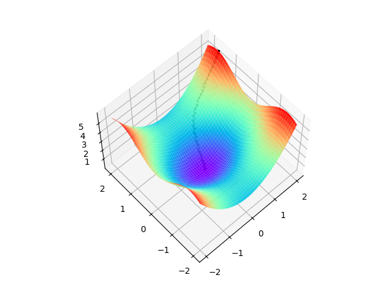
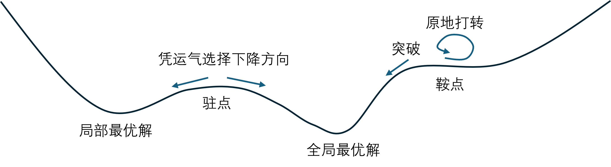
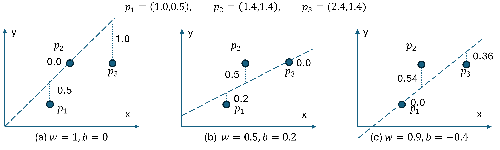
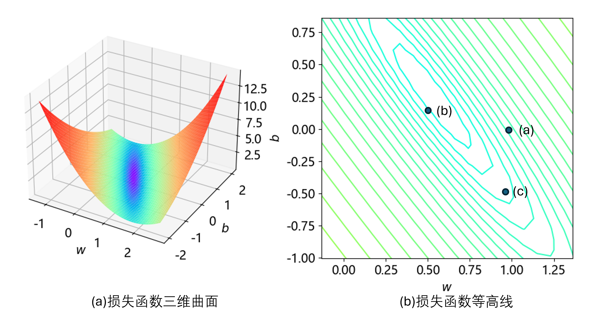
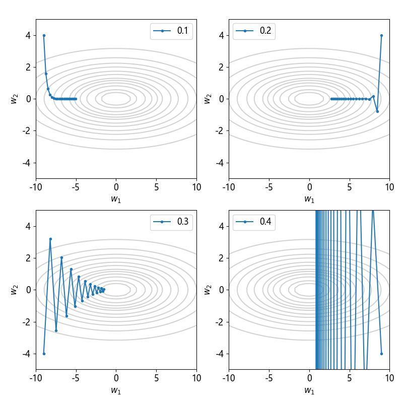

## 2.2 二元损失函数

其实，一元函数的导数（斜率）并不能称作真正的梯度。梯度的准确定义是：是一个向量，表示某一函数在该点处的方向导数沿着该方向取得最大值，即函数在该点处沿着该方向（此梯度的方向）变化最快，变化率最大（为该梯度的模）。

从定义可以看出，如果在某个点有多个方向可选择，那么这个点一定处于一个平面或曲面上，则这个函数一定是一个二元函数。而在本章的问题中，就是要求解一个二元函数：$f(w,b)$。

### 2.2.1 二元函数的梯度

图 2.2.1 二元函数梯度下降过程

图 2.2.2 局部最优解与全局最优解

### 2.2.2 损失函数

图 2.2.2 不同参数 $(w,b)$ 的回归线的误差

图 2.2.3 两个参数的均方误差损失函数图像

### 2.2.3 学习率的选择

图 2.2.4 不同的学习率迭代 20 步后的情况
