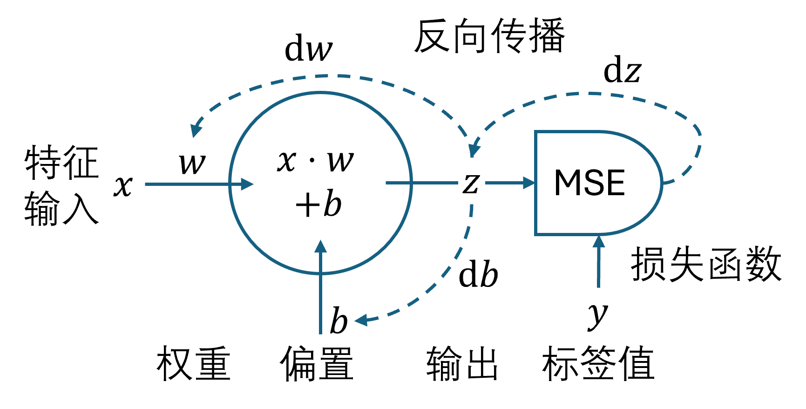
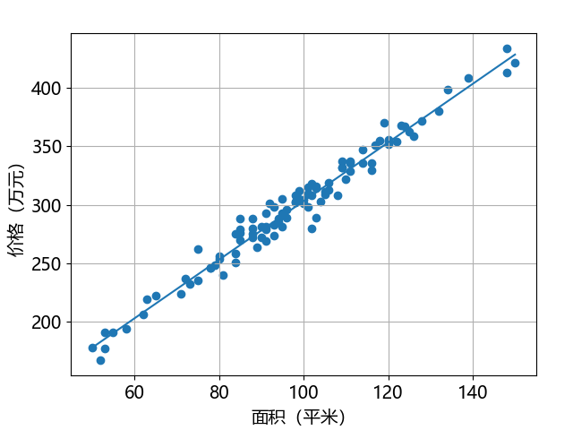

## 2.4 神经网络

在本章的问题中含有权重 $w$ 和偏置 $b$，所以神经元的模型如图 2.4.1 所示。

图 2.4.1 一维特征有偏置的线性回归神经网络模型

神经网络中有两类参数，一类是模型参数，如 $w、
b$，称作**参数**（parameters or weights），是需要学习的；而把学习率（learning rate）、训练轮数（epoch）以及后面要讲到的批大小（batch size）等等称作超级参数（hyperparameters），简称**超参**，是人工设置的。

### 2.4.1 前向计算

### 2.4.2 反向传播

### 2.4.3 代码实现

图 2.4.1 回归线
