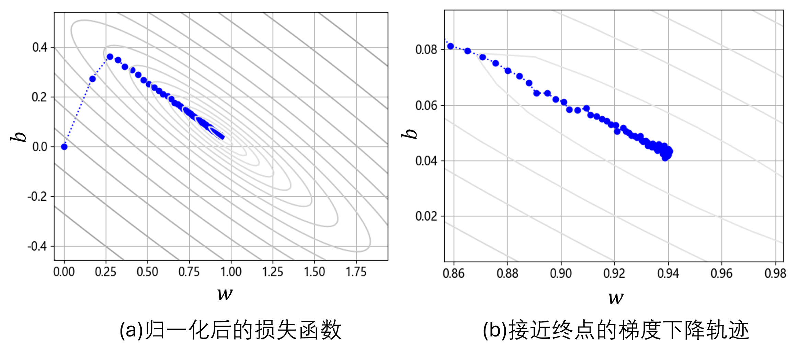
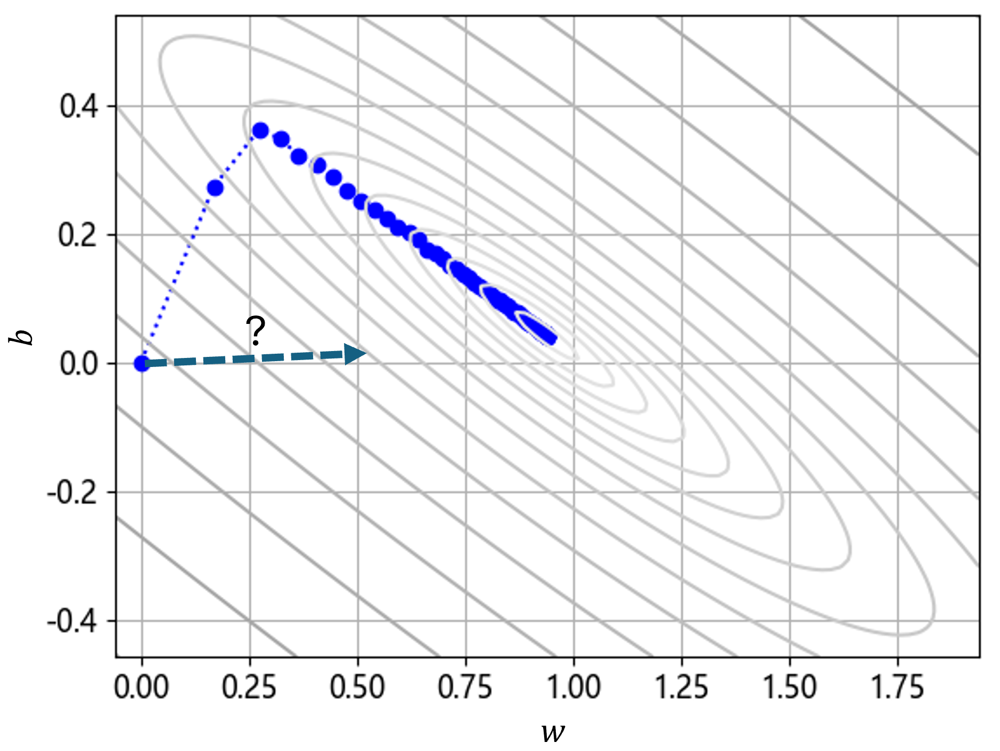

## 2.5 归一化与反归一化

图 2.5.1 训练过程中的梯度下降轨迹

### 2.5.1 归一化特征值与标签值

### 2.5.2 用归一化的数据做训练

### 2.5.3 参数的反归一化

### 2.5.4 预测时的归一化和反归一

图 2.5.2 预测值反归一化

### 2.5.5 再次检查损失函数等高线

图 2.5.3 归一化后的梯度下降过程

图 2.5.4 猜测的梯度方向
