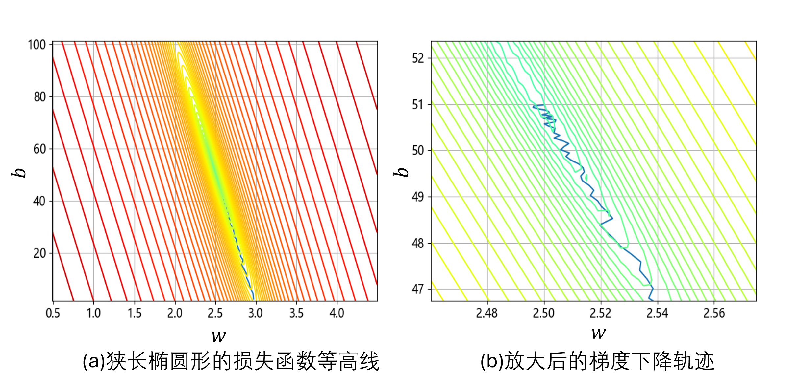
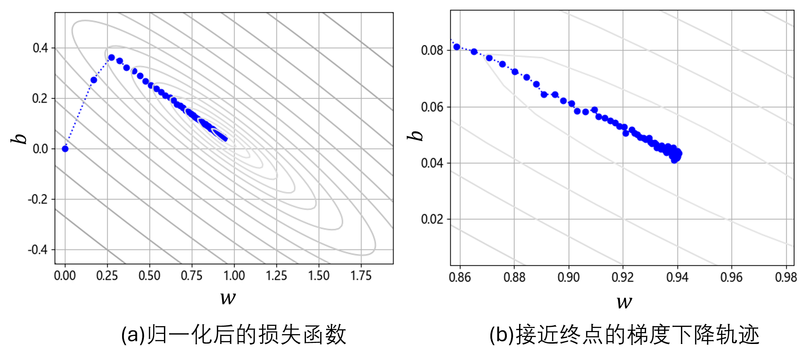
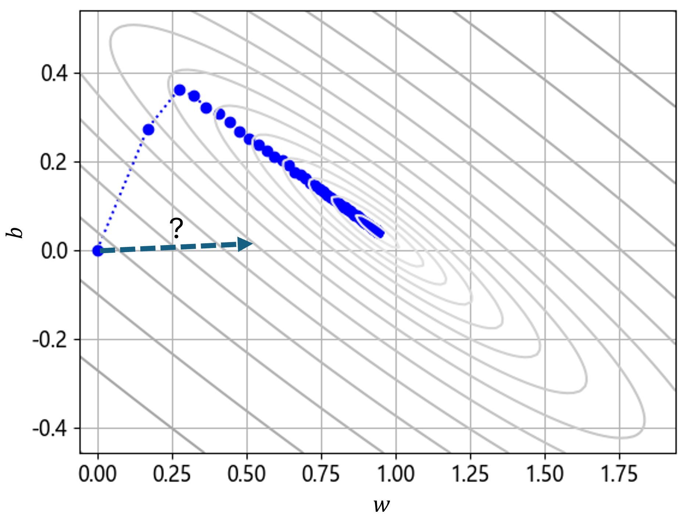

## 2.5 归一化样本数据

为了解决 2.4 节中最后提出的问题，我们在正常代码中嵌入一些测试代码。每隔 1000 轮，记录一次当前 $w、b$ 的值；最后训练完毕时，把 $w、b$ 的中间结果轨迹显示在 MSE 等高线图上。见【代码：H2_5_NN_client_test.py】。图 2.5.1 是训练过程中的梯度下降轨迹。

图 2.5.1 训练过程中的梯度下降轨迹

由于 $w$ 的基准值为 2.51 左右，$b$ 的基准值为 51 左右，所以可以看到在图 2.5.1（a）中，损失函数的等高线呈现出一个狭长的椭圆，在 $b$ 轴上非常长，是 $w$ 轴的 20 倍左右。下方有一根折线曲折地向最优点靠近。图 2.5.1（b） 是局部放大图，展示了更清晰的梯度下降法的搜索轨迹。由于分辨率的问题导致中心地区的等高线的边缘不是很平滑。

如果让 $b$ 轴变得和 $w$ 轴同样短，那么搜索过程会不会缩短很多呢？

### 2.5.1 归一化特征值与标签值

### 2.5.2 用归一化的数据做训练

### 2.5.3 预测时的归一化和反归一化

图 2.5.2 归一化后的梯度下降过程

图 2.5.3 猜测的梯度方向
