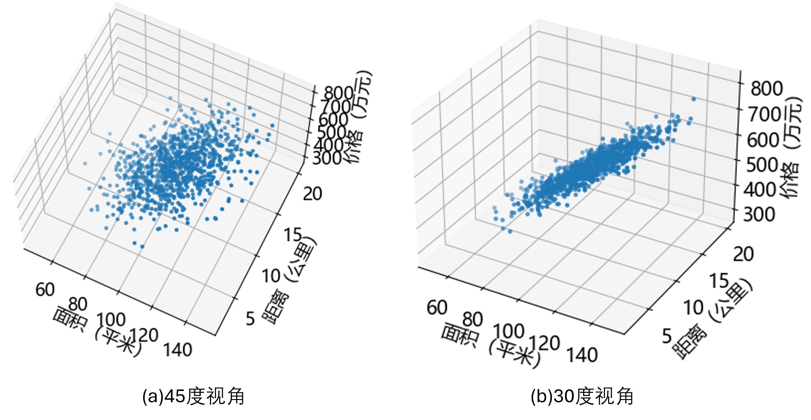

## 3.1 问题与建模

第 1 章中预测了三线城市的房屋价格，只依赖于面积，相对简单。第 2 章中预测了二线城市的房屋价格，除了面积以外，还增加了一个房屋附加值（偏置）。董大白现在在一线城市工作，所以他要研究一线城市的房屋价格了。

对于房价来说，面积是一个重要因素，另外一个重要因素就是地理位置。地理位置信息一般采用经纬度方式表示，但是经纬度是两个特征值，联合起来才有意义，因此我们把它转换成了房屋到城市中心的距离，越近价格越贵，越远价格越便宜。

董大白有1000个样本，每个样本有两个特征值（面积、距离），一个标签值（价格），示例如表 3.1.1。

表 3.1.1 样本数据

|样本序号|面积（平米）|距离（公里）|价格（万元）|
|---|---|---|---|
|1|117.92|4.39|659.58|
|2| 96.53|13.21|490.99|
|3|105.70|16.86|526.90|
|4|112.95|8.03|597.75|
|...|...|...|...|

**问题：在这个一线城市，距离区中心15公里的一套93平米的房子，大概是多少钱？**

### 问题分析

这批数据有三个维度，可以用两个特征值作为 $x$ 和 $y$，用标签值作为 $z$，在三维空间中展示样本分布，如图 3.1.1。

图 3.1.1 样本在三维空间的可视化

从图 3.1.1（a）看样本分布似乎是一个平面。从图 3.1.1（b）侧向看，和直线拟合数据很像。所以，对于这种三维的线性拟合，我们可以把它想象成为**平面拟合**，最终使得所有样本点到这个平面的距离的平方和最小。本问题要使用两个权重值来对应两个特征值：

$$
y=w_1 x_1 + w_2 x_2 + b\tag{3.1.1}
$$

所以这是一个三参数（$w_1,w_2,b$）的问题，它的数学模型是一个三维空间的平面拟合问题，而更高维的空间线性拟合问题可以称作超平面拟合。
