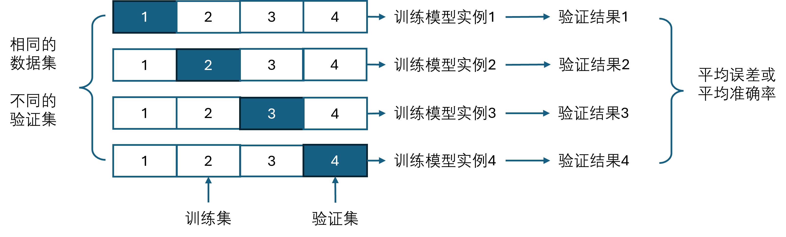
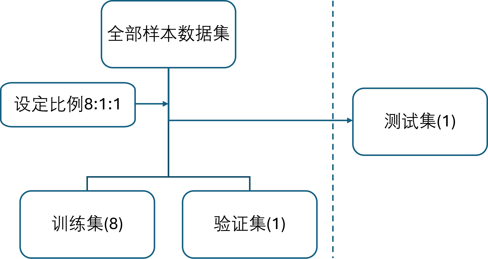

## 3.7 交叉验证与测试集【电子资源】

在 3.6 节中使用验证集的方法叫做留出法（hold out），就是保留一部分数据做为验证集不参与训练。当数据集较大时，可以采用这个方法。一共才有 1000 个样本，拿出 200 个做验证而不用于训练，总会有些“心疼”。

另外，评估训练结果时遇到了很多种情况，有正常的有不正常的，如果训练 10 次，有 5 次都有异常情况出现，就会很令人担心模型或数据出了什么问题，无法信赖。另外，于是出现了k-折交叉验证法。

### 3.7.1 k-折交叉验证

聪明的工程师们发明了k-折交叉验证（k-fold cross validation）方法来解决上面的问题。如图 3.7.1 所示。

图 3.7.1 k-折交叉验证（k=4）

图 3.7.1 中展示了当 k=4 时的情况，即把数据集先打乱顺序，做归一化，然后分成 4 等份：

- 第一轮，用训练集 2、3、4 训练模型实例 1，用验证集 1 做验证，得到误差1或准确率1。
- 第二轮，用训练集 1、3、4 训练模型实例 2，用验证集 2 做验证，得到误差2或准确率2。
- 第三轮，用训练集 1、2、4 训练模型实例 3，用验证集 3 做验证，得到误差3或准确率3。
- 第四轮，用训练集 1、2、3 训练模型实例 4，用验证集 4 做验证，得到误差4或准确率4。

注意：

- 这里的模型实例1、2、3、4实际上是**同一个模型**的不同实例，只是验证集不同而已，亦既训练数据不同。
- 数据集整体分成 4 个部分后，就不要再打乱顺序，以保证在四轮训练中，**每个样本在验证集中出现且仅出现一次**。但是在每轮训练中的训练集样本顺序还是可以打乱的，比如第一轮中的1、2、3内部可以互相打乱。
- 在得到四个误差或准确率值后，求平均误差或平均准确率，做为评价该模型的标准。

接下来有三种选择：
- 使用四个模型实例的中准确率最高的实例做预测。
- 同时使用这四个模型实例来做预测，每次对预测结果求平均或投票。
- 在确定当前模型参数为最优之后，使用全部数据集当作训练集（不留验证集），重新训练一遍模型，得到最终模型。

注意，一般情况下不能使用四个模型的权重值的平均值来做预测，因为由于模型结构的一些对称性（比如一个特征传入给多个神经元的情况），很有可能权重值的含义并不相同。但是在本例中，恰巧权重值的含义相同，可以做平均。

与留出法相比，使用交叉验证的方法虽然比较保险，但是非常耗时，尤其是在大数据量时，训练出一个模型都要很长时间，没有可能去训练出10个模型实例再去比较。

### 3.7.2 测试集

除了验证集外，在标准的工程实践中还有存在有测试集（test set），用来评估最终模型的泛化能力，但不能作为调参、选择特征等算法相关的选择的依据。三者之间的关系如图 3.7.2 所示。

图 3.7.2 训练集、验证集、测试集的关系

测试集一旦分出来后，就像是锁在保险柜里，不能再被开发者随意使用或看到，只能在开发者提交模型后，测试者用它来测试模型，看看是否达到了预期的目标。

有一个形象的比喻：

- 训练集既课本，学生根据课本里的内容来掌握知识；
- 验证集既作业，通过作业可以知道学生掌握知识的程度；
- 测试集既考试，学生平常都没有见过试卷上的题目，考察学生举一反三的能力。
  
关于三者的比例关系，在传统的机器学习中，三者可以是6:2:2。在深度学习中，一般要求样本数据量很大，所以可以给训练集更多的数据，比如 8:1:1。如果有些数据集已经给了你训练集和测试集，那就不关心其比例问题了，只需要从训练集中留出 10%~20% 左右的验证集就可以了。
