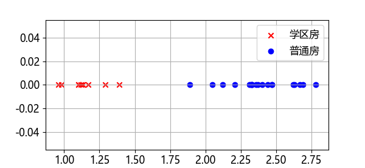

## 4.1 问题与建模

由于大城市房价暴涨，带动了很多周边小城市也跟着涨价，但是那里的居民的收入并没有很高，就造成了房价与收入不匹配问题。所以各个地方先后推出了安居房工程，以满足基层群众的住房需求。董大白调查了某个二线城市的安居房和商品房的价格，共有 500 个样本，部分样本在表 4.1.1 中展示。

表 4.1.1 样本

|序号|单价（万元/平米）|是否安居房|
|-|-|-|
|1|2.5030 |0|
|2|2.1838 |0|
|3|2.3240 |0|
|4|1.3688 |1|
|5|1.1911 |1|
|...|...|...|

**问题：请和董大白一起找出安居房和商品房的单价的分界点，以便确定一个合理的价格边界。**

### 问题分析

由于特征值（房屋单价）是一维数据，可以做可视化，图 4.1.1 展示了部分样本。

图 4.1.1 两种房屋的价格样本分布

从图 4.1.1 可以看到，安居房房的价格区间基本小于 1.5 万元/平米，而商品房的价格大于 1.75 万元/平米。但由于是部分样本，所以只能作为参考。

不同于第 1、2、3 章的内容，本章的数据样本标签值是 0 或 1（是否为安居房），这种类型的问题叫做**分类问题**（classification），本例中是**二分类**（binary classification），即 0 或 1 两个类别。通常，我们把 1 称作正类或正例（本例中是安居房），0 称作负类或负例（本例中是商品房）。

这个问题简单到似乎小学生都可以拿起一根筷子来竖着放在左侧的 'x' 样本和右侧的 'o' 样本之间作为分类线，关键是这根筷子的位置应该距离左侧样本更近还是距离右侧样本更近？或者在正中央？它的数学模型应该是用一个分类器（classifier）把输入的数据分成两类：

$$
\text{classifier}(x)=\begin{cases} 0, & \text{负类} \\ 1, & \text{正类} \end{cases}
$$

那么如何用神经网络实现这个分类器呢？
