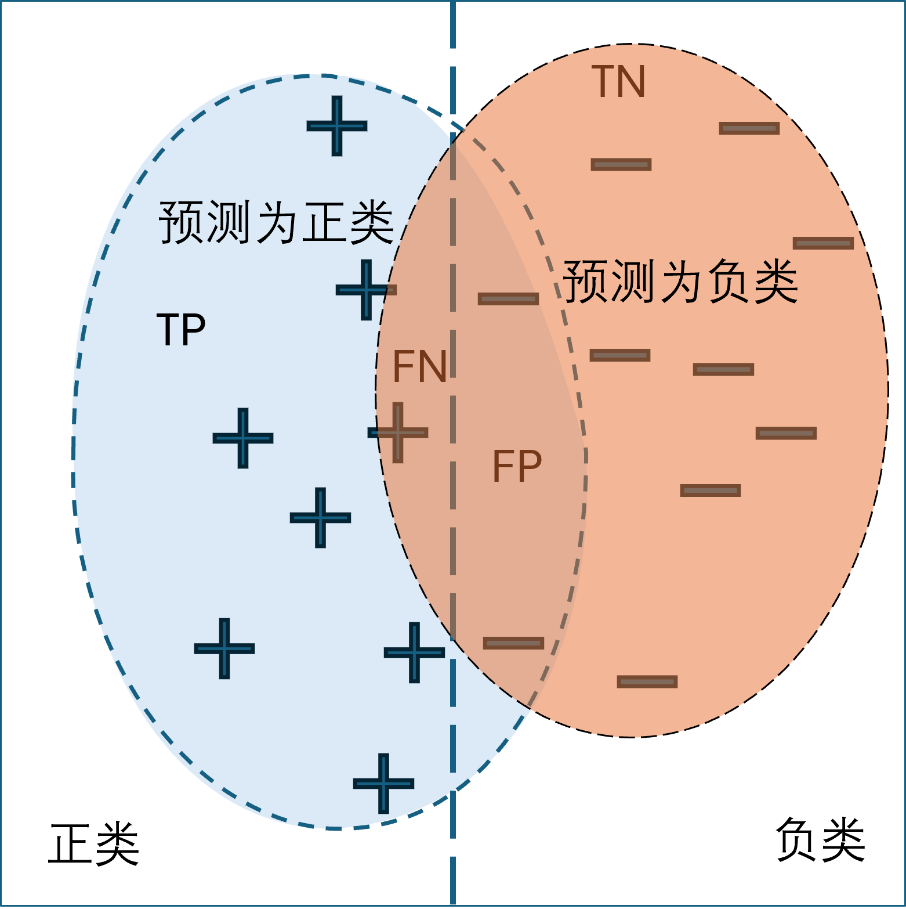
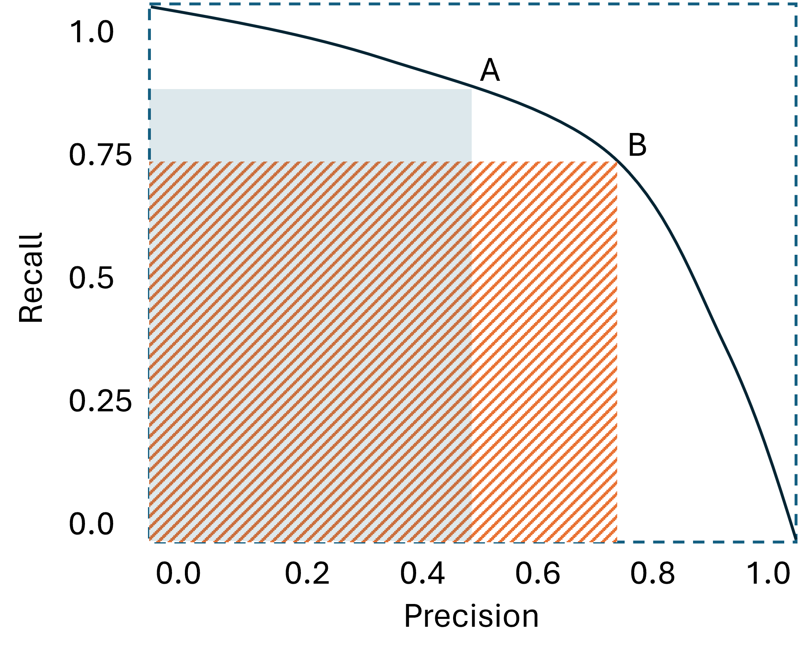

## 4.3 二分类任务评价标准

在正式动手解决二分类问题之前，我们先学习如何评价二分类任务的效果。

### 4.3.1 混淆矩阵

**混淆矩阵**（confusion matrix）也称误差矩阵，是表示**分类任务**精度评价的一种标准格式，用 $k$ 行 $k$ 列的矩阵形式来表示，$k$ 表示类别数。具体评价指标有总体精度、制图精度、用户精度等，这些精度指标从不同的侧面反映了分类的精度，特别用于监督学习。

假设真实情况为：100个样本中 30个为安居房（positive, P），70个为商品房（negative, N）。

假设预测情况为：

- 30个安居房中，有 29 个被预测为安居房（true positive, TP），1个被预测为商品房（false negative, FN）；
- 70 个商品房中，有 68 个被预测为商品房（true negative, TN），2个被预测为安居房（false positive, FP）。

把预测情况列在表 4.3.1 中。

表 4.3.1 二分类模型的混淆矩阵

||标签是正类 P=30|标签是负类 N=70|
|-|-|-|
|**预测为正类 P=31**|真正类 TP=29：<br> 标签是安居房 P<br>预测为安居房 P|假正类 FP=2：<br> 标签是商品房 N<br>预测为安居房 P|
|**预测为负类 N=69**|假负类 FN=1：<br> 标签是安居房 P<br>预测为商品房 N|真负类 TN=68：<br> 标签是商品房 N<br>预测为商品房 N|

有些资料中会把表中标签和预测的位置颠倒，请读者注意。

图 4.3.1 中更为直观地展示了四种情况，左右两个矩形是正类和负类样本，椭圆的范围是预测的结果。比如，左侧的椭圆把右侧矩形中的两个样本（➖）预测为正类，而右侧的椭圆把左侧矩形中的一个样本（➕）预测为负类。



图 4.3.1 四种预测情况


### 4.3.2 准确率

**准确率**（accuracy）是一个用于评估分类模型的标准，即模型预测正确的样本数量占总样本量的比例。

$$
\text{accuracy}=\frac{\text{TP}+\text{TN}}{\text{TP}+\text{TN}+\text{FP}+\text{FN}}=\frac{29+68}{29+68+2+1}=0.97
\tag{4.3.1}
$$

【代码：common.Functions_4】实现中利用了布尔矩阵的特点进行快速计算。
```python
# 分类模型的准确率
def tpn(a, y):
    result = (np.round(a) == y) # a <= 0.5 时变成 0, a > 0.5 时变成 1
    # result 中是 True(分类正确),False（分类错误）, sum() 是True的个数
    num_correct = result.sum()  
    return num_correct / a.shape[0] # 分类正确的比例（正负类都算）    
```

### 4.3.3 精确率

准确率与**精确率**（precision）是有区别的，精确率只关心被预测为正类的样本：

$$
\text{precision}=\frac{\text{TP}}{\text{TP}+\text{FP}}=\frac{29}{29+2} \approx 0.935
\tag{4.3.2}
$$

精确率也叫做查准率，即正确预测为正类样本的占全部预测为正类的比例，它的目标是**尽量不错**：宁愿漏检，也不能让现有的预测有错。比如我们的目标是严格检查安居房购买资格，宁可有遗漏，也不能有误判，让没有资格的人购买安居房。

### 4.3.4 召回率

**召回率**（recall）是针对原样本而言的，它只关心原本就是正类的样本。高的召回率意味着可能会有更多的误检，但是会尽力找到每一个应该被找到的对象。

$$
\text{recall}=\frac{\text{TP}}{\text{TP}+\text{FN}}=\frac{29}{29+1} \approx 0.967
$$

所以召回率的目标是**尽量不漏**：宁可有误判的，也不能有遗漏，找到每一个应该被预测为正类的样本。比如癌症筛查。


### 4.3.5 综合评价指标

从精确率与召回率的定义可以看到，这二者是相互矛盾的，所以需要综合考虑，就是 $\text{F-score}$。

$$
\text{F-score}=\frac{1+\alpha^2}{\alpha^2} \cdot \frac{\text{precision} \cdot \text{recall}}{\text{precision}+\text{recall}}
\tag{4.3.3}
$$

通常我们用 $\alpha=1$ 来做简单的权衡标准，叫做 $\text{F1}$：

$$
\text{F1}=2 \cdot \frac{\text{precision} \cdot \text{recall}}{\text{precision}+\text{recall}}
\tag{4.3.4}
$$

用上面的例子：$\text{F1}=2 \times \frac{0.935 \times 0.967}{0.935 + 0.967} \approx 0.95$。当 $\text{F1}$ 较高时，说明模型或算法的效果比较理想。

对于二分类问题，我们如果想得到一个比较高的 $\text{F1}$ 值，可以调节图 4.2.2 中的正负类分割点：

- 如果向上调整，则得到较高的 precision。
- 如下向下调整，则得到较高的 recall。

如果连续调整分割点，并把不同组合的 precision、recall 记录下来，就会得到图 4.3.2 所示的 P-R 曲线图。在该图中，目前展示了两个选择点 A、B，通过比较它们对应的两个矩形区域的面积，可以确定哪个选择更好：B 的面积大，是更好的选择。



图 4.3.2 P-R 曲线

考虑到是取最大值，所以对 $\text{F1}$ 求偏导并令结果为 0，可以得到当 $\text{precision} \cdot \text{recall}=\text{precision}+\text{recall}$ 时 $\text{F1}$ 值最大。

还有其他一些评估方法如 ROC、AUC 等等，请读者自己学习。
