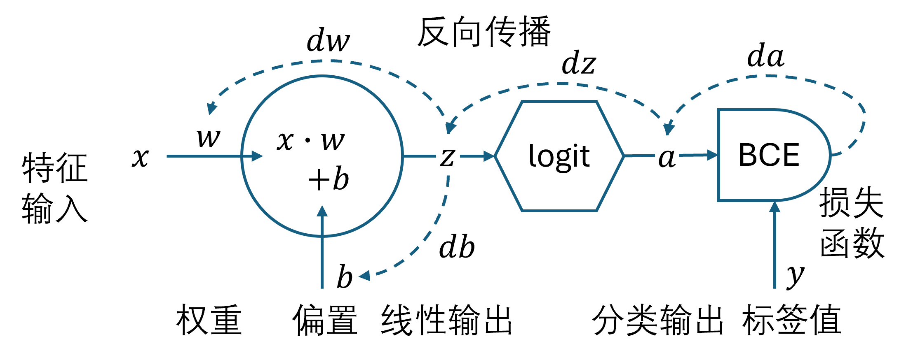
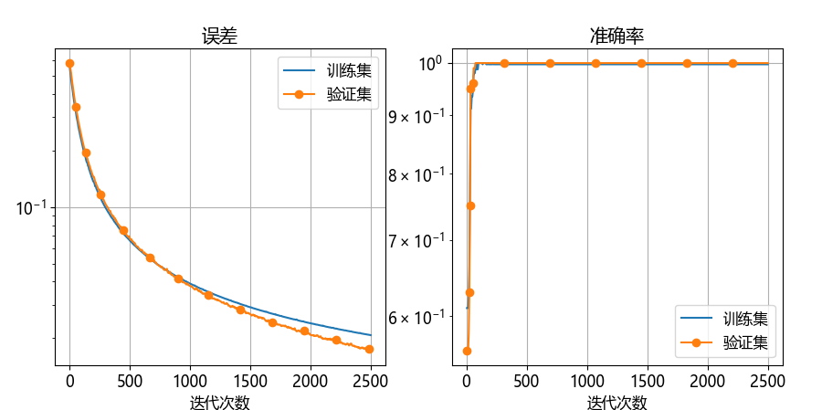
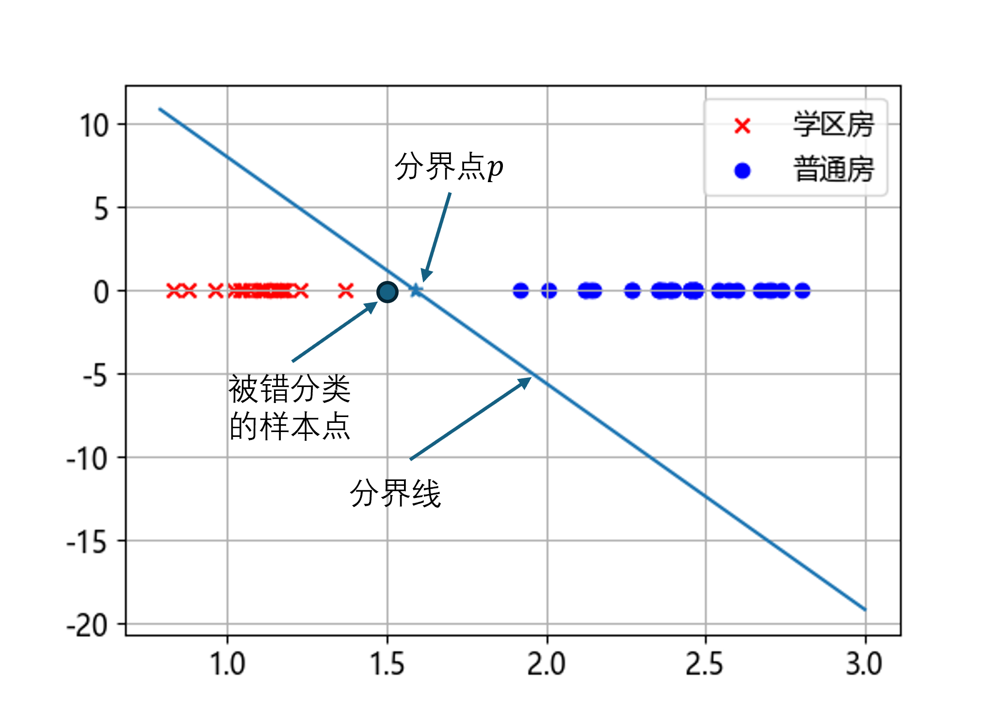

## 4.5 神经网络

图 4.5.1 是具有一维特征的二分类问题的神经网络模型。

图 4.5.1 一维特征二分类问题的神经网络模型

其中：$\mathbf x \in \mathbb{R}^{m \times 1}$，$m$ 为批量样本。$w、b$ 为标量。

有些资料中把这里的 Logit 函数称作激活函数，笔者认为不妥。因为它是完成二分类概率输出的，属于输出层，而激活函数是位于两个线性计算层之间的。

### 4.5.1 前向计算

### 4.5.2 反向传播

### 4.5.3 实现

### 4.5.4 训练

图 4.5.2 训练过程中的误差与准确率的变化

图 4.5.3 找到的分界点（图中五角星）
