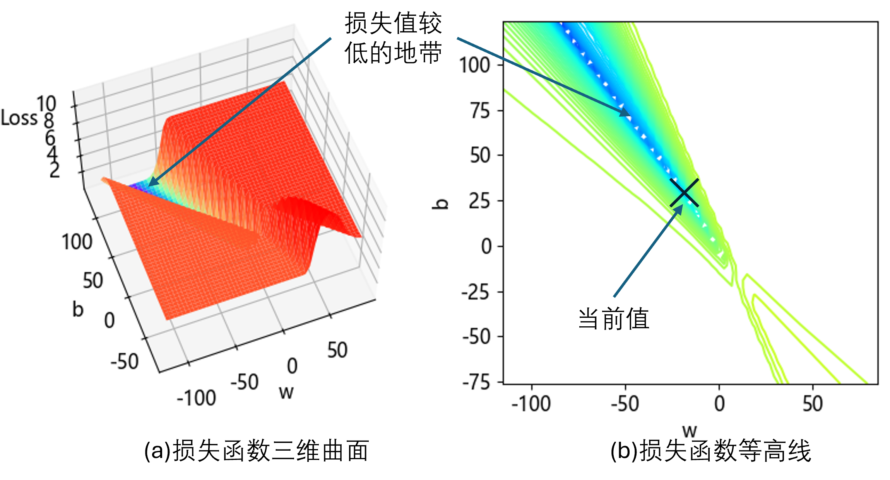

## 4.7 更多探索【电子资源】

理想的分界点 $x_0$ 应该是距离两类样本都“尽量远”。假设我们使用 MSE 做评估函数，那么应该有 $D= \sum_{i=1}^m (x_i-x_0)^2 $，然后最大化 $D$ 值。这与神经网络的损失函数求最小值的情况相反，而传统机器学习中的 SVM 可以轻松完成这个任务。

在本例中，正类样本点有 200 个，负类样本点有 300 个，那么**分界点应该略微偏向正类这边**，使得负类侧的距离足够大。

### 4.7.1 探索更多的训练轮数

从图 4.5.2 看，似乎损失函数还有下降的空间，目前我们只训练了 100 轮，看样子还有空间继续下探，所以分别设置 epoch=1000 和 2000，并把结果与 epoch=100 时做比较，列于表 4.7.1 中。运行【代码：H4_7_More_Epoch.py】可以得到近似数据。

表 4.7.1 不同轮数的训练结果对比

|训练轮数|$w$|$b$|分界点$x$|训练集误差|验证集误差|
|-|-|-|-|-|-|
|100|-13.56|21.29|1.57|0.006540|0.005020|
|1000|-22.93|34.62|1.51|0.002827|0.002401|
|2000|-28.26|42.16|1.49|0.002291|0.000579|

结果分析：

- 先看最直接的分界点 $x$ 的值，我们欣喜地发现它从 1.57 下降到了 1.51，最后到 1.49，这说明可以解决负类样本 $x=1.50$ 的问题了，使得准确率可以达到 100%。
- 再看 loss 值，无论是训练集还是验证集，都有明显的下降。
- 最后看 $w、b$ 的值。哦！它们的变化好大！唯一不（怎么）变的是 $-b/w$ 的值都在 1.5 左右。由于 $w、b$ 的值决定了分界线的形状，所以我们把分界线的情况展示在图 4.7.1 中。运行【代码：H4_7_Show_Result.py】可以得到此图并放大观察。

图 4.7.1 不同训练轮数的分界线情况

可以看到：

- 三条线与 $y=0$ 轴的交点（即分界点）**从右到左**分别为 1.57、1.51、1.49，分别对应表 4.7.1 中的训练轮数为100、1000、2000 的情况，说明准确率在改进。
- 而三条分界线的斜率也是从小到大，渐渐向垂直于横轴的方向发展。斜率越大的分界线，它对应的误差越小。比如图中的点状线的训练集 loss 值为 0.002291，点划线的误差为 0.002827，而实线的误差为 0.006540。

那么这里会产生一个新问题：**如果训练足够充分，最后会得到一条垂直的分界线吗？**

答案是**不会**！它只能趋近于垂直，而不会真的垂直，因为 $z=wx+b$ 这条直线的 $w$ 不会真的为 0，而这是由于本例中的损失函数的形态所决定的。

### 4.7.2 探索损失函数

在本例中，由于式（4.2.1）只有两个参数 $w,b$，所以很幸运，我们还可以做损失函数的可视化。损失函数的形态是取决于样本数据和模型公式的。回忆本例中的模型公式为：

$$
z = xw+b \tag{4.7.1}
$$

$$
a = \text{Logit}(z) \tag{4.7.2}
$$

$$
loss = -[ y \ln a + (1-y) \ln (1-a)] \tag{4.7.3}
$$

我们先以 $w=-15.5, b=23.9$ 为中心，宽度为 200×200，绘制损失函数在此区域内的形状，如图 4.7.2 所示，【代码：H4_7_Test_Loss.py】。

图 4.7.2 损失函数的整体形状

从左图可以看到低洼地区是一个“峡谷”，epoch=100 时权重值还处于峡谷的边缘，没有深入。这不禁让人猜想峡谷深处和更远的地方是什么样子，于是，笔者又以 $w=-200、b=308$ 为中心，绘制宽度为 50×50 的方形区域内的损失函数形状，如图 4.7.3 所示。

图 4.7.3 峡谷深处的损失函数局部形状

注意右图中有两个长形地带的白色区域，靠左侧的是损失值几乎为 0 的地带，已经没有什么梯度了；靠右侧的是梯度平缓的地带，只是由于计算和绘图精度不够而产生的空白。

从形态和发展趋势看，这个峡谷非常狭长，似乎并没有尽头。而且在峡谷中间存在着一长条损失值很低（几乎为 0）的地区，而不是一个极值点。据笔者分析，这个区域应该是一个长长的 V 字形，这意味着 $w、b$ 的绝对值将会很大。

为什么会是这种形态呢？这还要从模型公式来分析。

举个例子，当 $w、b$ 的绝对值很大的时候，比如当 $w=-1000、b=1500、x=1.1、y=1$ 时，则 $z=400，a \to 1，loss \to 0$。

在本例中，如果继续训练下去（比如 epoch=10000），那么将会越来越深入峡谷内部，而且没有尽头。所以，图 4.7.1 中的解 $w=-15.5、b=23.9$ 已经是一个比较满意的结果了。

从以上的分析可以看到，损失函数并非是规则的碗状，对于更高维的空间和更复杂的模型，还会产生非凸型形状，给梯度下降算法带来困难，需要用到优化算法来辅助解决。
