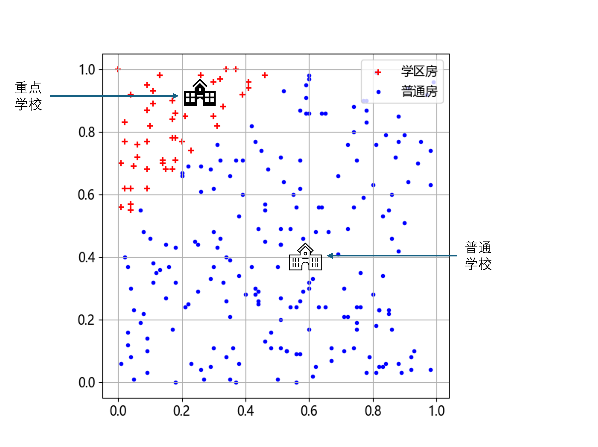
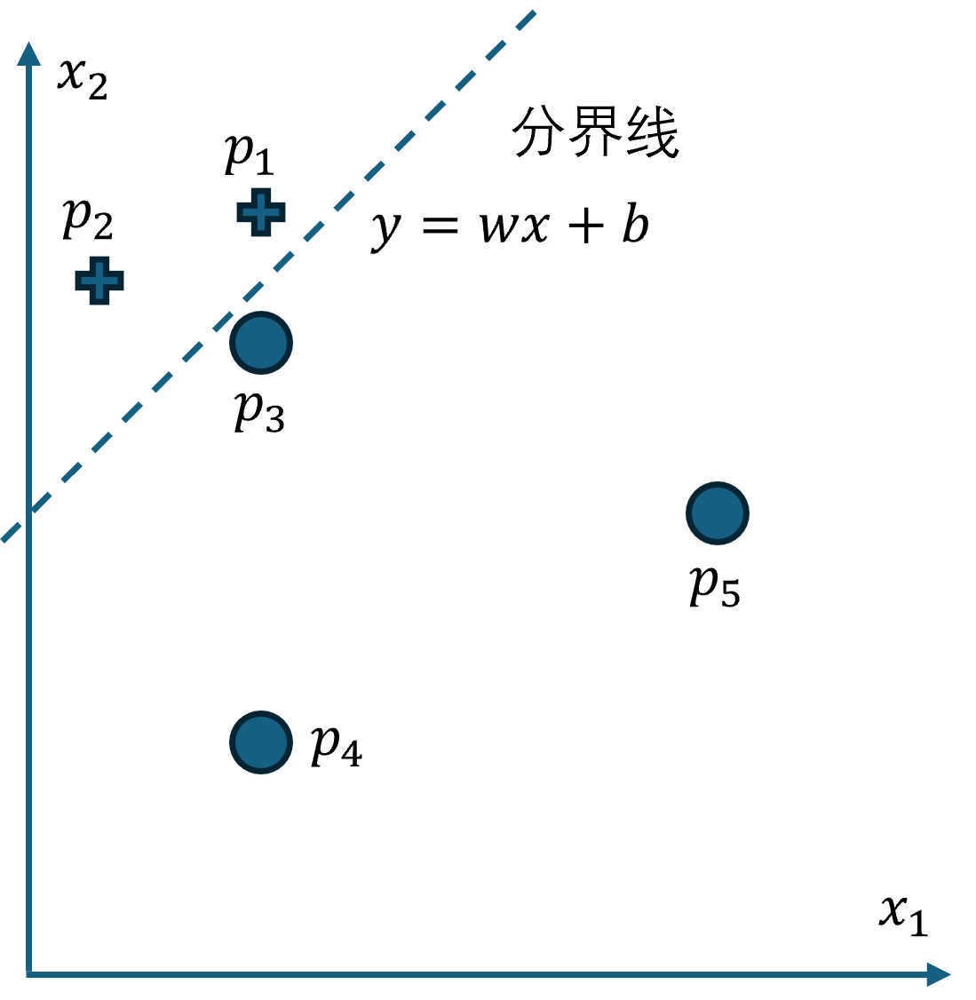

## 5.1 问题与建模

在董大白上学的大城市的某个方形区域内，层有一条河斜穿过这个区域，但多年后这条河改道了，河道还残存。在河道的北岸有一个教学质量很好的重点中学校，住在附近的孩子都可以去那里上学，所以那里的房子都被称为“学区房”。而河道的南岸就是普通住宅了，因为哪里只有一个普通学校。一般来说，学区房的价格要比普通住宅高 30%。

董大白想了解学校附近的房子的价格，从中介机构的统计中得知了两岸共 2000 套房子的属性和价格，在表 5.1.1 中列出了前几个样本。

表 5.1.1 学区房和普通住宅的样本数据

|样本|横坐标|纵坐标|面积|学区房|朝向|总价|
|-|-|-|-|-|-|-|
|1|0.77| 0.59|59| 0| 1|305|
|2|0.02| 0.77|65| 1| 1|432.5|
|3|0.63| 0.56|113|0| 0|575|
|4|0.20| 0.77|54| 1| 0|361|
|...|...|...|...|...|...|...|

样本数据说明：

- 由于是方形区域，所以在地理位置上有横坐标和纵坐标，我们已经把它们归一化了，所以整个方形区域的面积为 1，没有量纲；
- 是否是学区房用 0 和 1 表示，0 代表是普通住宅，1 代表是学区房；
- 还有一个属性是主卧的窗户是否朝南（简称朝向），这是北方地区人们的购房需求之一。

这一次我们有两个问题，请参看图 5.1.1：

**问题一：地理坐标为 $(0.2,0.8)、(0.4, 0.9)、(0.6,0.5)$ 的三套房子是学区房吗？**
**问题二：只根据面积和总价，能够识别出哪些是学区房吗？**

图 5.1.1 方形区域内的学区房与普通房的分布样本

### 问题分析

针对问题一，聪明的读者会想出这个办法：把三个坐标点放到图中去，然后看它周边的房子，如果普通房居多，那么它就是普通房，反之则是学区房。

这是一种简单的聚类方法，这个方法在边界地区容易误判，因为周围的房子既有普通房也有学区房。所以根本的解决办法是找到一条可以把两类样本点分开的分界线，因为从图 5.1.1 看，似乎存在这样一条直线，使得所有的学区房都位于直线上方，而普通房位于直线下方。如图 5.1.2 所示。

图 5.1.2 一条直线分开两类样本

从图 5.1.2 看，似乎我们只需要以坐标值作为特征值，以学区房标记作为标签值就可以了，表 5.1.1 中的其它特征是冗余的可以扔掉。这样就形成了表 5.1.2。

表 5.1.2 简化后的样本数据

|样本|横坐标 $x_1$ |纵坐标 $x_2$|学区房 $y$|
|-|-|-|-|
|1|0.77| 0.59|0|
|2|0.02| 0.77|1|
|3|0.63| 0.56|0|
|4|0.20| 0.77|1|
|...|...|...|...|...|

表 5.1.2 中有两个特征值，与第 4 章的一维空间二分类问题不同，本例中是二维空间的二分类问题。
