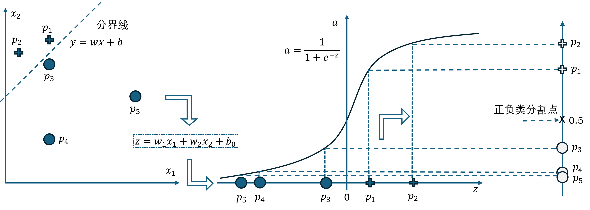

## 5.2 特征映射

回忆第 4 章的解决方案，先用 $z=xw+b$ 把一维的特征值映射到另外一个一维空间中，0 点左侧为负类样本，0 点右侧为正类样本，然后再用对数几率函数做分类判断。

图 5.2.2 二维空间二分类问题的解决方案

### 分界线的方程

我们知道通过神经网络的训练可以得到一组合理的界，即式（5.2.1）中的 $w_1、w_2、b_0$，那么用这三个值如何确定分界线的位置呢？
