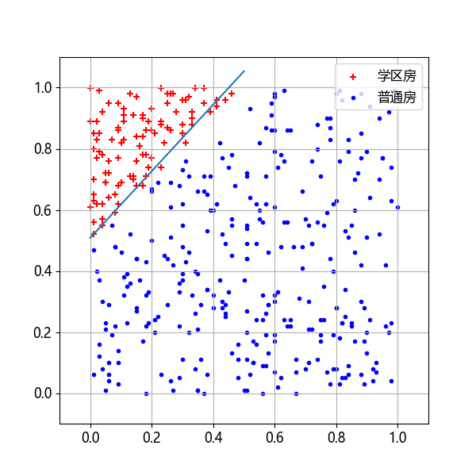
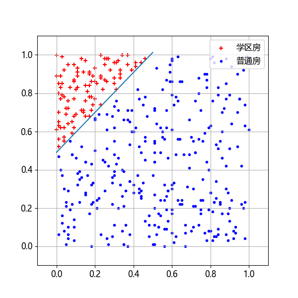
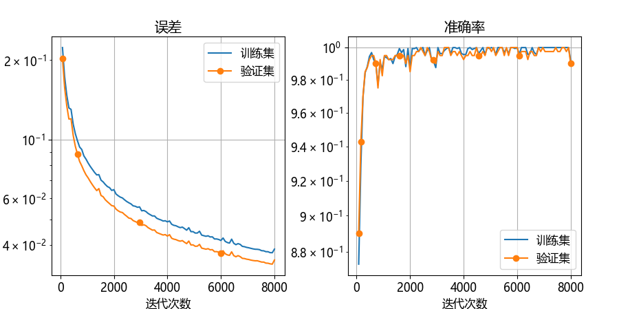
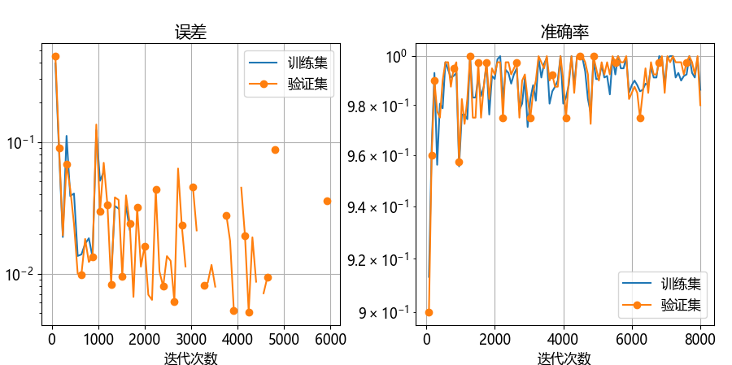

## 5.5 学习率的选择

有一句业内流传的话：所有超参中，如果只需要调整一个参数，那么就是学习率。由此可见学习率是多么的重要。但是学习率是一个非常难调的参数，下面给出具体说明。

图 5.5.1 学习率与误差的关系

### 5.5.1 不同学习率的试验

下面做了几组试验，训练轮数都是 50，批大小 10，学习率选取 $[0.01,0.1,0.5,1,10,50]$。

#### 1. 学习率为 0.01

图 5.5.2 学习率为 0.01 时的训练过程

图 5.5.3 学习率为 0.01 时的训练结果

#### 2. 学习率为 0.1

图 5.5.4 学习率为 0.1 时的训练过程

图 5.5.5 学习率为 0.1 时的训练结果

#### 3. 学习率为 0.5

图 5.5.6 学习率为 0.5 时的训练过程

图 5.5.7 学习率为 0.5 时的训练结果

#### 4. 学习率为 1.0

图 5.5.8 学习率为 1 时的训练过程

#### 5. 学习率为 10

图 5.5.9 学习率为 10 时的训练过程

#### 6. 学习率为 50

图 5.5.10 学习率为 50 时的训练过程

### 5.5.2 试验结果小结

#### 1. 为什么有多个解？

#### 2. 一般来说学习率都在 $(0,1)$ 之间，为什么本例中的学习率可以到 50？

#### 3. 表中样本 2 的作用是什么？

#### 4. 哪个学习率最好？
