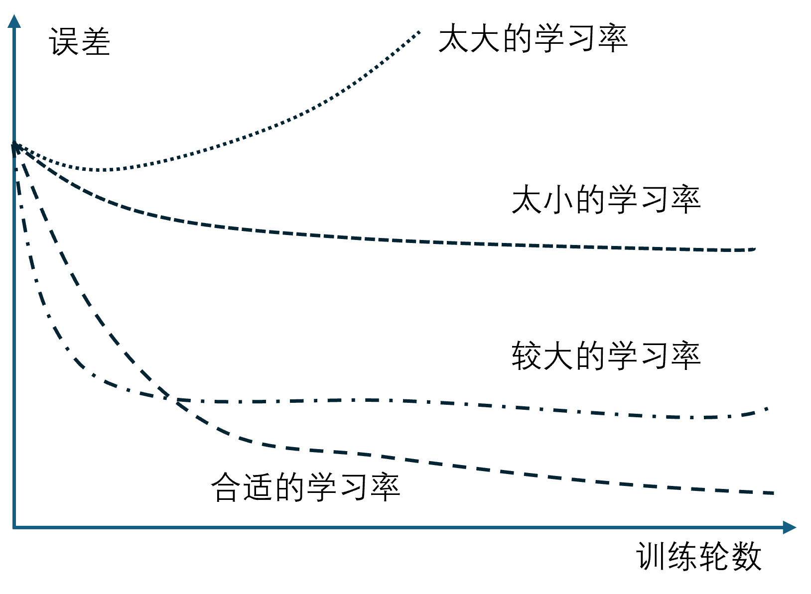
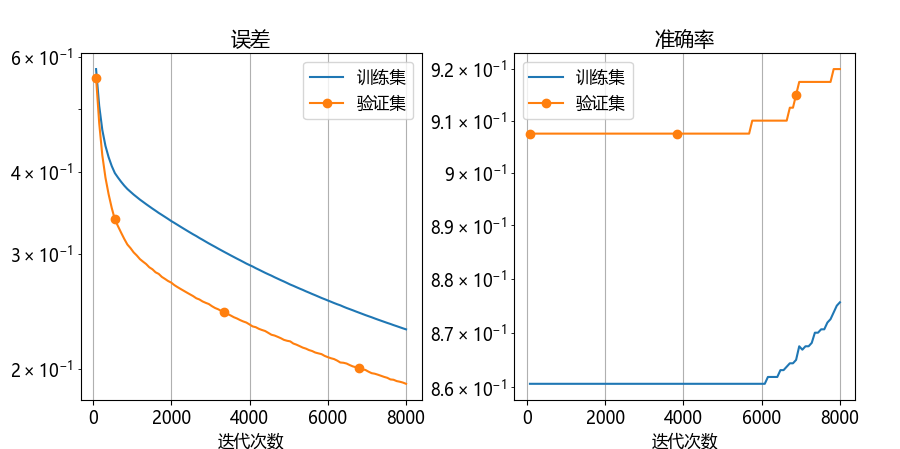
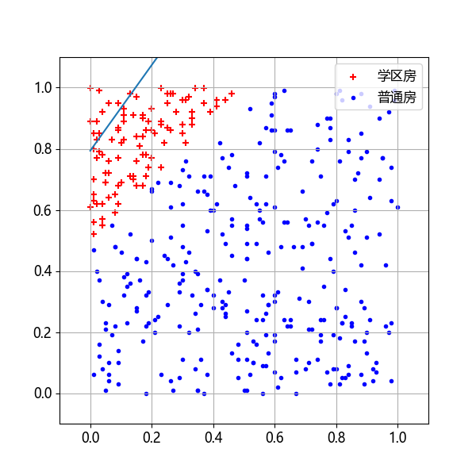
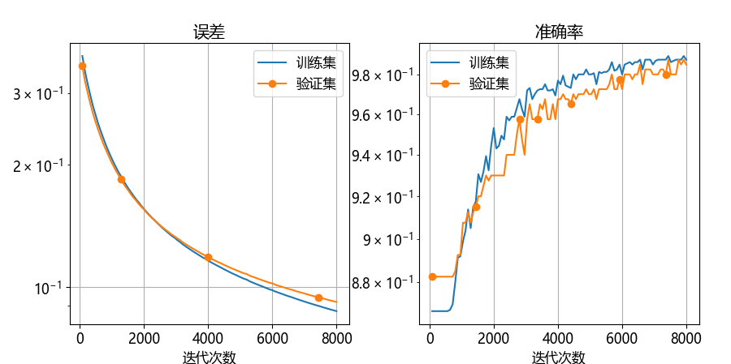
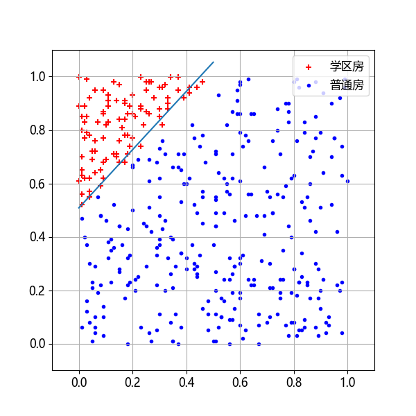
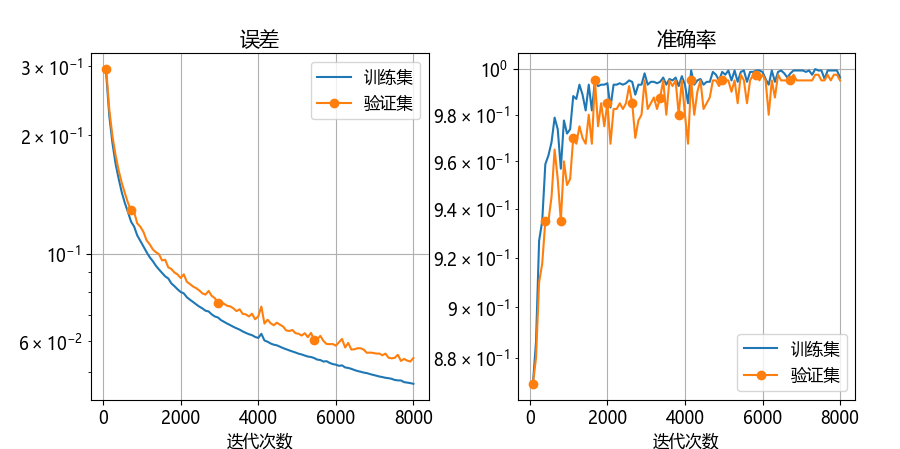
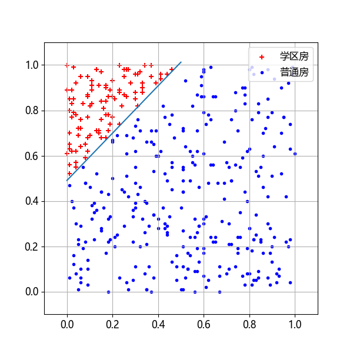
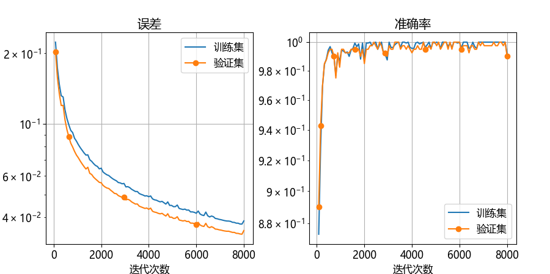
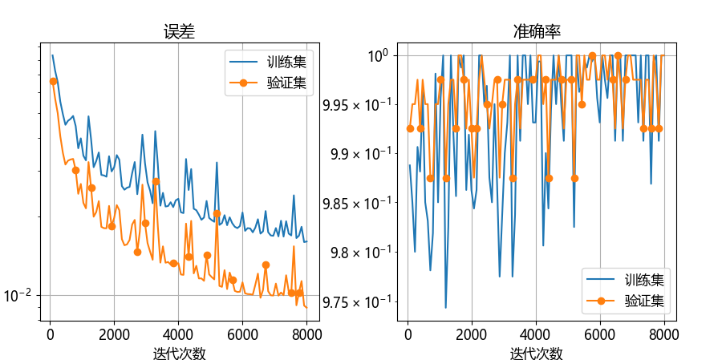
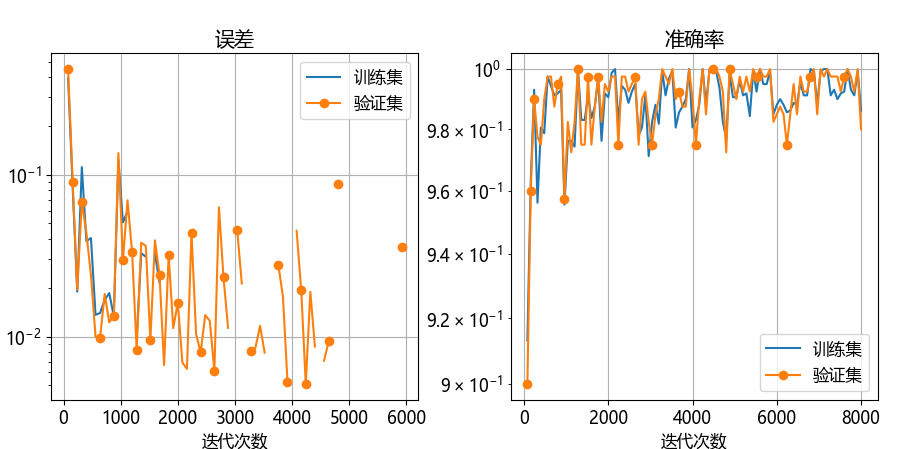

## 5.5 学习率的选择【电子资源】

有一句业内流传的话：所有超参中，如果只需要调整一个参数，那么就是学习率。由此可见学习率是多么的重要。但是学习率是一个非常难调的参数，下面给出具体说明。

前面章节学习过，普通梯度下降法，包含三种形式：单样本、小批量样本、全批量样本。我们通常把前两者统称为 SGD (stochastic gradient descent)。当批量不是很大时，全批量也可以纳入此范围。“大”的含义是“万级以上的数据量”，所以在本书的例子中基本上都不算“大”。

使用梯度下降的这些形式时，通常面临以下挑战：

- 很难选择出合适的学习率。太小的学习率会导致网络收敛过于缓慢，而学习率太大可能会影响收敛，并导致损失函数在最小值上波动，甚至出现梯度发散；
   
- 相同的学习率并不适用于所有的参数更新。如果训练集数据很稀疏，且特征频率非常不同，则不应该将其全部更新到相同的程度，但是对于很少出现的特征，应使用更大的更新率；
   
- 避免陷于多个局部最小值中。实际上，问题并非源于局部最小值，而是来自鞍点，即一个维度向上倾斜且另一维度向下倾斜的点。这些鞍点通常被相同误差值的平面所包围，这使得SGD算法很难脱离出来，因为梯度在所有维度上接近于零。

图 5.5.1 说明了学习率与误差的关系：

- 学习率太大，会使得网络发散；
- 较大的学习率可以使网络收敛，开始时误差下降很快，但到达极值点附近时，在最优解附近来回跳跃；
- 合适的学习率设置可以使得误差持续下降，训练平稳进行；
- 学习率太小，误差值下降速度慢，训练轮数长，收敛慢。



图 5.5.1 学习率与误差的关系

### 5.5.1 不同学习率的试验

下面做了几组试验，训练轮数都是 50，批大小 10，学习率选取 $[0.01,0.1,0.5,1,10,50]$。

#### 1. 学习率为 0.01

图 5.5.2、5.5.3 展示学习率为 0.01 时的过程与结果。



图 5.5.2 学习率为 0.01 时的训练过程



图 5.5.3 学习率为 0.01 时的训练结果

由于学习率太小，误差下降趋势虽然明显但是很缓慢，训练不充分，分类效果（分界线位置）不好。从下面的打印输出看，损失函数在 0.2，准确率 87%。相信更长时间的训练会有较好结果。

```
Epoch 49, 训练集: loss 0.2306, accu 0.8750, 验证集: loss 0.1904, accu 0.9200
Epoch 49, 训练集: loss 0.2297, accu 0.8756, 验证集: loss 0.1896, accu 0.9200
权重值 w = [[-3.0113] [ 2.1467]]
偏置值 b = [[-1.7036]]
测试样本1：地理位置在 [0.2 0.8] 的房子分类预测值为 [0.3569]  < 0.5, 不是学区房。
测试样本2：地理位置在 [0.4 0.9] 的房子分类预测值为 [0.2736]  < 0.5, 不是学区房。
测试样本3：地理位置在 [0.6 0.5] 的房子分类预测值为 [0.0803]  < 0.5, 不是学区房。
```

#### 2. 学习率为 0.1

图 5.5.4、5.5.5 展示学习率为 0.1 时的过程与结果。



图 5.5.4 学习率为 0.1 时的训练过程



图 5.5.5 学习率为 0.1 时的训练结果

由于学习率较小，误差下降到 0.08，准确率 98%。分类效果只差一点点就完美了。可以继续训练。

```
Epoch 49, 训练集: loss 0.087785, accu 0.989375, 验证集: loss 0.092389, accu 0.987500
Epoch 49, 训练集: loss 0.087410, accu 0.987500, 验证集: loss 0.092096, accu 0.985000
权重值 w = [[-9.0069] [ 8.2579]]
偏置值 b = [[-4.1985]]
测试样本1：地理位置在 [0.2 0.8] 的房子分类预测值为 [0.64712918]  > 0.5, 是学区房。
测试样本2：地理位置在 [0.4 0.9] 的房子分类预测值为 [0.40874625]  < 0.5, 不是学区房。
测试样本3：地理位置在 [0.6 0.5] 的房子分类预测值为 [0.00417801]  < 0.5, 不是学区房。
```

#### 3. 学习率为 0.5

图 5.5.6、5.5.7 展示学习率为 0.5 时的过程与结果。



图 5.5.6 学习率为 0.5 时的训练过程



图 5.5.7 学习率为 0.5 时的训练结果

由于学习率适中，误差下降到 0.04，准确率 99%，比较完美。测试样本 2 的预测值还可以再高一些，接近 0.5 时比较理想。

```
Epoch 49, 训练集: loss 0.046952, accu 0.999375, 验证集: loss 0.053262, accu 0.997500
Epoch 49, 训练集: loss 0.046756, accu 0.996250, 验证集: loss 0.054366, accu 0.995000
权重值 w = [[-16.1411] [ 15.4570 ]]
偏置值 b = [[-7.5799]]
测试样本1：地理位置在 [0.2 0.8] 的房子分类预测值为 [0.80442635]  > 0.5, 是学区房。
测试样本2：地理位置在 [0.4 0.9] 的房子分类预测值为 [0.43018793]  < 0.5, 不是学区房。
测试样本3：地理位置在 [0.6 0.5] 的房子分类预测值为 [6.0876e-05]  < 0.5, 不是学区房。
```

#### 4. 学习率为 1.0

图 5.5.8 展示学习率为 1 时的过程，其分类结果图与上面相同，不再展示。



图 5.5.8 学习率为 1 时的训练过程

误差下降到 0.03，准确率 99%。

```
Epoch 49, 训练集: loss 0.037379, accu 1.000000, 验证集: loss 0.033839, accu 1.000000
Epoch 49, 训练集: loss 0.038567, accu 0.991875, 验证集: loss 0.035073, accu 0.990000
权重值 w = [[-20.4762] [ 20.3784]]
偏置值 b = [[-10.0238]]
测试样本1：地理位置在 [0.2 0.8] 的房子分类预测值为 [0.84784340]  > 0.5, 是学区房。
测试样本2：地理位置在 [0.4 0.9] 的房子分类预测值为 [0.40786891]  < 0.5, 不是学区房。
测试样本3：地理位置在 [0.6 0.5] 的房子分类预测值为 [3.3936e-06]  < 0.5, 不是学区房。
```

#### 5. 学习率为 10

图 5.5.9 展示学习率为 10 时的过程。



图 5.5.9 学习率为 10 时的训练过程

学习率较大，误差曲线下降时看似震荡较大，但其实是坐标范围小而导致的显示错觉。误差下降到 0.01，准确率 100%。

```
Epoch 49, 训练集: loss 0.015949, accu 1.000000, 验证集: loss 0.009098, accu 1.000000
Epoch 49, 训练集: loss 0.016036, accu 1.000000, 验证集: loss 0.008923, accu 1.000000
权重值 w = [[-46.2160] [ 46.8112]]
偏置值 b = [[-23.1940]]
测试样本1：地理位置在 [0.2 0.8] 的房子分类预测值为 [0.99338496]  > 0.5, 是学区房。
测试样本2：地理位置在 [0.4 0.9] 的房子分类预测值为 [0.61056436]  > 0.5, 是学区房。
测试样本3：地理位置在 [0.6 0.5] 的房子分类预测值为 [1.1196e-12]  < 0.5, 不是学区房。
```

#### 6. 学习率为 50

图 5.5.10 展示学习率为 50 时的过程。



图 5.5.10 学习率为 50 时的训练过程

学习率太大，导致误差计算溢出了。

```
Epoch 49, 训练集: loss nan, accu 0.999375, 验证集: loss nan, accu 1.000000
Epoch 49, 训练集: loss nan, accu 0.986250, 验证集: loss nan, accu 0.980000
权重值 w = [[-93.6901] [ 93.8484 ]]
偏置值 b = [[-46.8202]]
测试样本1：地理位置在 [0.2 0.8] 的房子分类预测值为 [0.99962179]  > 0.5, 是学区房。
测试样本2：地理位置在 [0.4 0.9] 的房子分类预测值为 [0.05426521]  < 0.5, 不是学区房。
测试样本3：地理位置在 [0.6 0.5] 的房子分类预测值为 [1.03667-30]  < 0.5, 不是学区房。
```

### 5.5.2 试验结果小结

表 5.5.1 以测试样本 2 为例展示了六次试验结果比较。

表 5.5.1 相同训练轮数不同学习率的试验结果比较

|学习率|误差|准确率|权重值|样本2的预测值|
|-|-|-|-|-|
|0.01|0.229|0.87 |$w=[-3.01,2.15],b=-1.70$|0.27|
|0.1 |0.087|0.987|$w=[-9.01,8.25],b=-4.19$|0.41|
|0.5 |0.047|0.996|$w=[-16.1,15.4],b=-7.58$|0.43|
|1.0 |0.038|0.992|$w=[-20.5,20.4],b=-10.02$|0.41|
|10  |0.016|1.0  |$w=[-46.2,46.8],b=-23.2$|0.61|
|50  |nan  |0.986|$w=[-93.7,93.8],b=-46.8$|0.05|

从表 5.5.1 中可总结出几个问题及其答案。

#### 1. 为什么有多个解？

如果显示出本例的损失函数形态，应该可以看到和 4.7 节中相似的情况，它的底部是一个水平（不是垂直方向）开放的 V 字形（就是把 V 推倒在地面的样子），有无数多个解，只要 $w、b$ 满足一定的比例关系就是正确的，即：$w_1 \approx -w_2$ 且 $w_1/b_1 \approx 2$。

#### 2. 一般来说学习率都在 $(0,1)$ 之间，为什么本例中的学习率可以到 50？

表 5.5.1 中权重值较小的是位于 V 字形的底端，而权重值较大时可以到二位数甚至三位数。因此，它的学习率可以很大，使得 $w、b$ 值快速向 V 字形的开口区移动。出现 nan 并非梯度爆炸，而是计算损失函数的对数计算越界了。

#### 3. 表中样本 2 的作用是什么？

因为样本 2 的坐标 $[0.4,0.9]$ 正好位于理想的分界线 $y=x+0.5$ 上，所以，理想的权重值应该与这条分界线吻合，并且样本 2 的预测值应该为 0.5 左右，上下浮动不能太大。权重值太大会造成对微小值的差异过于敏感，从最后一行样本 2 的预测值为 0.05 就可以看出了这种影响。

#### 4. 哪个学习率最好？

在 `epoch=50, batch_size=10` 的条件下，`learning_rate=0.5` 对于本例来说最好。不同的网络或同一个网络的不同的超参设置，都会影响学习率的选择。

在表 5.5.1 中，虽然 `learning_rate=10` 时的准确率最高，但是这是有前提条件的，即所有的试验都限定为 `epoch=50, batch_size=10`，否则无法比较。相信 0.1、0.5、1.0 这三个学习率随着训练轮数的增加都会达到 100%，而且误差也会到达和 `learning_rate=10` 时的 0.016 的水平。
