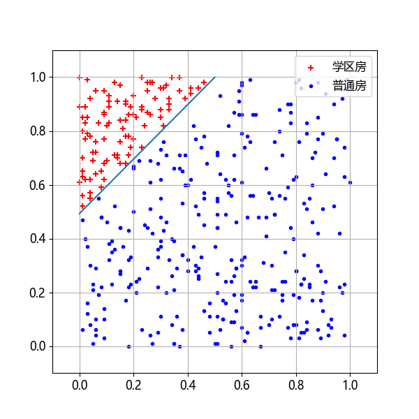
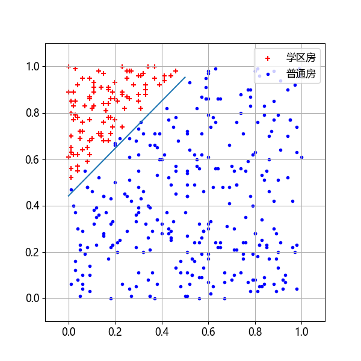

## 5.6 特征值的有效性【电子资源】

在 5.1 节中的表 5.1.1 中，我们还埋了一个伏笔：一共有六个字段，出去标签值“学区房”以外，还有五个特征值，在 5.3 节中使用了“横坐标、纵坐标”，在 5.4 节中使用了“面积、总价”，那么“朝向”这个特征有用吗？我们可以一起做以下几个试验。

- 试验一：“横坐标、纵坐标、朝向”作为特征值完成分类任务。
- 试验二：“横坐标、纵坐标、总价”作为特征值完成分类任务。
- 试验三：“横坐标、纵坐标、面积”作为特征值完成分类任务。

测试样本统一使用正类样本 $[0.2,0.8]$ 和负类样本 $[0.5,0.6]$ 来做对比。

### 5.6.1 试验一

表 5.6.1 试验一的样本数据

|样本|横坐标$x_1$|纵坐标$x_2$|朝向$x_3$|学区房$y$|
|-|-|-|-|-|
|1|0.44| 0.29|1|0| 
|2|0.44| 0.26|1|0|
|3|0.39| 0.92|0|1|
|4|0.17| 0.78|1|1| 
|...|...|...|...|...|

在【代码：H5_5_NN_client_1_sun.py】中，做以下修改：

```python
def load_data():
    data_loader.load_data([0, 1, 4, 3]) # x, y, 朝向, 学区房标签
    # data_loader.normalize_train_data() # 不需要归一化
    ...
def train(data_loader: DataLoader_5):
    ...
    W = np.zeros((3,1))
    B = np.zeros((1,1))
    ...
```

即：
- 在加载数据时，加载了“横坐标、纵坐标、朝向”为特征值，“学区房”为标签值，还要做归一化，因为面积值是一个较大的数字；
- 在训练模型时，把 $\mathbf W$ 变成 3×1 的形状，以对应三个特征值，所以前向计算公式变为

$$
z = x_{1} w_1 + x_{2} w_2 + x_{3} w_3  + b \tag{5.6.1}
$$

如果朝向是一个多项选择，比如“朝东、朝南、朝西、朝北”，那么必须把该字段分成四个字段，用独热（one-hot）编码表示。如 $[1,0,0,0]、[0,1,0,0]、[0,0,1,0]、[0,0,0,1]$ 分别表示朝东、朝南、 朝西、朝北。相应地，式（5.6.1）要变成 6 个权重值。

训练过程打印输出为：
```
...
Epoch 498, 训练集: loss 0.037069, accu 1.000000, 验证集: loss 0.037566, accu 1.000000
Epoch 499, 训练集: loss 0.037040, accu 1.000000, 验证集: loss 0.037564, accu 1.000000
权重值 w =
 [[-20.01760072] # 横坐标
 [ 20.13303452]  # 纵坐标
 [ -0.05432436]] # 朝向
偏置值 b =
 [[-10.03111957]]
```
可以看到在 $\mathbf W$ 的三个分量中，对应到横坐标和纵坐标的 $w$ 的数值（绝对值）很大，而朝向的权重很小，不在一个数量级上，这说明这个字段对标签值的学习影响不大。

然后可视化输出分界线如图 5.6.1 所示，可以看到分界线依然正确，因为 $\mathbf W[0,0]、\mathbf W[0,1]、\mathbf B[0,0]$ 这三个值的相对大小没有变化。


图 5.6.1 试验一的分界线可视化结果

训练结束后，使用测试数据做预测：一共四条数据，每条数据三个字段，对应三个特征值，而且故意把前两个样本和后两个样本设置为**只有朝向数据不同，而坐标相同**。

```python
                        #朝向0,        #朝向1
x = np.array([[0.2, 0.8, 0], [0.2, 0.8, 1],    # 正类坐标
              [0.6, 0.5, 0], [0.6, 0.5, 1]])   # 负类坐标
```
下面是测试结果，全部正确。
```
样本 [0.2 0.8 0. ] 预测值 [0.88780691] > 0.5, 是学区房。
样本 [0.2 0.8 1. ] 预测值 [0.89375136] > 0.5, 是学区房。
样本 [0.6 0.5 0. ] 预测值 [5.6849e-06] < 0.5, 不是学区房。
样本 [0.6 0.5 1. ] 预测值 [6.0427e-06] < 0.5, 不是学区房。
```
测试结果也说明了朝向 $x_3$ 对分类没有贡献。

### 5.6.2 试验二

试验二使用三个特征：横坐标、纵坐标、总价。

表 5.6.2 试验二的样本数据

|样本|横坐标$x_1$|纵坐标$x_2$|总价$x_3$|学区房$y$|
|-|-|-|-|-|
|1|0.77| 0.59|305|0|
|2|0.02| 0.77|432.5|1|
|3|0.63| 0.56|575|0|
|4|0.20| 0.77|361|1|
|...|...|...|...|...|...|...|

【代码：H5_5_NN_client_2_price.py】的数据部分加载 [0,1,5,3] 字段，对应表 5.6.2 中各字段，然后做归一化。在训练时，设置 $\mathbf W$ 为 3×1。

```python
def load_data():
    ...
    data_loader.load_data([0, 1, 5, 3]) # x, y, 价格, 学区房标签
    data_loader.normalize_train_data()  # 需要归一化价格数据
```

训练的过程也很顺利，误差一直在下降，准确率也很令人满意。打印输出如下：

```
...
Epoch 498, 训练集: loss 0.038369, accu 1.000000, 验证集: loss 0.031333, accu 1.000000
Epoch 499, 训练集: loss 0.038340, accu 1.000000, 验证集: loss 0.031311, accu 1.000000
```
从训练得到权重值可以看到，房屋价格特征的权重值很低。$\mathbf W、\mathbf B$ 之间的相对大小没有变化，图 5.6.2 中能正确地画出分界线。

```
权重值 w =
[[-20.2912]  # 横坐标权重值
 [ 20.1979]  # 纵坐标权重值
 [ -0.2432]] # 房屋价格权重值
偏置值 b = [[-9.8982]]
```



图 5.6.2 试验二的分界线可视化结果

最后使用四个测试样本来做两两的对比测试：

```python
                        #低价格,          #高价格
x = np.array([[0.2, 0.8, 300], [0.2, 0.8, 600],   # 正类坐标
              [0.6, 0.5, 300], [0.6, 0.5, 600]])  # 负类坐标
```

以下输出结果表明分类结果正确，预测时并没有理会价格 300 和 600 的不同。

```
样本 [  0.2   0.8 300. ] 的房子预测值 [0.90089073] 是学区房。
样本 [  0.2   0.8 600. ] 的房子预测值 [0.89227908] 是学区房。
样本 [  0.6   0.5 300. ] 的房子预测值 [0.00000529] 不是学区房。
样本 [  0.6   0.5 600. ] 的房子预测值 [0.00000482] 不是学区房。
```

### 5.6.3 试验三

试验二使用三个特征：横坐标、纵坐标、面积。如表 5.6.3 所示。

表 5.6.3 试验三的样本

|样本|横坐标$x_1$|纵坐标$x_2$|面积$x_3$|学区房$y$|
|-|-|-|-|-|
|1|0.77| 0.59|59| 0|
|2|0.02| 0.77|65| 1|
|3|0.63| 0.56|113|0|
|4|0.20| 0.77|54| 1|
|...|...|...|...|...|

在【代码：H5_5_NN_client_3_area.py】加载横坐标、纵坐标、面积数据并做归一化：

```python
def load_data():
    ...
    data_loader.load_data([0, 1, 2, 3]) # x, y, 面积, 学区房标签
    data_loader.normalize_train_data()  # 归一化面积数据
```

训练过程不如前两个试验顺利，准确率在 500 轮内没有达到 1.0：

```
...
Epoch 498, 训练集: loss 0.035533, accu 0.993750, 验证集: loss 0.027850, accu 0.995000
Epoch 499, 训练集: loss 0.035508, accu 0.993750, 验证集: loss 0.027843, accu 0.995000
权重值 w =
[[-19.4435]  # 横坐标权重
 [ 18.9781]  # 纵坐标权重
 [ -2.8332]] # 面积权重
偏置值 b = [[-8.3756]]
```
权重值的结果也有所不同，面积权重不再是不可忽视的，并且会影响分界线的可视化结果，如图 5.6.3，可以看到分界线稍微向下移动了一些，造成一些负类样本在线的上方。



图 5.6.3 试验三的分界线可视化结果

用四个样本做两两对比试验，即坐标相同、面积不同：
```python
                       #小面积,         #大面积
x = np.array([[0.2, 0.8, 50], [0.2, 0.8, 120],   # 正类坐标
              [0.5, 0.6, 50], [0.5, 0.6, 120]])  # 负类坐标
```
通过对比试验，分类结果还是正确的，说明面积值的影响虽然存在，但是不是特别明显，只有在分类线附近的样本才可能会被误判：

```
样本 [ 0.2  0.8 50. ] 的房子预测值 [0.95157315] 是学区房。
样本 [ 0.2  0.8 120.] 的房子预测值 [0.72741746] 是学区房。
样本 [ 0.5  0.6 50. ] 的房子预测值 [0.00128355] 不是学区房。
样本 [ 0.5  0.6 120.] 的房子预测值 [0.00017451] 不是学区房。
```
样本 2 的概率值是 0.72，因为面积是 120，比样本 1 的 50 要高很多，所以最后的分类预测值要比样本 1 低很多，说明它“犹豫”了一点点。
