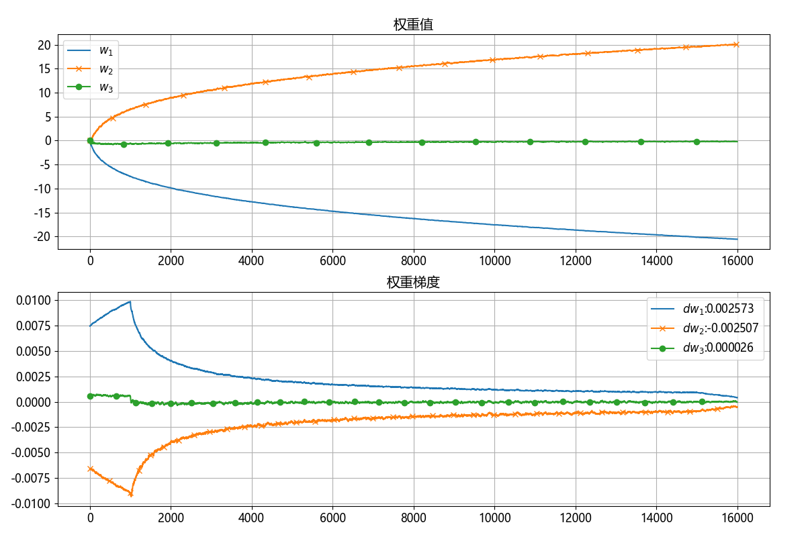
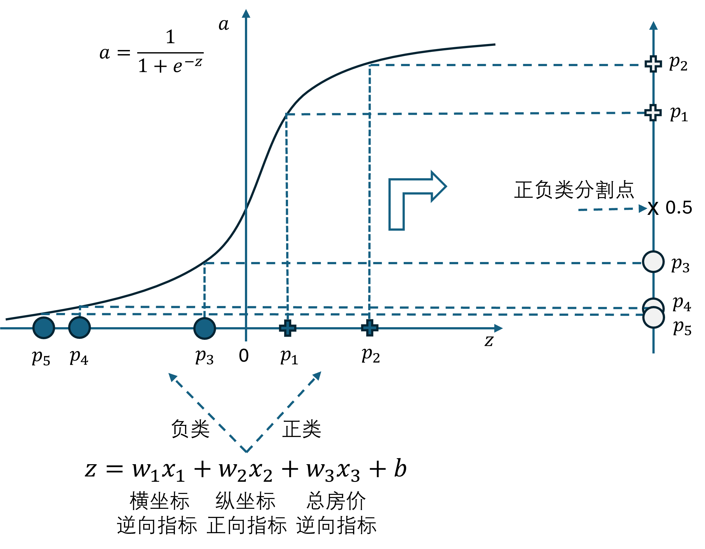
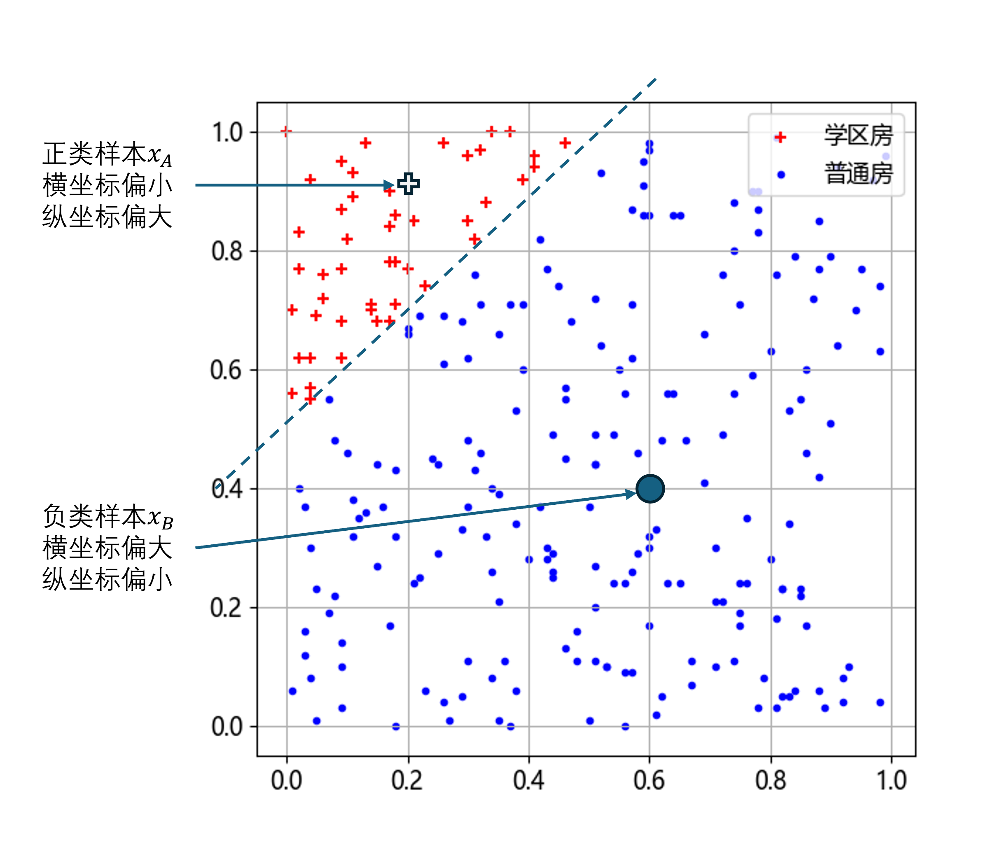

## 5.7 工作原理【电子资源】

上个小节我们通过具体试验知道了朝向、总价、面积三个特征值与横纵坐标一起训练时，得到的权重值很小。见表 5.5.1。

表 5.5.1 试验结果汇总

|试验|$w_1$|$w_2$|$w_3$|
|-|-|-|-|
|试验一（$w_3=$ 朝向）|-20.01|20.13|-0.054|
|试验二（$w_3=$ 总价）|-20.29|20.19|-0.243|
|试验三（$w_3=$ 面积）|-19.44|18.98|-2.833|

其中：

- 朝向的权重值 $w_3$ 与 $w_1,w_2$ 相比小了三个数量级；
- 总价的权重小两个数量级；
- 面积的权重小一个数量级。

为什么房价、朝向对分类基本没影响，但是面积对分类有影响呢？读者可以运行【代码：H5_6_data.py】得到以下统计数据表 5.7.2。

表 5.7.2 两类房子的统计数据

|类别|数量|朝向比例|平均总价|平均面积|
|-|-|-|-|-|
|学区房| 260|0.52|494.50|74.54|
|非学区房|1740|0.48|512.29|100.46|


对比学区房与非学区房的统计数据：

- 朝向是随机的，基本没有影响，因为不算是特征；
- 平均总房价 494.50 与 512.29 相差不大，所以有一点点影响；
- 对于面积特征，学区房的房屋面积普遍较小，平均值 74.54，而非学区房是 100.46，所以成为了较为明显的特征。

笔者以**试验二**为例进行了进一步的探索：以 0.5 的学习率和批大小为 10 训练了 100 轮，总共得到了六组数据（$w_1,w_2,w_3,dw_1,dw_2,dw_3$），每组 16000 个采样，即把每一次迭代时的 $w$ 和 $dw$ 都记录下来了，便于观察它们的变化情况，见图 5.7.1，具体数据在【数据：H5_6_history.txt】中，运行【代码：H5_6_test.py】可以得到彩色图。



图 5.7.1 权重值及其梯度值变化趋势

三个权重值都是 0 初始化。然后：

- $w_1$ 一路向下，一直到 -20 附近，这是因为 $dw_1$ 的均值为 0.002573，大于 0，根据梯度下降更新公式， $w_1 = w_1 - 0.5 \cdot 0.002573 \times 16000 \approx -20$；
- $w_2$ 正相反，一路向上一直到 20 附近，$dw_2$ 的均值为 -0.002507；
- $w_3$ 的梯度均值为 0.000026，所以它最后到达 -0.243 附近。

### 5.7.1 三个权重值的正负号问题

问题：$w_1, w_3$ 为什么是负的？而 $w_2$ 是正的？

- $w_1$ 负责横坐标特征值的映射，在原始数据中，正类样本集中在左上角即横坐标值较小的地方。在经过 $x_1 w_1$ 运算后把横坐标数据左右颠倒，变成了正类样本在负类样本右侧，便于后续用 Logit 函数分类；

- $w_2$ 是负责纵坐标特征的，它的情况与 $w_1$ 正好相反，正类样本位于纵坐标较大值的区域，所以它是正数；

- $w_3$ 负责价格特征，在表 5.7.2 中可以看到负类样本（非学区房）的平均总价要大一些，所以 $w_3$ 为负数把样本向左移动。

总之是由特征值是正向指标还是逆向指标决定的，图 5.7.2 说明了这一问题。



图 5.7.2 特征值与权重值的正负关系

### 5.7.2 三个权重值的数值大小问题

那么接下来的问题是：神经网络依靠什么机制做特征值识别？也就是说给与哪个特征值以多大的权重值？

要想知道这个原因，需要探查反向传播时 $w_1、w_2、w_3$ 的 $dw$ 值分别是多少，就能知道它们最终会收敛于什么值上。首先给出两个假设样本实例，便于后面说明运算过程。

- 正类样本的横坐标偏小，纵坐标偏大，朝向随机，如 $x_A=(0.2, 0.9, 0.49)$。
- 负类样本的横坐标偏大，纵坐标偏小，朝向随机，如 $x_B=(0.6, 0.4, 0.51)$。

其中，朝向随机意味着可以取归一化后的 $[0,1]$ 的中间值 0.5 附近，可以参考表 5.7.2 取值为 0.49、0.51。见图 5.7.3。



图 5.7.3 正类样本和负类样本的坐标值偏向不同

接下来看反向传播时的运算代码：

```python
def backward(self, X, Y, A):
    dZ = A - Y
    self.dw = np.dot(X.T, dZ) / m # 样本数
    ...
```
下面对两个样本进行反向传播运算。

正类样本 $x_A$，假设预测值为 $a=0.7，y=1$，则有：

$$
\begin{aligned}
dz&=a-y=0.7-1=-0.3 \\
dw_A&=x^{\top} \cdot dz=(0.2, 0.9, 0.49)^{\top}\cdot(-0.3)=(-0.06, -0.27, -0.147)^{\top}
\end{aligned}
\tag{5.7.1}
$$

负类样本 $x_B$，假设预测值为 $a=0.3，y=0$，则有：

$$
\begin{aligned}
dz&=a-y=0.3 - 0 = 0.3 \\
dw_B&=x^{\top} \cdot dz=(0.6, 0.4, 0.5)^{\top}\cdot(0.3)=(0.18, 0.12, 0.153)^{\top}
\end{aligned}
\tag{5.7.2}
$$


两次迭代的梯度最后是要相加的，所以有：

$$
dw = dw_A + dw_B = \begin{pmatrix} -0.06 \\ -0.27 \\ -0.147 \end{pmatrix} + \begin{pmatrix} 0.18 \\ 0.12 \\ 0.153 \end{pmatrix}=\begin{pmatrix} 0.12 \\ -0.15 \\ 0.006 \end{pmatrix}
\tag{5.7.3}
$$

式（5.7.3）中的三个分量就是 $dw_1、dw_2、dw_3$，其中 $dw_3$ 比其它权重值小两个数量级且大于 0，这与图 5.7.1 下图的情况一致。另外有两点说明：

- 在我们的例子中，样本 $x_A$ 和样本 $x_B$ 的预测值 $z$ 都不是很极端如 0.99 或 0.01，而是0.7、0.3。而在图 5.7.1 中，大概在横坐标为 4000 次迭代之后，对正类负类样本的预测值分别可以达到 0.9 以上或 0.01 以下，这样一来，$dw$ 的值就会再小两个数量级；
- 从表 5.7.2 可以看到，在本章的样本中，负类样本的数量是正类的 6 倍多，而式（5.7.1）只展示了一个正类样本$+$一个负类样本的情况，会不会有所出入？实际情况是，在下面的打印输出中显示的一批十个样本的误差 $dz$ 中，有两个正类，所以有两个小于 0 的误差值，而其它负类样本的误差都非常小（除了一个值 0.25095959 以外），这样就会使得两类样本均衡。而发生这种现象的原因是负类样本分布广泛（方差较大），经过线性变换后很容易距离 0 点很远（很小的负数），从而使得分类值 $a$ 很小。

```
dZ=[
    0.01788289, 0.00124754, 0.00020502, 0.00009769, -0.32393873,
    0.00004529, 0.25095959,-0.35088802, 0.02757233,  0.07000927
]
```

这就解释了**神经网络决定权重值大小的工作原理**，其根本原因就是由于特征值对损失函数贡献的不同导致了反向传播的力度不同，累积多次后：

- 有用的特征值会获得绝对值较大的权重值；
- 无用的特征值会获得接近于 0 的权重值，比如本例试验一中的 $w_3$；
- 而稍微有点儿用的特征值会获得大于 0 但远远小于有用的特征值的权重，如试验二和试验三中的 $w_3$。

这种特性使得神经网络可以自动筛选出有用和无用的特征值，而无需人的干预。
