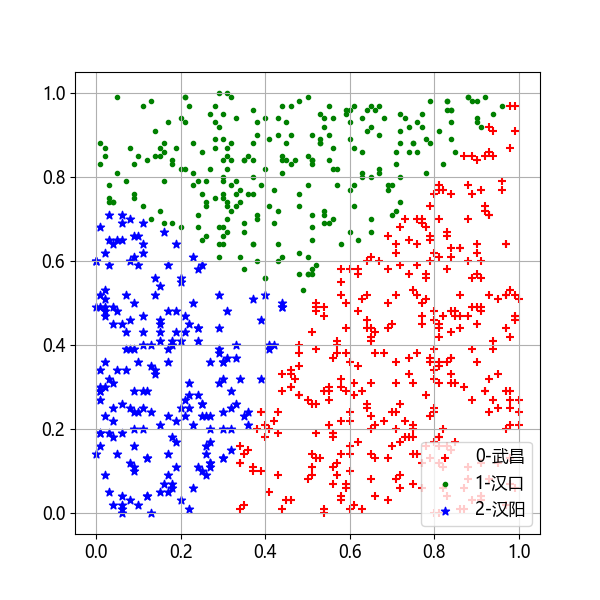
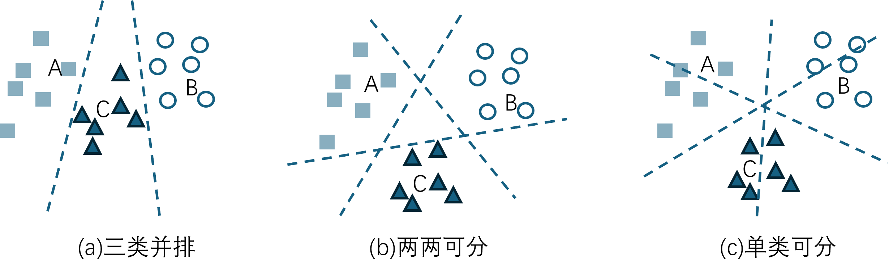

## 6.1 问题与建模

董大白上学的城市中还有很多河流，其中有一些较大的河流会影响到整个城市的规划。有三个区，就如同著名的武汉三镇中的武昌、汉口、汉阳，每个区内各自有很多房子。现在有了这些房子的地理坐标位置，也知道它们各自属于哪个区，如表 6.1.1 所示的部分样本，一共有 1000 个这样的样本。

表 6.1.1 部分样本示例

|样本|横坐标 $x_1$|纵坐标 $x_2$|区域 $y$|
|-|-|-|-|
|1|0.60|0.77|1|
|2|0.13|0.34|2|
|3|0.91|0.56|0|
|4|0.85|0.85|1|
|5|0.29|0.38|2|
|6|0.34|0.14|0|
|...|...|...|...|

**问题：如何用神经网络画出三个区域的分界线？**

### 问题分析

这是一个典型的线性多分类问题，由于是二维特征，所以我们先来做一个数据可视化，见图 6.1.1。

图 6.1.1 三个区域的房屋分布图

其中，【+】表示 0 区（武昌），【·】 表示 1 区（汉口），【*】表示 2 区（汉阳）。可以看到三个区之间的划分还是比较整齐的，似乎可以从中心点画三条射线来分割三个区域。注意【+】样本区域的左侧边缘并非一条直线，而是一条折线。

从特征上看，$x_1、x_2$ 可以唯一决定一个点的所属区域，而区域本身也有唯一的编码 0、1、2，可以用作标签值，但是还需要加工才能使用。

#### 1. 线性多分类的基本概念

图 6.1.2 是线性多分类的基本概念，从类别位置相互关系上看大概有三种分法（以三分类为例）：

- 图 6.1.2（a），A、B、C三类顺序排列，用两条分界线分开；
- 图 6.1.2（b），三类成犄角形分列，用三条分界线分开，但是每条分界线只保证一侧分类正确；
- 图 6.1.2（c），每条分界线能保证二分类正确，但是可能会夹杂着其他类。

图 6.1.2 线性多分类的基本概念

#### 2. 多特征与线性可分的关系

在图 6.1.2 中的例子其实都是二维特征的线性分类问题，那么如果特征数量大于 2 时，还可以做线性分类吗？

比如数据有三个特征，那么可以映射到三维空间中，同样可以做线性分类，分类边界从二维空间中的直线变成了三维空间中的平面。大于三个特征时人类无法想象，但是数学表达上毫无困难，仍然可以用一个超平面把几类样本分开。当然，上述结论的前提是给出的问题是**线性可分**的。当必须用曲线、曲面才能分开几类样本时，就需要用到第 10 章中的知识来解决问题。所以，是否线性可分与特征数量无关，但是特征越来越多时线性可分的可能性会越来越小。

#### 3. 多分类与多标签的区别

多分类学习中，虽然有多个类别，但是每个样本只属于一个类别。但有另外一种情况也很常见，比如一幅图中，既有蓝天白云，又有花草树木，那么这张图片可以有两种标注方法：

- 标注为“风景”，而不是“人物”，属于风景图片，这叫做分类；
- 被同时标注为“蓝天”、“白云”、“花草”、“树木”等多个标签，这样的任务不叫作多分类学习，而是“多标签”学习（multi-label learning），本书不涉及这类问题。
