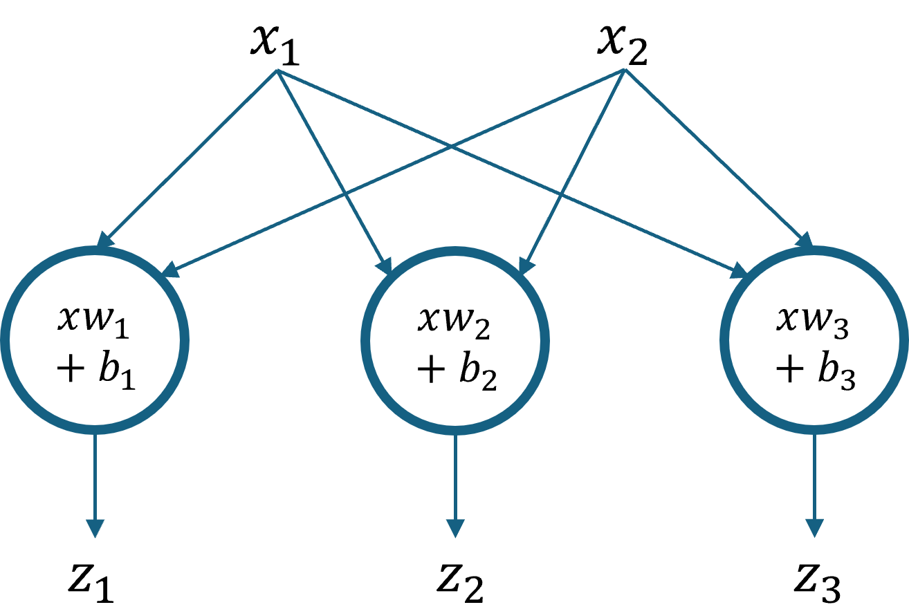

## 6.2 多分类函数

传统的多分类问题有三种解法。

- 一对一方式：假设一共有三个类别 A、B、C，每次先只保留两个类别的数据，训练一个分类器，则一共需要训练 (A|B)、(B|C)、(A|C) 三个分类器。推理时，把被预测样本 X 放到三个分类器中，得到三个分类结果，其中肯定有两个分类器输出一样的结果，则就是最终结果。

- 一对多方式：假设一共有三个类别 A、B、C，得到 (A|BC)、(B|AC)、(C|AB) 三个分类器。推理时，如果分类器 (A|BC) 预测 X 是 A 类，则就是 A 类，否则就再使用其它两个分类器之一来确定是 B 类还是 C 类。

- 多对多方式：假设有 4 个类别 A、B、C、D，我们可以把 AB 算作一类，CD 算作一类，训练一个分类器 1；再把 AC 算作一类，BD 算作一类，训练一个分类器2。推理时，第 1 个分类器告诉你是 AB 类，第二个分类器告诉你是 BD 类，则做“与”操作，结果就是 B 类。

### 6.2.1 更高效的方法

图 6.2.1 从二维特征变成三维特征

### 6.2.2 Softmax 求导

### 6.2.3 分类计算
