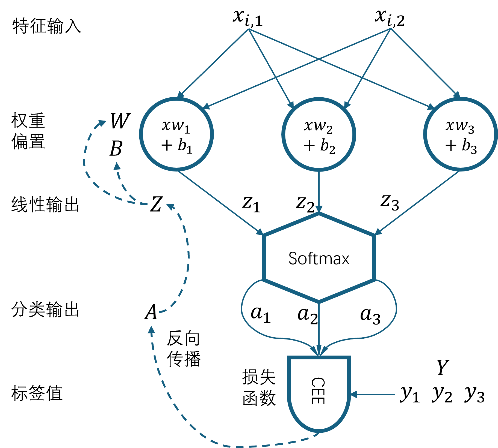
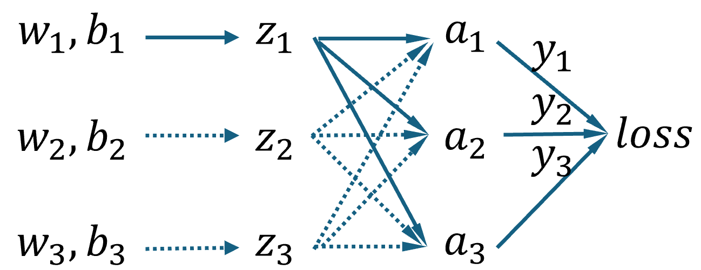
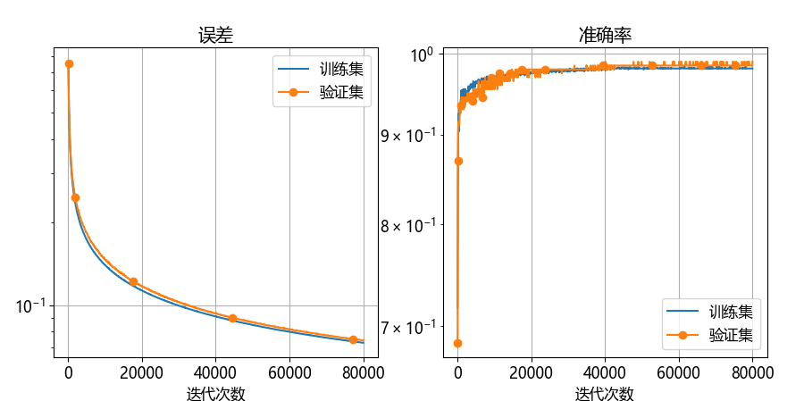

## 6.4 神经网络

图 6.4.1 是本例的神经网络模型。

图 6.4.1 二维特征三分类的神经网络模型

与前几章不同，图 6.4.1 把流程画成纵向的了，是为了让 $\mathbf w、\mathbf b、\mathbf z、\mathbf a、\mathbf y$ 的形状与实际的矩阵形状相符。$x_{i,1}、x_{i,2}$ 是一个样本的两个特征值，在后面的公式推导中简写为 $x_1、x_2$。

由于是三分类，Softamx 分类函数要求有三个输入$z_1、z_2、z_3$，而一个神经元虽然可以有多个输入，但是只能有一个输出，所以需要三个神经元来完成任务。而样本有两个特征值，这就要求每个神经元接收两个特征值的输入。这样的话，$\mathbf X \in \mathbb{R}^{1 \times 2}，\mathbf W \in \mathbb{R}^{2 \times 3}，\mathbf B \in \mathbb{R}^{1 \times 3}$。它们的具体形式为：

$$
\begin{aligned}
\mathbf x &= \begin{pmatrix} x_1 & x_2\end{pmatrix} \\
\mathbf W &= \begin{pmatrix} \mathbf w_1 & \mathbf w_2 & \mathbf w_3\end{pmatrix}=\begin{pmatrix} w_{1,1} & w_{1,2} & w_{1,3}\\w_{2,1} & w_{2,2} & w_{2,3}\end{pmatrix} \\
\mathbf B &= \begin{pmatrix} b_1 & b_2 & b_3\end{pmatrix}
\end{aligned}
$$

Softmax 输出 $a_1、a_2、a_3$，损失函数是多分类交叉熵损失函数（cross entropy error，CEE），计算 $a_1、a_2、a_3$ 与 $y_1、y_2、y_3$ 之间的误差。

### 6.4.1 前向计算

### 6.4.2 反向传播

图 6.4.2 计算图

### 6.4.3 网络训练

图 6.4.3 训练过程中的误差与准确率的变化
