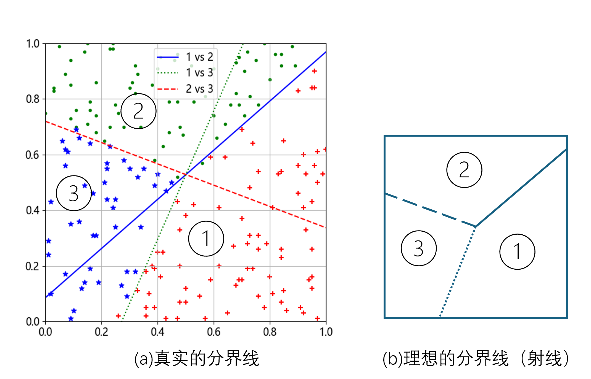
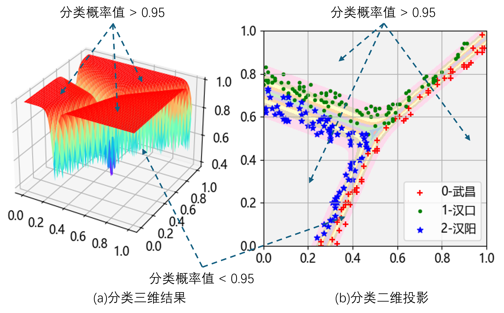
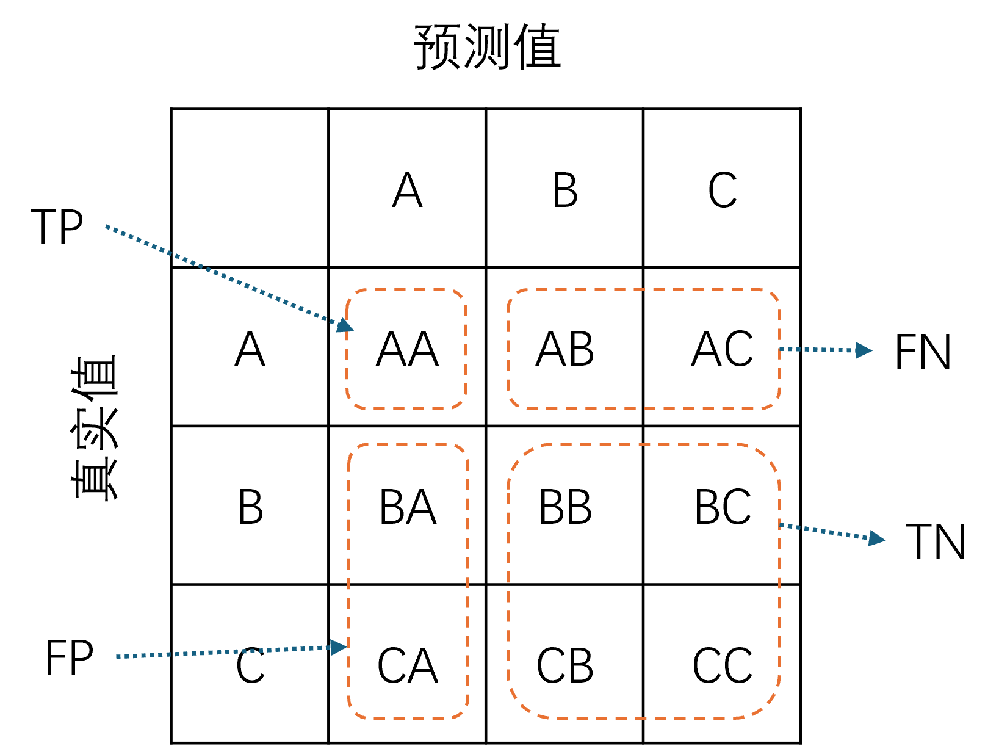
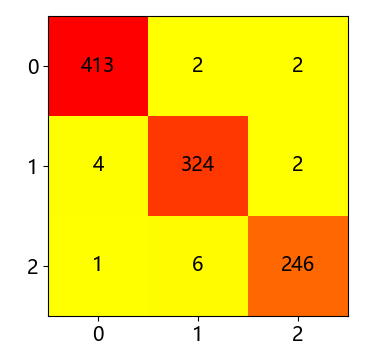

## 6.5 可视化分类结果

在上一小节训练结束后，我们先保存结果到文件中。以方便以后使用，避免重复训练。见【代码：H6_5_Visualize.py】：

```python
def save_result(nn):
    file_name = "weights6.txt"
    file_path = os.path.join(os.path.dirname(os.path.abspath(__file__)), file_name)
    np.savetxt(file_path, nn.W)
    file_name = "bias6.txt"
    file_path = os.path.join(os.path.dirname(os.path.abspath(__file__)), file_name)
    np.savetxt(file_path, nn.B)
```
在本小节中把结果加载到内存里：
```python
def load_result():
    file_name = "weights6.txt"
    file_path = os.path.join(os.path.dirname(os.path.abspath(__file__)), file_name)
    W = np.loadtxt(file_path)
    file_name = "bias6.txt"
    file_path = os.path.join(os.path.dirname(os.path.abspath(__file__)), file_name)
    B = np.loadtxt(file_path)
    return W, B
```
进一步加载到神经网络中：
```python
def load_nn(W, B):
    nn = NeuralNet_6(None, W, B)  # 指定 W,B 的值作为初始化值
    return nn
```

### 6.5.1 绘制分界线



图 6.5.1 用权重值计算出来的分界线

### 6.5.2 用概率决定边界



图 6.5.2 分类结果可视化

### 6.5.3 混淆矩阵



图 6.5.3 三分类混淆矩阵定义



图 6.5.3 混淆矩阵结果
