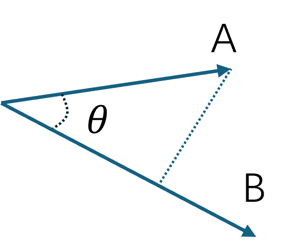
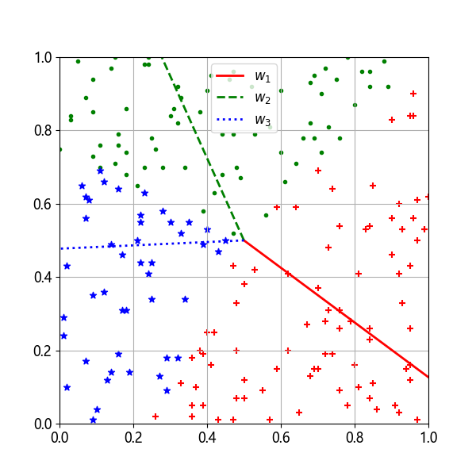
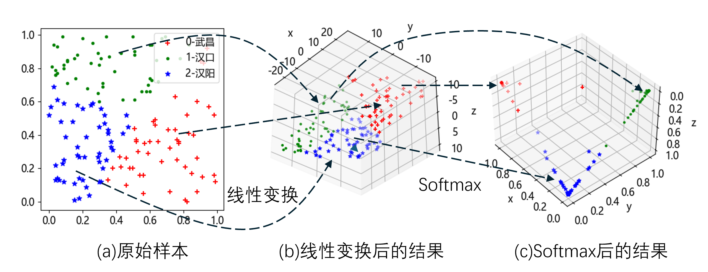

## 6.6 工作原理

因为在可视化分类结果时没有形成射线，所以笔者怀疑有关分界线的解释，就如同二分类一样，那个所谓的分界线其实是应该用来做二维空间到一维空间的映射的。下面我们研究一下矩阵 $\mathbf W、\mathbf B$ 的含义。先从线性变换说起，看式（6.6.1）：

$$
\begin{aligned}
z_{1}&=x_{1} w_{1,1} + x_{2} w_{2,1} + b_1\\
z_{2}&=x_{1} w_{1,2} + x_{2} w_{2,2} + b_2\\
z_{3}&=x_{1} w_{1,3} + x_{2} w_{2,3} + b_3
\end{aligned}
\tag{6.6.1}
$$

式（6.6.1）对每个特征值 $x_1、x_2$ 做三次线性运算，最后得到 $z_1、z_2、z_3$ 三个新的特征值。对三类样本各取 5 个样本，它们线性变换后的结果输出如下：

```
第1类线性变换结果：
# z1           z2          z3
[[12.65359861 -7.27896516 -5.37463345]
 [ 5.65532013 -3.06401077 -2.59130936]
 [ 5.43811044 -0.21462456 -5.22348588]
 [ 7.67415433 -8.00509093  0.33093659]
 [11.86813379 -6.6809849  -5.18714889]]
```
可以观察到第 1 类样本的第一列值 $z_1$ 大于其它两列值。
```
第2类线性变换结果：
#  z1           z2            z3
[[-21.79650904  12.13990717   9.65660187]
 [-20.1232091   14.33560187   5.78760722]
 [ -4.91923701   9.24163707  -4.32240006]
 [ -8.00367659   8.51303739  -0.5093608 ]
 [ -1.32497811   3.75581399  -2.43083589]]
```
第 2 类样本的第二列值 $z_2$ 大于其它两列值。
```
第3类线性变换结果：
#  z1           z2            z3
[[  1.43886536  -7.64420477   6.20533941]
 [-11.66086635   4.88181416   6.77905219]
 [ -6.42027788  -2.31561978   8.73589766]
 [-15.60617069   5.26684507  10.33932561]
 [-10.25422178   2.76350154   7.49072024]]
 ```
第 3 类样本的第三列值 $z_3$ 大于其它两列值。

以上结果已经为后续的 Softmax 计算奠定了基础，可以得到正确的分类结果。那么这是怎么做到的呢？

### 6.6.1 权重值的含义

 

图 6.6.1 向量点乘的几何含义

 

图 6.6.2 权重矩阵所代表的三个向量在样本图中的方向

### 6.6.2 另外一种解释


 

图 6.6.3 通过空间变换得到分类输出
