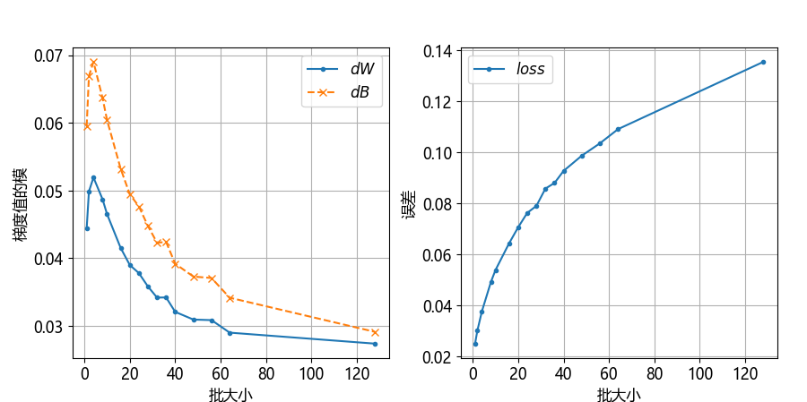
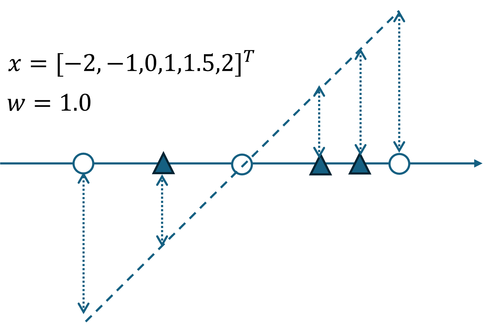
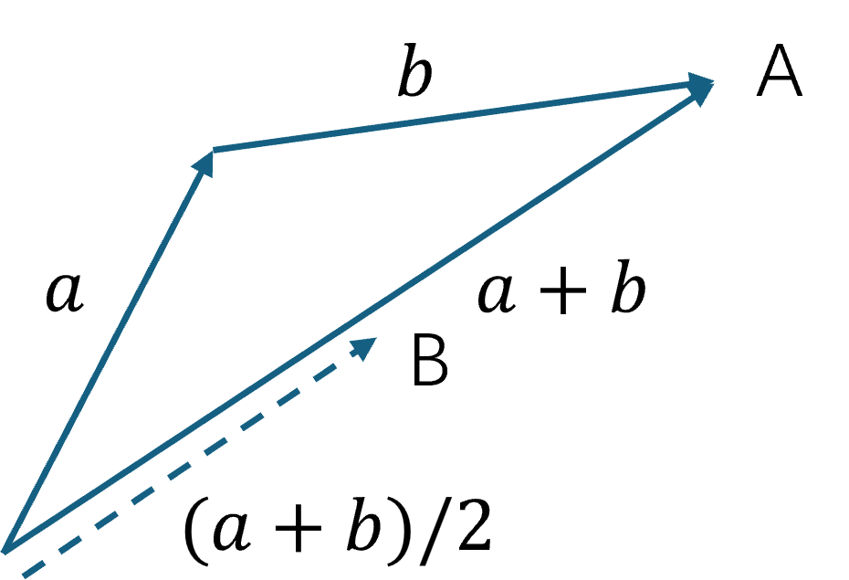
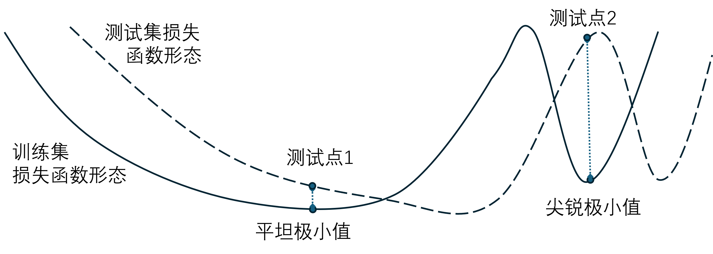

## 6.7 学习率与批量

在梯度下降公式中：

$$
w_{t+1} = w_t - \eta\frac{1}{m} \sum_i^m \nabla loss(w,b)
\tag{6.7.1}
$$

其中，$\eta$ 是学习率，$m$ 是批量。所以，学习率（learning rate）与批量（batch size）是对梯度下降影响最大的两个因子。

### 6.7.1 批量与梯度的关系

图 6.7.1 不同批量情况下平均梯度值与最终误差值的比较

### 6.7.2 原因解释

图 6.7.2 两批各三个样本做两次回归任务的梯度下降

图 6.7.3 一批六个样本做一次回归任务的梯度下降

图 6.7.4 向量相加的概念

### 6.7.3 调整学习率以适应批量

#### 1. 调整的方法

#### 2. 验证学习率与批量的关系

图 6.7.5 与批量相匹配的学习率可以使得误差保持一致

### 6.7.4 批量的选择

#### 1. 优化能力

如图 6.7.6 大批量和小批量数据在训练时的损失函数曲线不同

#### 2. 泛化能力

如图 6.7.7 训练集和测试集的损失函数曲线不同

#### 3. 比较
