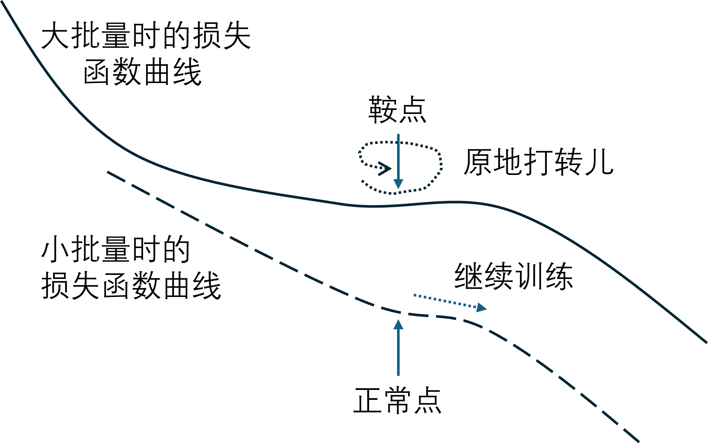

## 6.7 学习率与批大小【电子资源】

在梯度下降公式中：

$$
w_{t+1} = w_t - \eta\frac{1}{m} \sum_i^m \nabla loss(w,b)
\tag{6.7.1}
$$

其中，$\eta$ 是学习率，$m$ 是批量。所以，学习率（learning rate）与批量（batch size）是对梯度下降影响最大的两个因子。

### 6.7.1 批量与梯度的关系

有一种观点认为“10个样本产生的梯度比5个样本更大”。这种观点是否正确呢？让我们用试验来说话！

在【代码：H6_7_BatchSize_Error.py】中，我们设计了这样一个试验（代码有节略）：

```python
def train(data_loader: DataLoader_6):
    epoch = 500
    lr = 0.5
    test_batch_size = [1,2,4,8,10,16,20,24,28,32,36,40,48,56,64,128] # 试验的批量
    for batch_size in test_batch_size:
        W = np.zeros((2,3)) # 初始化为 0
        B = np.zeros((1,3))
        nn = NeuralNet_6_7(data_loader, W, B, lr=lr, batch_size=batch_size)
        training_history, dw, db = nn.train(epoch)
        # 计算每一步迭代的 w,b 的模
        dw = np.array(dw) # 把列表变成数组，axis=0 为步数
        db = np.array(db)
        dw_mean = np.mean(np.linalg.norm(dw, axis=(1,2))) # 计算模 dw
        db_mean = np.mean(np.linalg.norm(db, axis=(1,2))) # 计算模 db
```
条件设置：
- 一共有 16 组批量，最小为 1，最大为 128；
- 统一设置学习率为 0.5，训练轮数为 500 以保持稳定复现；
- 在每一步梯度更新的时候，都记录 $d\mathbf W、d\mathbf B$ 的值。由于本例中 $\mathbf W \in \mathbb{R}^{2 \times 3}，\mathbf B \in \mathbb{R}^{1 \times 3}$，而且有正有负，所以计算它们各自的模（二范数）作为梯度大小的表征，并且求平均。

运行后把结果绘制在图 6.7.1 中。


图 6.7.1 不同批量情况下平均梯度值与最终误差值的比较

先看左图中的 $d\mathbf W、d\mathbf B$ 的变化，根据式（6.4.7）$d\mathbf B=\frac{1}{m} \mathbf 1^{\top} \mathbf (\mathbf A - \mathbf Y)$，因为它是直接用 $\mathbf A-\mathbf Y$ 得到的，所以最能反应梯度的大小。结论是批量越大，梯度越小。这二者都会除以批量 $m$，所以 $m$ 的大小并不是决定因素。最开始时在批量为 1、2、4 时有一个小的上升，可以忽略不记，应该是样本的方差引起的。

右图中 loss 值在学习率始终为 0.5 、500 轮训练的情况下，会随着批量的增加而增加。

结论是：**梯度会随着批量的增加而减小，从而造成梯度更新缓慢，误差不能很快降低**。

### 6.7.2 原因解释

原因其实很简单，就是因为在独立同分布的前提下，批量大的时候，产生的误差会比较小。图 6.7.2 和图 6.7.3 给出了一种简单的解释。


图 6.7.2 两批各三个样本做两次回归任务的梯度下降

假设在一维特征的回归任务中（如第 1 章的例子）目前的回归线 $w=1.0，\eta=0.1$，批量为 3。第一次梯度下降的情况是：

$$
\begin{aligned}
x&=[-2,0,2]^{\top}, y=[0,0,0]^{\top}, w=1, b=0 \\
z&= xw+b=[-2,0,2]^{\top} \cdot 1 + 0=[-2,0,2]^{\top}\\
dz &= z - y = [-2,0,2]^{\top} \\
dw &= \frac{1}{3} x^{\top} \cdot dz = \frac{1}{3}[-2,0,2]\cdot [-2,0,2]^{\top}=2.667 \\
w &= w - \eta \cdot dw = 1 - 0.1 \cdot 2.667 = 0.733
\end{aligned}
\tag{6.7.2}
$$

第二次梯度下降的情况是：

$$
\begin{aligned}
x&=[-1,1,1.5]^{\top}, y=[0,0,0]^{\top}, w=0.733, b=0 \\
z&= xw+b=[-1,1,1.5]^{\top} \cdot 0.733 + 0=[-0.733,0.733,1.099]^{\top}\\
dz&= z - y = [-0.733,0.733,1.099]^{\top} \\
dw&= \frac{1}{3} x^{\top} \cdot dz = \frac{1}{3}[-1,1,1.5]\cdot [-0.733,0.733,1.099]^{\top}=1.038 \\
w&= w - \eta \cdot dw = 0.733 - 0.1 \cdot 1.038 = 0.629
\end{aligned}
\tag{6.7.3}
$$

再看图 6.7.3，同样是这六个样本，起始条件也相同，只做一次梯度下降。


图 6.7.3 一批六个样本做一次回归任务的梯度下降

计算过程为：

$$
\begin{aligned}
x&=[-2,-1,0,1,1.5,2]^{\top}, y=[0,0,0,0,0,0]^{\top}, w=1, b=0 \\
z &= xw+b=[-2,-1,0,1,1.5,2]^{\top} \cdot 1 + 0=[-2,-1,0,1,1.5,2]^{\top}\\
dz &= z - y = [-2,-1,0,1,1.5,2]^{\top} \\
dw &= \frac{1}{6} x^{\top} \cdot dz = \frac{1}{6}[-2,-1,0,1,1.5,2]\cdot [-2,-1,0,1,1.5,2]^{\top}= 2.042\\
w &= w - \eta \cdot dw = 1 - 0.1 \cdot 2.042 = 0.796
\end{aligned}
\tag{6.7.4}
$$

从结果看，式（6.7.2）和式（6.7.3）用了两次梯度下降把 $w$ 值减低到 0.629，而式（6.7.4）用一次梯度下降得到 $w=0.796$，显然是前者的效果好，因为我们的目标是 $w=0$。

图 6.7.4 用比较简洁的方法说明了同样的道理。


图 6.7.4 向量相加的概念

图 6.7.4 的 $a、b$ 相当于是各三个样本的两次梯度下降，而向量 $a+b$ 相当于是六个样本做一次梯度下降，虽然目标点一致都是 A，但是由于两批数据合并，所以要除以 2。$|a|+|b| > |a+b|$，所以 $\frac{|a|+|b|}{2} > \frac{|a+b|}{2}$，即两次运算可以达到 A 点，但是合并为一次运行只能达到 B 点。

有些读者可能会认为如果不除以 2 就会得到相同的效果，确实如此。但是在实际训练时，如果不除以批量值，很可能会造成梯度爆炸。

### 6.7.3 调整学习率以适应批量

#### 1. 调整的方法

在式（6.7.4）的情况下，如果学习率为 0.185，则 $w = 1 - 0.185 \cdot 2.042=0.622$，效果会好于批量为 3 时的两次迭代。批量是前者的 2 倍，学习率是前者的 1.85 倍，所以学习率的变化应该小于等于批量的变化。

一个极端的情况是，当批量为 1 时，即单个样本，由于噪音的存在，我们不能确定这个样本所代表的梯度方向就是正确的方向，但是我们又不能忽略这个样本的作用，所以往往采用很小的学习率。这种情况很适合于 online-learning 的场景，即流式训练。

使用小批量的好处是可以克服单样本的噪音，此时就可以使用稍微大一些的学习率，让收敛速度变快，而不会由于样本噪音问题而偏离方向。从偏差方差的角度理解，单样本的偏差概率较大，多样本的偏差概率较小，而由于独立同分布（I.I.D.）的假设存在，多样本的方差是不会有太大变化的，即 16 个样本的方差和 32 个样本的方差应该差不多，那它们产生的梯度的方差也应该相似。

有两种建议：

- 批量和学习率成线性缩放。即批量增加一倍，学习率也增加一倍；
- 批量增加 $m$ 倍，学习率增加 $\sqrt{m}$ 倍。用 $\sqrt{m}$ 的原因是图 6.7.1 中右图的曲线形态是非线性的。

#### 2. 验证学习率与批量的关系

为了验证学习率与批量的关系，我们再设计一个试验，见表 6.7.1。

表 6.7.1 不同的批量匹配不同的学习率

|批量|1|2|4|8|16|32|64|128|
|-|-|-|-|-|-|-|-|-|
|学习率|0.05|0.1|0.2|0.5|1|1.5|2|4.0|

训练 500 轮以保证稳定收敛，得到它们最终的验证集误差，显示在图 6.7.5 中。


图 6.7.5 与批量相匹配的学习率可以使得误差保持一致

说明：

- 位于下方的折线是 8 次试验所形成，批量为横坐标（对数坐标绘制），对应的圆点是 500 轮训练后得到的误差值，数字是对应的学习率；
- 位于上方的曲线是对照组试验，不管多大的批量，总是用 0.05 学习率训练。

可以从试验中得到直观的认识：大的批数值应该对应大的学习率，否则收敛很慢；小的批数值应该对应小的学习率，否则会收敛不到最佳点。

### 6.7.4 批量的选择

所以，应该先选批量，再确定学习率。直观上看，大数值的批量甚至全批量可以带来很准确的梯度方向，应该尽量选大批量。但是在实践中有两个很有趣的现象打破了人们的这种美好的愿望。

#### 1. 优化能力

小批量可以帮助克服鞍点，如图 6.7.6 所示。



如图 6.7.6 大批量和小批量数据在训练时的损失函数曲线不同

在大批量或全批量的损失函数上，当训练达到鞍点时会原地打转儿。此时如果使用小批量来做训练，它的损失函数曲线如下方的虚线所示，在同一个位置上不是鞍点，而是一个正常的可以梯度下降的点。


#### 2. 泛化能力

小批量有助于提高测试准确率，如图 6.7.7 所示。


如图 6.7.7 训练集和测试集的损失函数曲线不同

小批量有助于收敛到平坦极小值（flat minima），而大批量可能会一下子陷入到尖锐极小值（sharp minima）。因为小批量带来的噪音会帮助梯度下降算法逃脱尖锐极小值。

测试集的损失函数形态很可能与训练集不同。在平坦极小值处的测试点 1 的结果与训练集的预测结果相差无几，但是在尖锐极小值处测试点 2 的结果与训练集就相差很远。

#### 3. 比较

最后比较一下小批量和大批量的优缺点，见表 6.7.2。

表 6.7.2 两种批量的优缺点比较

||小批量|大批量|
|-|-|-|
|并行计算|不方便|方便|
|可得的最小误差|小|大|
|收敛速度|快|慢|
|更新权重值次数|多|少|
|训练一轮的时间|慢|快|
|梯度表现|有噪音|稳定|
|优化能力|更好|不好|
|泛化能力|更好|不好|

结论：

- 通常我们使用小批量训练，如 32，64 等等；
- 学习率要根据批量的大小进行调整，批量越大，学习率越大。
