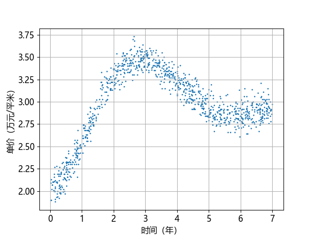
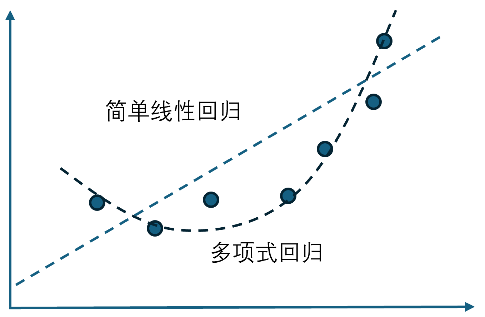
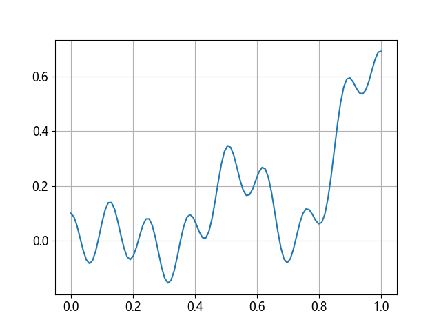

## 7.1 问题与建模

终于毕业了，但是董大白没有打算在工作地买房，他觉得不如租房方便，尤其是考虑到上下班问题，在公司附近租一个房子更划算，每天能节省至少 1 个多小时的通勤时间。但是他很关心家乡的房价，想给父母买个房。家乡是一个三线城市，他统计了最近 7 年的商品房的单价（万元/平米），一共 1000 个样本，表 7.1.1 中列出了部分样本。这些数据对于预测未来房价的走向有很重要的意义。

表 7.1.1 某三线城市最近7年的商品房单价

|样本|年份（小数）$x$|商品房单价（万元/平米）$y$|
|-|-|-|
|1|5.00 |2.93|
|2|4.88 |2.95|
|3|1.51 |2.95|
|4|6.83 |2.91|
|...|...|...|

其中的年份是小数，比如 4.88，可以用 $0.88 \times 365=321$，表示第 4 年的第 321 天的统计数据。

**问题：查询第二年零两个月、第五年零七个月的商品房的平均单价。**

### 7.1.1 问题分析

在第 1~3 章中，我们通过简单的房价预测由浅入深地学习了线性回归，从本章开始的连续三章中，我们将学习**非线性**的回归问题在神经网络中的解决方案。在表 7.1.1 中，可以把年份看作是自变量（特征值）$x$，把单价看作是因变量（标签值）$y$，这样就可以建立起模型。

由于是二维数据，所以可以先做可视化，如图 7.1.1 所示。



图 7.1.1 样本数据可视化

图 7.1.1 中，横坐标表示过去的年份，0 就是 2017 年，以此类推。在前三年中房价一直处于上升趋势，在三线城市也不例外。从第 4 年时开始回归理性，当然也有政策控制的因素。前年的时候处于低点，而去年又有缓慢抬头的趋势。

以下是样本数据的基本信息。

```
--- X (1000, 1) ---         --- Y (1000, 1) ---
最大值: [7.]                最大值: 3.73
最小值: [0.01]              最小值: 1.88
均值: [3.55398]             均值: 2.9668999999999994
标准差: [2.03249835]        标准差: 0.39658238740518975
```
### 7.1.2 经典解决方案

在经典的机器学习中，对于非线性回归问题可以把 $x$ 升维到 $x^2、x^3、\cdots$，然后使用多项式回归来解决问题：

$$
y = w_1 x + w_2 x^2 + w_3 x^3 + \cdots \tag{7.1.1}
$$

其效果如图 7.1.2 所示，其中，简单线性回归只能用一条直线拟合数据，误差较大，而多项式回归可以生成拟合曲线。



图 7.1.2 简单线性回归和多元线性回归

非线性回归一般用于拟合一些复杂的函数曲线，所以又叫做曲线拟合。式（7.1.1）的这种方法对于本章中的房价拟合问题可以胜任，但是对于稍微复杂一些的曲线就非常吃力甚至无能为力了，比如下面这个函数：

$$
y=0.4x^2 + 0.3x\sin(15x) + 0.1\cos(50x) \tag{7.1.2}
$$

其在 $[0,1]$ 区间内的函数图像如图 7.1.3 所示，多项式回归无法准确地拟合这种曲线。



图 7.1.3 复杂的复合函数曲线

所以，我们在本章中要学习如何用神经网络来拟合这类复杂曲线，虽然图 7.1.1 的例子比较简单，但是我们使用的方法是通用的，只需要多增加神经元就可以完成复杂任务。
