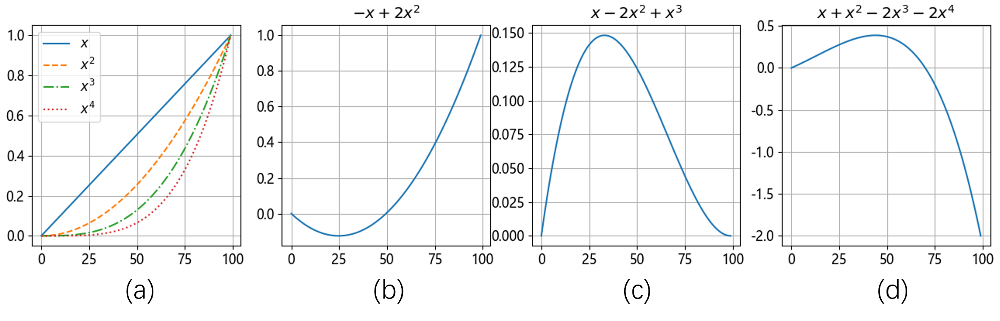
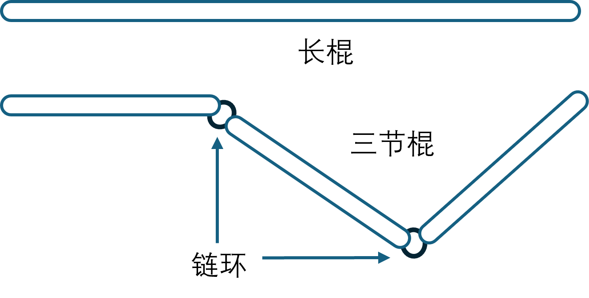

## 7.2 从线性到非线性

既然多项式回归可以完成类似的任务，我们不妨先研究一下它的原理。比如在 $[0,1]$ 之间均匀生成了 100 个数，然后分别计算它们的平方、三次方、四次方，如【代码：H7_2_Polynomial.py】所示。

```python
    x1 = np.linspace(0, 1, 100)
    x2 = x1 * x1 # 平方
    x3 = x2 * x1 # 三次方
    x4 = x3 * x1 # 四次方
```
在图 7.2.1（a）中展示了它们各自的曲线。接下来，分别用这四种曲线进行不同组合，得到不同的组合效果，如图 7.2.1 中的后三张子图。



图 7.2.1 多项式回归的组合效果

对于图 7.2.1 中后三张子图的解释如下：

- 图 7.2.1（b），$y = -x+2x^2$，权重值 $w_1=-1,w_2=2$；
- 图 7.2.1（c），$y = x-2x^2+x^3$，权重值 $w_1=1,w_2=-2,w_3=1$；
- 图 7.2.1（d），$y = x+x^2-2x^3-2x^4$，权重值 $w_1=1,w_2=1,w_3=-2,w_4=-2$。

可以看到它们的组合产生出了不同的曲线，只需要学习、调整权重值，就可以得到更多的形状。这就是多项式回归的原理。

### 7.2.1 多层线性网络叠加



图 7.2.2 长棍和三节棍的区别

### 7.2.2 通用近似定理
