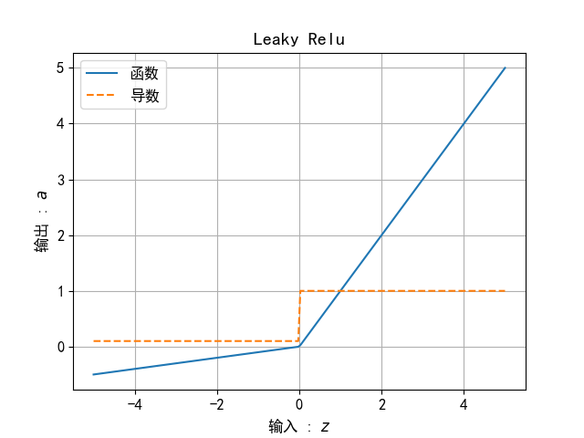

## 7.3 激活函数

### 7.3.1 挤压型激活函数

#### 1. 对数几率函数

图 7.3.1 $\sigma$ 函数图像

#### 2. 双曲正切函数

图 7.3.2 双曲正切函数图像

#### 3. 其它 S 型函数

图 7.7.3 其它 S 型函数

## 7.3.2 半线性激活函数

#### 1. ReLU函数 

图 7.3.4 线性整流函数 ReLU

#### 2. Leaky ReLU函数

图 7.3.5 LeakyReLU 的函数图像

#### 3. ELU 函数

图 7.3.6 ELU的函数图像

####  4. Softplus函数

图 7.3.7 Softplus的函数图像

#### 5. GELU 函数

图 7.3.8 GELU的函数图像
