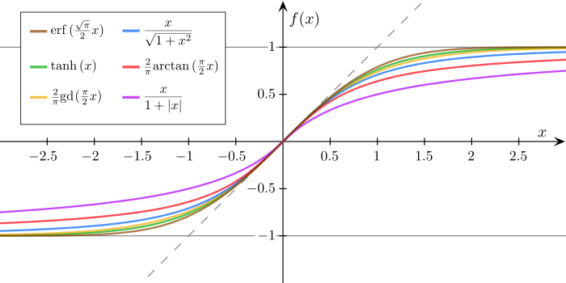

## 7.3 激活函数

**激活函数**（activation function）的基本性质如下。

- 压缩性：把很大的数压缩到一个小空间内，便于后续计算。
- 非线性：可以让平直的线产生弯曲，以满足非线性情况。
- 可导性：误差反向传播和梯度下降要求激活函数的可导性。
- 单调性：单一的输入会得到单一的输出，较大值的输入得到较大值的输出。

激活函数在神经网络中位于线性计算层之间。如果包括输出层在内有 $n$ 层的话，那么必然有 $n-1$ 个激活函数。输入层没有激活函数，输出层也没有。有些资料中把输出层的二分类和多分类函数也叫做激活函数，这是不正确的。一层内的激活函数一般使用同一种，而不同层的激活函数可以不同。

### 7.3.1 挤压型激活函数

#### 1. 对数几率函数

图 7.3.1 $\sigma$ 函数图像

#### 2. 双曲正切函数

图 7.3.2 双曲正切函数图像

#### 3. 其它 S 型函数

图 7.7.3 其它 S 型函数

## 7.3.2 半线性激活函数

#### 1. ReLU函数 

图 7.3.4 线性整流函数 ReLU

#### 2. Leaky ReLU函数

图 7.3.5 LeakyReLU 的函数图像

#### 3. ELU 函数

图 7.3.6 ELU的函数图像

####  4. Softplus函数

图 7.3.7 Softplus的函数图像

#### 5. GELU 函数

图 7.3.8 GELU的函数图像
