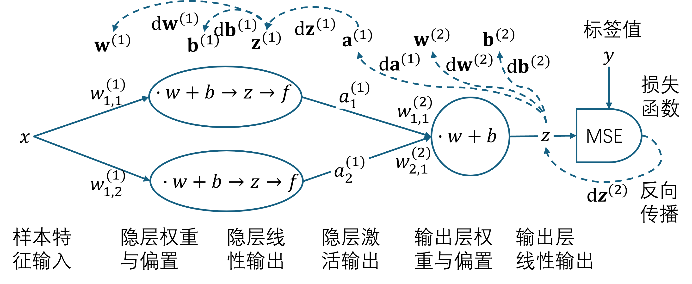
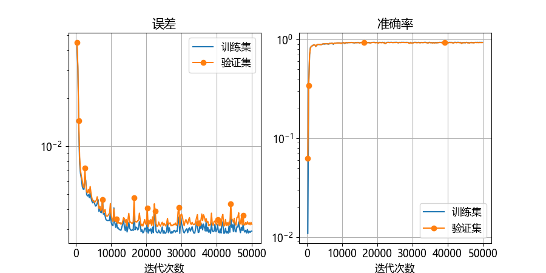
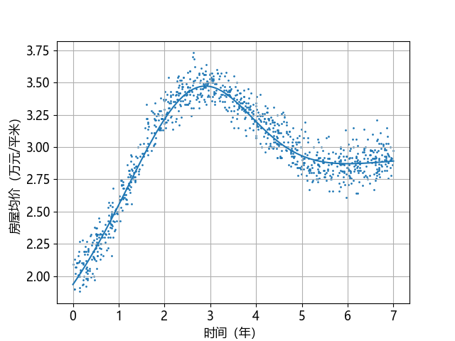

## 7.4 神经网络

图 7.4.1 是解决本章问题的神经网络模型。

图 7.4.1 曲线拟合神经网络模型

在这个模型中，隐层用了两个神经元，对于本例的问题来说是足够了，其中的 $f$ 表示激活函数计算。如果有更复杂的函数需要拟合的话，则隐层的神经元数量需要增加。输出层和前三章的回归模型一样，就是一个线性输出，后面接一个 MSE 损失函数。

### 7.4.1 前向计算

### 7.4.2 反向传播

#### 1. 对输出层的梯度

#### 2. 对隐层的梯度

### 7.4.3 网络训练

图 7.4.2 训练过程中损失函数和准确率的变化

图 7.4.3 拟合结果
