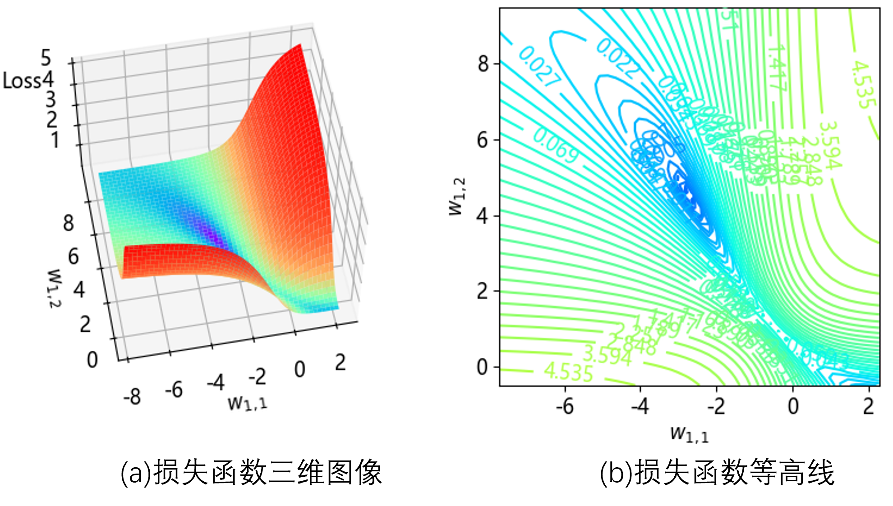
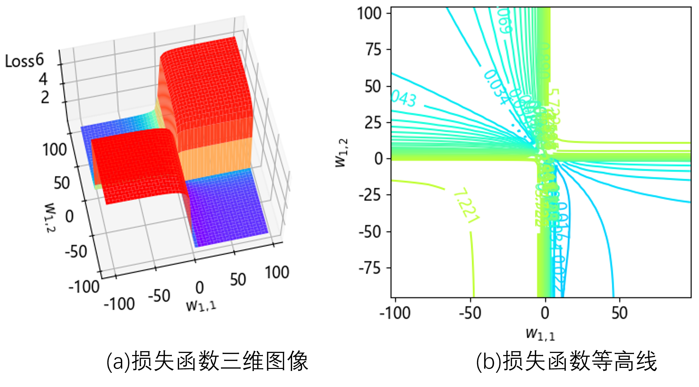
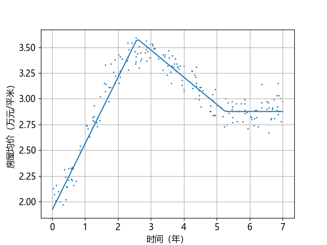
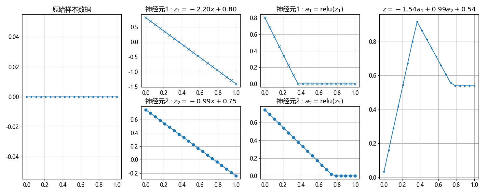
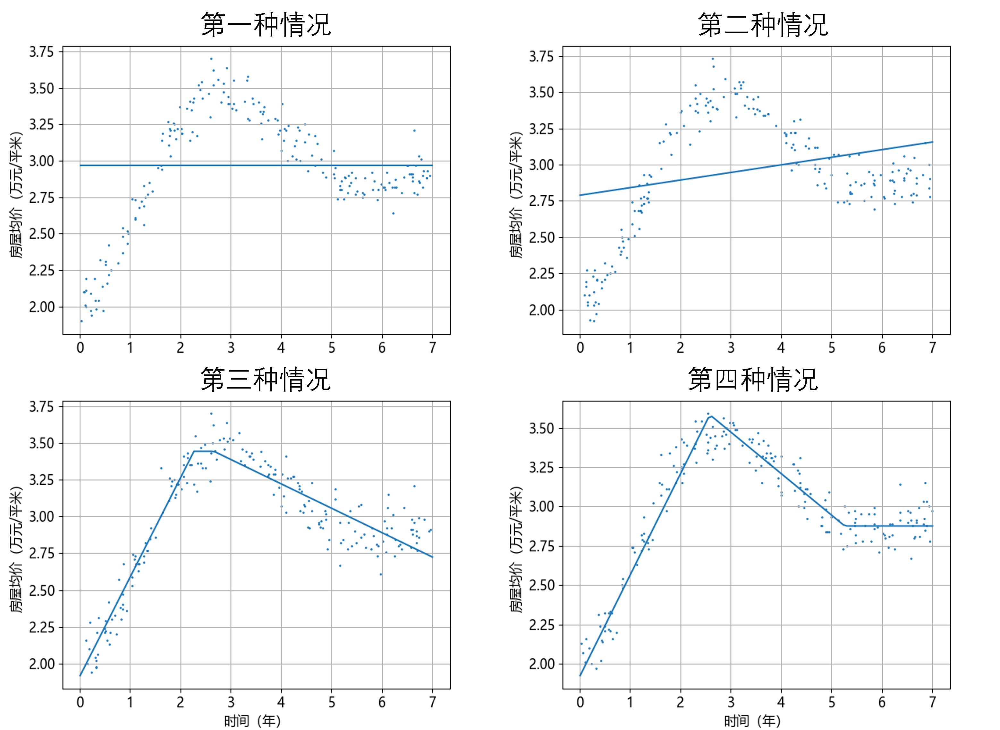
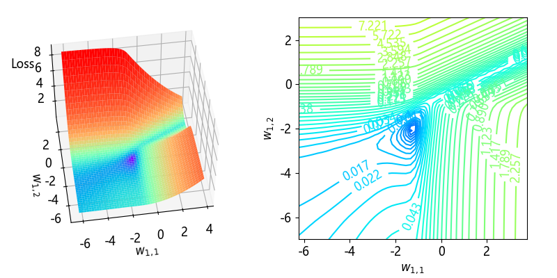
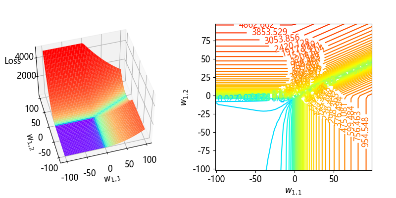

## 7.6 更多探索【电子资源】

接下来我们会研究损失函数和 ReLU 激活函数。

### 7.6.1 研究损失函数的可行性

前面的章节已经研究过几次损失函数了，在网络中只有两个参数（权重值和偏置值）的时候，我们可以做损失函数的可视化。但是当参数大于等于三个时，就无法直接做这种研究了。

此外，还有一个难点。虽然损失函数本身是一个凸函数，可以方便地做梯度下降以得到最优解，但是有个前提，在参数与损失函数之间必须是线性的。比如下面的三个网络由简单到复杂各自不同。

#### 1. 网络一

$$
\begin{aligned}
z&=xw+b \\
loss&=\text{MSE}(z, y) 
\tag{7.6.1}
\end{aligned}
$$

因为都是线性计算，所以关于 $w、b$ 的损失函数是凸函数。

#### 2. 网络二

而下面这一组表达式

$$
\begin{aligned}
z&=xw+b \\
a&= \text{Logit}(z) \\
loss&=\text{BCE}(z, y)
\end{aligned}
 \tag{7.6.2}
$$

在损失函数 loss 和 $w、b$ 之间有个二分类函数 Logit 并非线性的，所以损失函数的整体形态就不是凸函数了。

#### 3. 网络三

$$
\begin{aligned}
z_1&=xw_1+b_1 \\
a&= \text{Tanh}(z_1) \\
z_2&=xw_2+b_2 \\
loss&=\text{MSE}(z_2, y)
\end{aligned}
 \tag{7.6.3}
$$

这是两层网络，在损失函数和 $w_1、b_1$ 之间有一个Tanh激活函数，在第二层还有两个参数 $w_2、b_2$，这就彻底没法研究了，因为有至少 4 个参数，无法可视化。但是我们可以这样分析：

- 假设 $w_1、b_1$ 已经训练好了，那么我们只需要研究 $w_2、b_2$ 的损失函数就行了，这就变成了只有两个参数的凸函数。这种情况我们在第 2 章中已经做过研究。
- 反之，假设 $w_2、b_2$ 已经训练好了，那么我们只需要研究 $w_1、b_1$ 的损失函数就行了，也只有两个参数，但不一定是凸函数。这是我们本节的研究目标。

### 7.6.2 激活函数为Tanh时的损失函数

首先要说清楚研究的目标。把图 7.4.1 拷贝过来便于说明。


来自图 7.4.1 一元函数拟合神经网络模型

从 $a^{(1)}$ 到 MSE 之间是线性的，所以可以不管 $w^{(2)}、b^{(2)}$，因为第 1 章研究过，我们把它当作透明的。从 $x$ 到 $a^{(1)}$ 之间经过激活函数，而且有 $w_{1,1}、w_{1,2}、b_1、b_2$ 四个参数。我们可以只看 $w_{1,1}、w_{1,2}$ 的影响，而把 $b_1、b_2$ 看作固定值。

首先看图 7.6.1，运行【代码：H7_6_Test_Loss_Tanh.py】可以得到彩色图。



图 7.6.1 损失函数图局部

它是以 (-2.7, 4.5) 为中心绘制的三维图和等高线图，可以看到我们的神经网络训练结果确实达到了损失函数的谷底，但从图 7.6.1（a）的三维图可以看到它并不是一个纯粹的凸函数。我们可以从图 7.6.2 所示的全景图做进一步分析。



图 7.6.2 损失函数图全景

这张图很有趣，从顶面看全局被分成了四个象限，而且中心点在 (0,0) 点。原因是在图 7.4.1 中，我们有上下两个神经元，它们是完全对称的。也就是最优值有两个，一个在左上象限，一个在右下象限。而从图 7.6.1 的局部细节看，这两个象限之间似乎还有一个很窄的“连接通道”。所以，这绝对不是一个凸函数。

### 7.6.3 用 ReLU 做激活函数

在【代码：common.NeuralNet_7.py】中，我们使用了 Tanh 作为激活函数。但是在现代神经网络中，ReLU 是一个宠儿，因为它的优点很明显：导数为 0 或 1，易于计算；梯度不会消失。我们不妨在本例中使用 ReLU 作为激活函数与Tanh做比较。

在【代码：common.NeuralNet_7_6.py】中，修改一行代码：

```python
self.activator = Relu()  # 与Tanh比较训练效果
```
然后运行【代码：H7_6_Train_Relu.py】开始训练，如果“运气好”的话，会得到图 7.6.3 的结果。



图 7.6.3 用 ReLU 做激活函数的训练结果

可以看到，这个激活函数“刚直不阿”，见棱见角，它不能区分很多细节，比如原始样本中的左下角的弯曲、最高点的弯曲、右侧转为横向时的弯曲等等细节都没有了。我们看一下它的工作过程，运行【代码：H7_7_HowItWorks_Relu.py】，如图 7.6.4 所示。



图 7.6.4 使用 ReLU 函数的工作过程

第三列子图中的激活结果确实是 0、1 分明，在小于 0 的时候都是 0，大于 0 的时候保持原值。

前面说过使用 ReLU 做激活函数需要有“运气”。因为通过笔者的试验，发现训练很不稳定，会得到图 7.6.5 所示的四种情况。



图 7.6.5 使用ReLU做激活函数的多种训练结果

而从训练过程的打印输出看，上面两种情况的准确率一直处于非常低的水平，还不到 10%；而下面两种情况，几百轮以后就可以达到 90% 以上的准确率。这是为什么呢？明明是同一个网络，为什么会有不同的训练结果？

我们以第二种情况为例说明问题，因为它出现的次数最多。下面是它的打印输出：

```
轮数 998, 迭代 159840, 训练集: loss 0.042981, accu 0.075638, 验证集: loss 0.039730, accu 0.091147
轮数 999, 迭代 160000, 训练集: loss 0.042791, accu 0.079710, 验证集: loss 0.039398, accu 0.098753
权重值 w1 = [[-0.28913318  0.2314505 ]]
偏置值 b1 = [[-0.47384024  1.11787763]]
权重值 w2 = [[-0.24699492] [0.92075714]]
偏置值 b2 = [[-0.54090268]]
```
可以看到准确率一直在 0.08 以下，可以说是惨不忍睹。根据它最终得到的权重值做一个计算。假设样本值为 $x=0.5$，则有：

$$
\begin{aligned}
z_{1}&=w_{1,1} x + b_1=-0.289\cdot 0.5 - 0.474=-0.6185 \\
z_{2}&=w_{1,2} x + b_2=0.231\cdot 0.5 + 1.118=1.2335 \\
a_1&=\text{ReLU}(z_1)=0\\
a_2&=\text{ReLU}(z_2)=1.2335
\end{aligned}
$$

由于样本中的特征值在归一化之后都是 0 到 1 之间的数，所以 $a_1$ 会一直等于 0，那么隐层等于只有第二个神经元在工作，第一个神经元一直处于“不激活”的状态。由于我们使用的是随机初始化，当 $w、b$ 被初始化为不合适的值时，就会出现这个情况，而且无法通过反向传播纠正。所以，**当用 0-1 归一化并且用 ReLU 做激活函数的时候，权重值一定要初始化为正值**。这一点我们在后面的章节中会有专门的说明。

另外，即使初始化没问题，但是在训练过程中，如果某一次的反向传播令 $w_{1,1}、w_{1,2}、b_1、b_2$ 的值不适合了，也会出现这个问题。比如 $w$ 虽然是正值，但是 $b$ 值忽然变成一个较大的负值，则 $z$ 值也会变成负值。解决办法是把学习率设置得小一些，别让权重值一下子被更新为负数。或者使用 LeakyReLU  函数等替换 ReLU。

### 7.6.4 激活函数为 ReLU 时的损失函数

下面看激活函数为 ReLU 时的情况，前提是我们已经用 ReLU 训练好了一个神经网络（如图 7.6.5 的第四种情况），现在只需要把保存好的参数再取出来就可以了。

首先看图 7.6.6，运行【代码：H7_6_Test_Loss_Relu.py】可以得到彩色图。



图 7.6.6 损失函数图局部

它的最优解位置和 Tanh 的情况不同，大概在 $(-1.2,-2)$ 附近，而且我们确实得到了此近似解。请注意，**损失函数图像只取决于神经网络结构是样本数据，而与参数的具体值无关**。所以我们使用训练好的参数值定位此图的中心位置，这一做法并没有不妥之处。再看图 7.6.7 的全景图。



图 7.6.7 损失函数图全景

我们试图看到一个与图 7.6.2 一样的对称的形态，但是此图令我们失望了，在右上角的“通道”并没有连接到另外一个“低洼处”，当然也许是我们的视野不够大而已。从另一个方面思考，由于 Tanh 是对称的，而 ReLU 是不对称的，所以，损失函数也不是对称的，在遥远的右上角并没有另外一个最优解。

在三维图中右上角的缺失并非损失函数的本身形态，而是实际值超出绘制范围。
