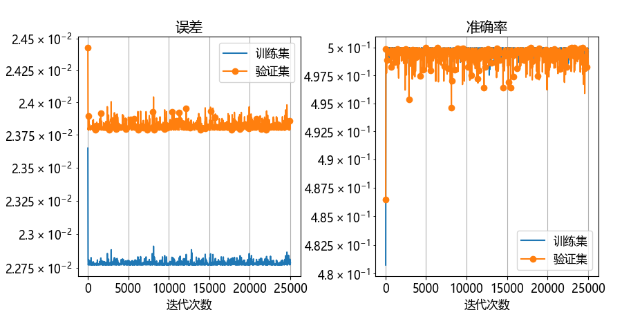
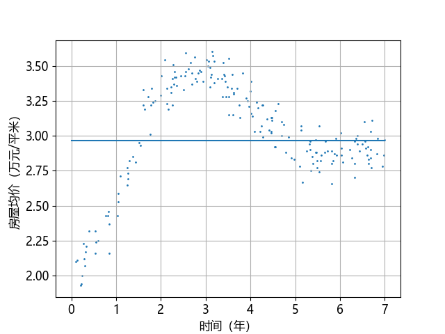
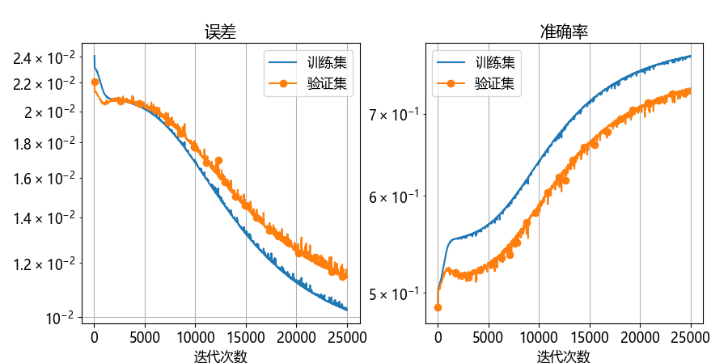
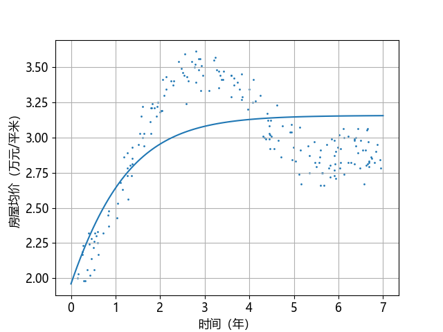
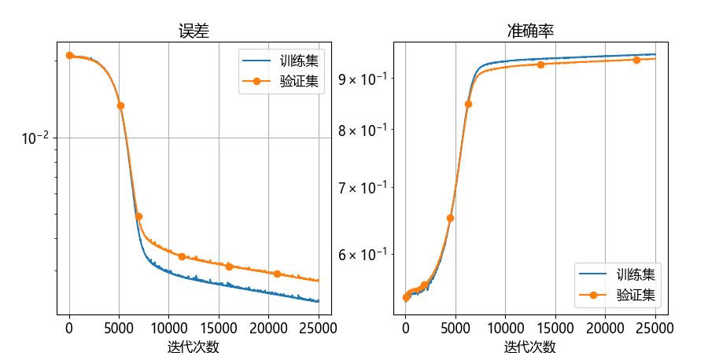
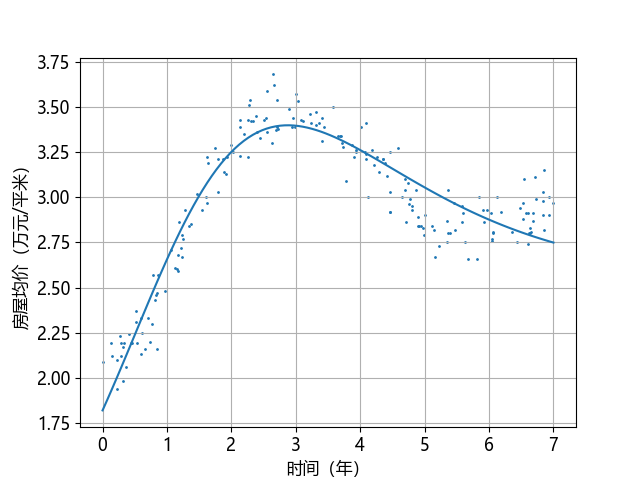

## 7.7 权重矩阵随机初始化【电子资源】

在 1~6 章中，我们一直是把权重矩阵初始化为 0 的，但是到了第 7 章就不一样了，这是我们第一次接触两层的神经网络。在【代码：H7_5_Train.py】中是这样做的：

```python
def train(data_loader: DataLoader_7):
    ...
    num_hidden = 2
    W1 = np.random.normal(size=(1, num_hidden)) # 随机初始化
    B1 = np.random.normal(size=(1, num_hidden)) # 可以为 0
    W2 = np.random.normal(size=(num_hidden, 1)) # 随机初始化
    B2 = np.random.normal(size=(1, 1))          # 可以为 0
    ...
```
用一个随机初始化代替了全 0 初始化，这是为什么呢？

下面我们将采用相同的学习率（0.5）、训练轮数（1000）、批大小（32），做一个不同的初始化的比较。详见【代码：H7_8_Train_Init_0.py】。

### 7.7.1 情况一

W、B 初始化全为 0，或 B2 为随机。代码如下：

```python
W1 = np.zeros((1, num_hidden))
W2 = np.zeros((num_hidden, 1))
B1 = np.zeros((1, num_hidden))
B2 = np.zeros((1, 1)) # B2 = np.random.normal((1, 1))
```
打印输出：
```
轮数 998, 迭代 24975, 训练集: loss 0.022775, accu 0.4999, 验证集: loss 0.023822, accu 0.4992
轮数 999, 迭代 25000, 训练集: loss 0.022787, accu 0.4996, 验证集: loss 0.023853, accu 0.4985
W1 = [[0. 0.]]
B1 = [[0. 0.]]
W2 = [[0.] [0.]]
B2 = [[0.5943196]]
```
从打印输出就可以看到，两个数据集的准确率都不到 50%，什么也没有学到，只有第二个线性层的偏置值有变化，其它值还保持为 0。图 7.7.1 和图 7.7.2 也展示了相同的情况。



图 7.7.1 初始化全为 0 时的训练情况



图 7.7.2 初始化全为 0 时的拟合情况

我们以连续两次单样本的前向/反向数据为例给以说明，请同时参考图 7.5.8 的反向传播路径说明。下面是第一次迭代的情况。
```
----迭代 1----
前向: Z1=[[0. 0.]],     A1=[[0. 0.]],   Z2=[[0.]]
反向: dZ2=[[-0.5459]],  dA1=[[0. 0.]],  dZ1=[[0. 0.]]
      ----------------------------------------------------------
      W1=[[0.   0.]],  B2=[[0.   0.]],  dW1=[[0.   0.]],  dB1=[[0.   0.]]
      W2=[[0.],[0.]],  B2=[[0.05459]],  dW2=[[0.] [0.]],  dB2=[[-0.5459]]
```
第一次训练迭代前向全为 0，因为所有参数都是 0，这是正常的。

反向传播时：
- `dZ2` 有值，正常，因为标签值为正数。
- 根据式（7.4.6），$d\mathbf w^{(2)}=(\mathbf a^{(1)})^{\top}d\mathbf z^{(2)}$，**由于 `A1` 为 0，所以 `dW2` 也为 0，进而 `W2` 更新后也是 0**；
- 根据式（7.4.7），$d\mathbf b^{(2)}=d\mathbf z^{(2)}$，由于 `dZ2` 有值，所以 `dB2` 也有值，进而 `B2` 更新后有值；
- 根据式（7.4.8），$d \mathbf a^{(1)}=d\mathbf z^{(2)} (w^{(2)})^{\top}$，**由于 `W2` 是0，所以 `dA1` 也是 0**，到此为止无法再向前传播误差了。

下面是第二次迭代的情况。
```
----迭代 2----
前向: Z1=[[0. 0.]],        A1=[[0. 0.]],  Z2=[[0.05459459]]
反向: dZ2=[[-0.20486486]], dA1=[[0. 0.]], dZ1=[[0. 0.]]
      ----------------------------------------------------------
      W1=[[0. 0.]],   B1=[[0. 0.]],      dW1=[[0. 0.]],   dB1=[[0. 0.]]
      W2=[[0.] [0.]], B2=[[0.07508108]], dW2=[[0.] [0.]], dB2=[[-0.20486486]]
```
前向计算时 `Z2` 有值是正常的，因为 `B2` 不为 0，其它都是 0。

反向传播时的所有情况都同迭代 1 相同，所以一直为 0，不再会有什么奇迹发生。

### 7.7.2 情况二

`W1` 为 0 或 1，`W2` 为 0 或 1，`B` 为 0 或 1，但它们不同时为 0。

训练过程打印输出如下：

```
轮数 998, 迭代 24975, 训练集: loss 0.010238, accu 0.7807, 验证集: loss 0.011466, accu 0.7333
轮数 999, 迭代 25000, 训练集: loss 0.010244, accu 0.7805, 验证集: loss 0.011418, accu 0.7344
W1 = [[3.47452848 3.47452848]]
B1 = [[0.62676595 0.62676595]]
W2 = [[0.72174554] [0.72174554]]
B2 = [[-0.75384841]]
```

从打印输出可以看到，`W1,B1,W2` 内部两个元素始终相等，但是情况比情况一好一些，图 7.7.3 和图 7.7.4 的曲线变化都显示了神经网络学习到了一部分内容，拟合线的前面一小段还凑合，后面就不行了。



图 7.7.3 `W1=0 或 1`、`W2=0 或 1`、`B=0 或 1`，但它们不同时为 0 的训练情况



图 7.7.4 `W1=0 或 1`、`W2=0 或 1`、`B=0 或 1`，但它们不同时为 0 的拟合情况


下面是第一次迭代的情况。

```
----迭代 1----
前向: Z1=[[1. 1.]],   A1=[[0.7615 0.7615]], Z2=[[1.]]
反向: dZ2=[[0.4756]], dA1=[[0. 0.]],        dZ1=[[0. 0.]]
    ----------------------------------------------------------
    W1=[[0. 0.]],            B1=[[1. 1.]],   dW1=[[0. 0.]],           dB1=[[0. 0.]]
    W2=[[-0.0362][-0.0362]], B2=[[0.9524]],  dW2=[[0.3622] [0.3622]], dB2=[[0.4756]]
```
前向计算：
- 因为 `B1,B2` 为 1，所以 `Z1,A1,Z2` 有值；
- `Z1` 为 1 是因为 `W1` 为 0，`B1` 为 1；
- `W1` 为两个 0，所以 `A1` 的两个元素值相同；
- `Z2` 为 1 是因为 `W2` 为 0，`B2` 为 1。

反向传播：
- `dZ2` 有值，正常；
- 根据式（7.4.6），$d\mathbf w^{(2)}=(\mathbf a^{(1)})^{\top}d\mathbf z^{(2)}$，由于 `A1` 有值，所以 `dW2` 也有值，进而 `W2` 更新后也有值。但是由于 `A1` 的两个元素值相等，所以 `dW2,W2` 的两个元素也相等；
- 根据式（7.4.7），$d\mathbf b^{(2)}=d\mathbf z^{(2)}$，由于 `dZ2` 有值，所以 `dB2` 也有值，进而 `B2` 更新后有值；
- 根据式（7.4.8），$d \mathbf a^{(1)}=d\mathbf z^{(2)} (w^{(2)})^{\top}$。在计算 `dA1` 时，由于本轮还没有更新权重，所以 `W2` 的值还是 0，因此 `dA1` 为 0，不再传播。在随后的权重更新时 `W2` 的值变成 -0.0362。

下面是第二次迭代的情况。

```
----迭代 2----
前向: Z1=[[1. 1.]],    A1=[[0.7615 0.7615]],     Z2=[[0.8972]]
反向: dZ2=[[0.7296]],  dA1=[[-0.0264 -0.0264]],  dZ1=[[-0.0111 -0.0111]]
---------------------------------------
W1=[[0.0007 0.0007]],    B1=[[1.001 1.001]], dW1=[[-0.0007 -0.0007]], dB1=[[-0.0111 -0.0111]]
W2=[[-0.0917][-0.0917]], B2=[[0.879464]],    dW2=[[0.5557] [0.5557]], dB2=[[0.7296]]
```
前向计算：因为 `B1,B2` 为 1，所以 `Z1,A1,Z2` 有值。

反向传播：
- `dZ2` 有值，正常；
- 根据式（7.4.6），$d\mathbf w^{(2)}=(\mathbf a^{(1)})^{\top}d\mathbf z^{(2)}$，由于 `A1` 有值，所以 `dW2` 也有值，进而 `W2` 更新后也有值。但是由于 `A1` 的两个元素值相等，所以 `dW2,W2` 的两个元素也相等；
- 根据式（7.4.7），$d\mathbf b^{(2)}=d\mathbf z^{(2)}$，由于 `dZ2` 有值，所以 `dB2` 也有值，进而 `B2` 更新后有值；
- 根据式（7.4.8），$d \mathbf a^{(1)}=d\mathbf z^{(2)} (w^{(2)})^{\top}$，`W2` 有值，所以 `dA1` 也有值，但是两个元素相等，并且导致后面的 `dZ1,dB1,dW1` 的两个元素都相等，所以 `W1,B1` 更新后两个元素也相等。

至此，虽然再后面的训练还会更新值，但会始终保持 `W1,B1,W2` 的两个元素相等，训练失败。如果两组 W 都初始化为 1 时结果相同。

### 7.7.3 情况三

W 或 B 的其中一组随机初始化，其它随意（0、1、随机）。

打印输出：

```
轮数 998, 迭代 24975, 训练集: loss 0.002289, accu 0.9501, 验证集: loss 0.002755, accu 0.9403
轮数 999, 迭代 25000, 训练集: loss 0.002254, accu 0.9508, 验证集: loss 0.002720, accu 0.9410
W1 = [[1.9353 3.2746]]
B1 = [[-0.4177 -0.3019]]
W2 = [[-1.3177] [ 1.7202]]
B2 = [[-0.0447]]
```
打印输出终于正常了！损失函数和准确率也都很合理，图 7.7.5 和图 7.7.6 也印证了这一点。



图 7.7.5 任意一组 W 随机初始化时的训练情况



图 7.7.6 任意一组 W 随机初始化时的拟合情况

训练成功。这种情况相当于把神经网络分成了两层，每一层都和单层网络一样可以全零初始化，但是合在一起时必须有一层不是零初始化。

### 7.7.4 小结

两组权重矩阵，只要有一组为随机始化，就会得到正常的训练结果。所以，我们最好是把所有的权重矩阵 W 都做随机初始化，因为从 0 开始调节权重值所需要的时间比较长。B 值可以是 0。但是关于初始化问题，在后面的章节中还会有更深入的讨论。

在本节中我们不厌其烦地讨论细节，目的是想让读者通过打印输出信息自己来熟悉双层网络的反向传播过程，有助于加深理解。如果读者想复现以上过程的话，需要在【代码：common.NeuralNet_7.py】中增加打印输出。
