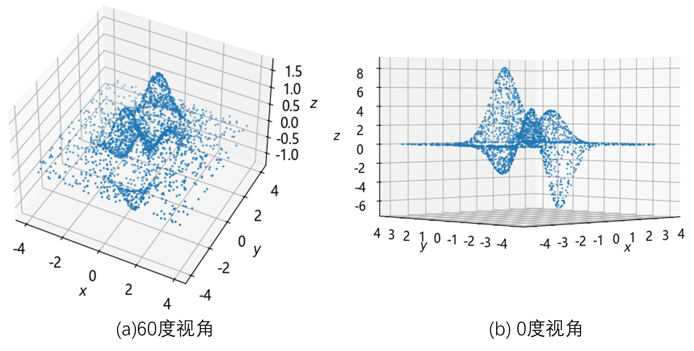

## 8.1 问题与建模

在某个地方，有一幢别墅的屋顶采用了哥特式的设计，从远处看起来像一个迷你的教堂，因为房屋的主人是个数学家+艺术家，是董大白的老师。他为建造这栋房屋花了不少钱，而且屋顶需要用一种特殊的材料来防腐、防水、防热，并且还可以发出淡蓝色的光芒，所以这种材料很贵，需要知道用量后在厂家预定。但是由于屋顶凹凸不平的奇特造型，无法准确丈量出面积。于是建筑公司的人用小型民用无人机在屋顶使用激光测距仪进行了三维坐标的采样，一共2500个样本点，表 8.1.1 是其中的几个。

表 8.1.1 屋顶形状的三维数据样本

|样本|横坐标$x$|纵坐标$y$|高度$z$|
|-|-|-|-|
|1|-0.35| -0.02| 0.53|
|2|0.41 |1.02|0.64 |
|3|-0.17 |0.63| 0.19|
|4|-0.57 |-1.48| 0.23|
|...|...|...|...|

**问题：如何根据这些样本来比较准确地计算出屋顶的面积？**

### 8.1.1 问题分析

从横纵坐标值来看有正有负，应该是以房屋的俯视图中心为参考点进行的测量；而高度有正有负应该是以屋顶平面处为参考点。由于是三维数据，我们还可以进行可视化。见图 8.1.1。



图 8.1.1 屋顶形状的三维数据采样点

图 8.1.1 是一个三维图的两个观察角度，左侧子图是标从斜上方观察，右侧子图是从水平面观察，一共有三个凸起和两个凹陷。所以这是一个三维的曲面拟合问题。在上一章中，我们学习了二维的曲线拟合问题，其原理与此相同，只不过本章中是两个特征值输入，见表 8.1.2。

表 8.1.2 重新命名样本数据

|样本|横坐标 $x_1$|纵坐标 $x_2$|高度 $y$|
|-|-|-|-|
|1|-0.35| -0.02| 0.53|
|2|0.41 |1.02|0.64 |
|3|-0.17 |0.63| 0.19|
|4|-0.57 |-1.48| 0.23|
|...|...|...|...|

表 8.1.2 中对样本数据进行了重新命名，两个特征值 $x_1、x_2$ 是横纵坐标，标签值 $y$ 是屋顶高度。以下是基本数据统计：

```
--- X (2500, 2) ---                 --- Y (2500, 1) ---
最大值: [4. 4.]                     最大值: 1.62
最小值: [-4. -4.]                   最小值: -1.18
均值: [-0.0095 0.2827  ]            均值: 0.2148
标准差: [1.4653  1.6614]            标准差: 0.4614
```

数据量纲一致（都是米），数值级别在同一水平（都是 8 米以内），所以可以直接用于训练。但是笔者实在是想不通那两个凹陷到室内的尖端的具体作用是啥？问了董大白，他回答说：这是一个复杂的神经网络的损失函数的形状，它有很多特点：

- 它不是简单的凸函数优化问题；
- 它有一个局部最优解和一个全局最优解；
- 它还有很多梯度为 0 的平坦地区，以及鞍点、驻点等，导致训练不能进行下去；
- 如果初始化的位置不同，会导致训练过程的长短不同，而且会导致最终结果不同。

总之，它是神经网络工程的噩梦！但同时也激励着无数研究人员去努力奋斗克服困难！

### 8.1.2 数据标准化

从第 2 章开始我们一直使用数据归一化方法来处理样本数据，即把所有数据线性压缩到 $[0,1]$ 之间的数（如果是分类任务的话，标签值不做此处理），便于神经网络计算。而在本章中的数据有个特点：均值接近于 0，最大值和最小值正负对称。所以，我们学习一种新的数据标准化（standardization）方法。

$$
x_{new} = \frac{x - \text{mean}(x)}{\text{std}(x)}
\tag{8.1.1}
$$

即，原始数据减去所有样本数据的均值，再除以所有样本数据的标准差。它的输出结果是均值为 0 方差为 1 的数据，所以又叫做 Z-score 标准化。下面的打印输出是对原始数据标准化后的统计信息，注意它是对每个特征进行标准化，所以得到两组统计数据。

```
====== 标准化后的统计信息 ======
--- X (2500, 2) ---                 --- Y (2500, 1) ---
最大值: [2.7361 2.2374]             最大值: 3.0448
最小值: [-2.7231 -2.5777]           最小值: -3.0226
均值: [-6.9100e-17 -2.7569e-16]     均值: 2.2737e-17
标准差: [1. 1.]                     标准差: 1.0
```

标准化的目的和归一化相同：在源头就让数据的各个维度的量纲一致，使得损失函数形态比较对称，利于梯度下降算法的学习。
