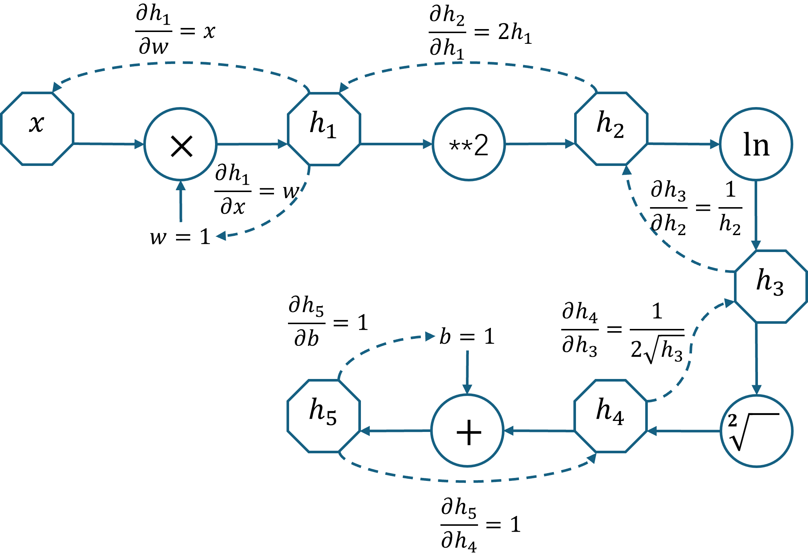
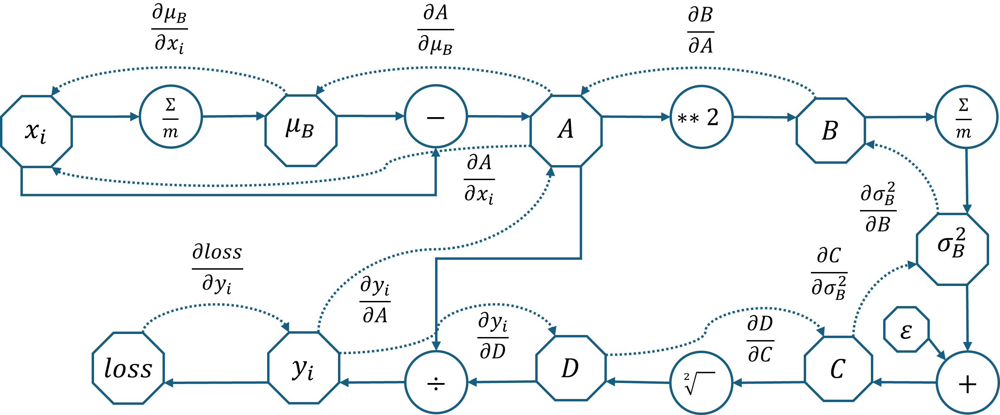
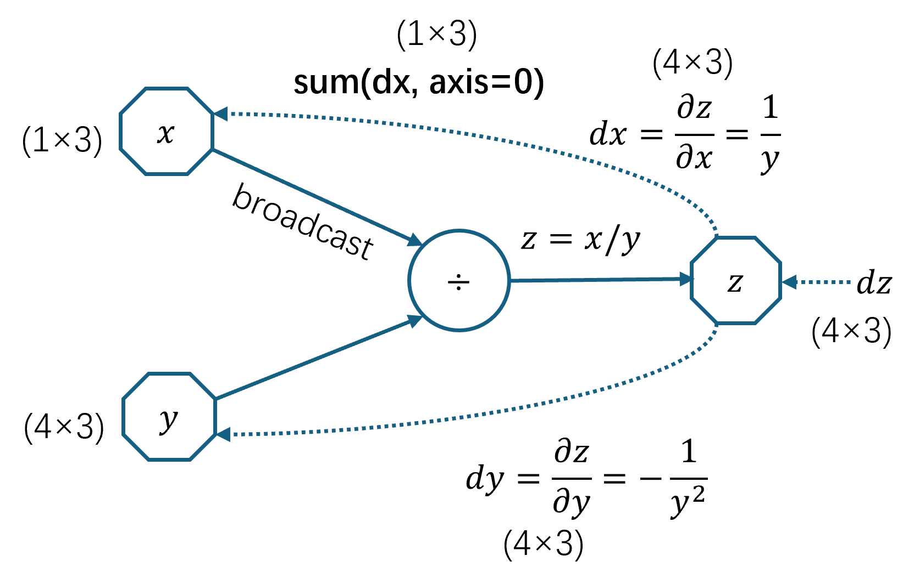

## 8.2 自动梯度计算

在第 7 章中学习的曲线拟合的内容在本章中仍然有效，只不过曲线拟合任务只有一个特征值 $x$ 输入，而曲面拟合任务需要有 $x_1、x_2$ 两个特征值输入，分别代表横纵坐标，如表 8.1.2 所示。

我们不想重复在前面的章节中的标准步骤：定义前向计算、定义损失函数、定义反向传播。因为经过前面的学习，读者应该已经清楚了这些基本的步骤，但难点在于：一旦将来设计的神经网络不是这种简单的形式，而是要很多完成其它更复杂的功能时，仍然需要读者**自己来做反向传播的公式推导工作，这种过程很容易出错**。

所以，神经网络设计的挑战之一就是求导问题，而所有的深度学习框架（framework）都提供了所谓的**自动梯度**（auto-grad）的解决方案。这个名字听上去很先进，但实际上所有的自动梯度工作都是工程师在后台写代码完成的，并不存在魔法。下面我们来看看它的实现方法。

### 8.2.1 基本运算符

图 8.2.1 计算图

### 8.2.2 组合运算符

### 8.2.3 优化运算符

### 8.2.4 计算图实例

图 8.2.2 计算图的前向（实线）和反向（虚线）

### 8.2.5 实现步骤

自动梯度计算的实现步骤如下。

#### 1. 实现操作符

图 8.2.3 以除法为例的自动梯度计算时的数组形状缩放

#### 2. 实现计算图

#### 3. 建立模型
