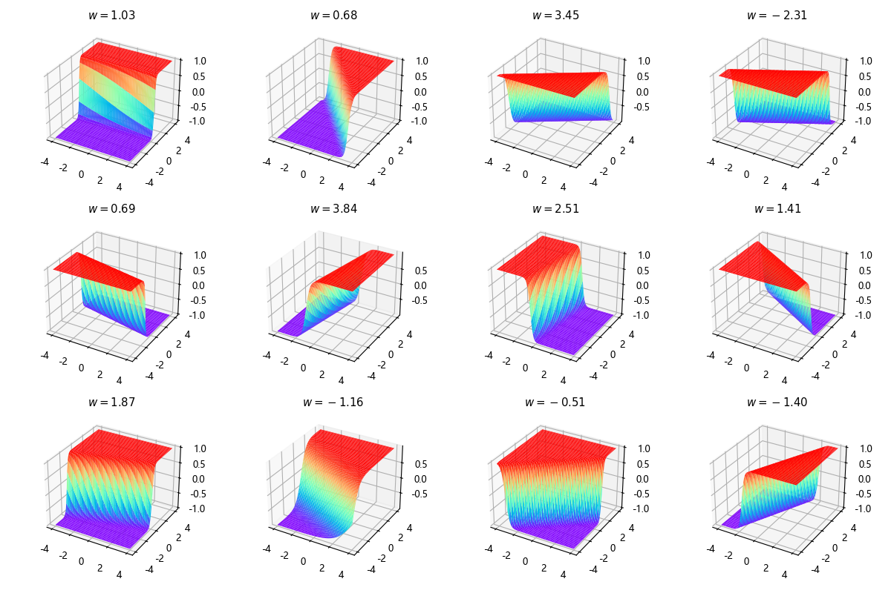

## 8.4 工作原理

本章中的神经网络工作原理其实和第 7 章如出一辙，只不过从二维数据变成了三维数据。我们依次探查隐层、激活函数、输出层的工作状况。

### 8.4.1 隐层的工作

图 8.4.1 隐层完成的工作

### 8.4.2 激活函数的工作

图 8.4.2 激活函数完成的工作

### 8.4.3 线性输出层的工作

图 8.4.3 逐步叠加效果

### 8.4.4 拟合效果不好的部位
