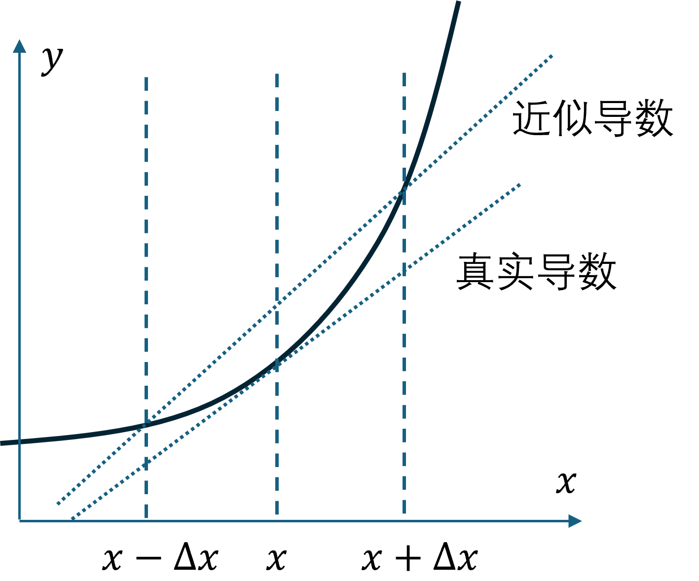

## 8.5 梯度检查

神经网络算法使用反向传播计算目标函数关于每个参数的梯度，可以看做数学解析梯度，叫做自动微分（automatic differentiation, AD）。由于需要利用链式法则手工求导，然后把公式用代码实现。而且在计算过程中涉及到的参数很多，即使封装在很多独立的运算符中，用代码实现时也很容易出现错误，导致最后训练结果不正确，而且很难发现具体原因。

为了确认代码中反向传播计算的梯度是否正确，可以使用梯度检验（gradient check）检查工具。该工具通过数值微分（numerical differentiation, ND）的方法计算梯度值，得到梯度的近似值，然后和自动微分得到的梯度进行比较，若两者相差很小的话则证明反向传播的代码是正确无误的。

### 8.5.1 数值微分的理论基础

泰勒展开公式是将一个在 $x=x_0$ 处具有 $n$ 阶导数的函数 $f(x)$ 展开成 $n$ 次多项式来逼近函数的方法。其展开形式如下：

$$
\begin{aligned}
f(x)=&\frac{f(x_0)}{0!} + \frac{f'(x_0)}{1!}(x-x_0)+\frac{f''(x_0)}{2!}(x-x_0)^2 + \\
&...+\frac{f^{(n)}(x_0)}{n!}(x-x_0)^n+R_n(x) 
\end{aligned}
\tag{8.5.1}
$$

其中，$f^{(n)}(x)$ 表示 $f(x)$ 的 $n$ 阶导数，$R_n(x)$ 是泰勒公式的余项，是$(x-x_0)^n$的高阶无穷小。 

我们用三阶泰勒展开：

$$
f(x)=f(x_0) + f'(x_0)(x-x_0)+\frac{f''(x_0)}{2}(x-x_0)^2 + O(\Delta x^3)
\tag{8.5.2}
$$


令 $x=x_0 + \Delta x$ 可以得到：

$$
f(x_0 + \Delta x)=f(x_0) + f'(x_0)\Delta x + \frac{1}{2}f''(x_0)\Delta x^2 + O(\Delta x^3) 
\tag{8.5.3}
$$

令 $x=x_0 - \Delta x$ 可以得到：

$$
f(x_0 - \Delta x)=f(x_0) - f'(x_0)\Delta x + \frac{1}{2}f''(x_0)\Delta x^2 - O(\Delta x^3) 
\tag{8.5.4}
$$

式（8.5.3）减去式（8.5.4）：

$$
f(x_0 + \Delta x) - f(x_0 - \Delta x)=2f'(x_0)\Delta x + 2O(\Delta x^3) 
\tag{8.5.5}
$$

两边除以 $2\Delta x$：

$$
f'(x_0) + O(\Delta x^2)={f(x_0 + \Delta x) - f(x_0 - \Delta x) \over 2\Delta x} 
\tag{8.5.6}
$$

式（8.5.6）中左侧多出来的第二项就是双边逼近的误差，是 $O(\Delta x^2)$ 级别。在图 8.5.1 中，真实导数直线和近似导数直线的斜率之差就是这个误差，称作**中心差分法**或**双边逼近法**。



图 8.5.1 中心差分法

所以有：

$$
f'(x) = \lim_{\Delta x \to 0} \frac{f(x+\Delta x)-f(x-\Delta x)}{2\Delta x} 
\tag{8.5.7}
$$

实现代码：

```Python
def numerical_diff(f, x):
    delta_x = 1e-5
    d = (f(x + delta_x) - f(x - delta_x)) / delta_x
    return d
```

因为计算机的舍入误差的原因，`delta_x`不能太小，比如`1e-10`，会造成计算结果上的误差，所以我们一般用`[1e-4,1e-7]`之间的数值。

### 8.5.2 实例验证

式（8.5.7）就是梯度检查的理论基础。比如函数：

$$
\begin{aligned}
f(x) &= x^2 + 3x \\
f'(x) &= 2x + 3
\end{aligned}
$$

我们检查它在 $x_0=2$ 处的数值微分，令$\Delta x = 0.001$：

$$
\begin{aligned}
f(x_0+\Delta x) = f(2+0.001) &= (2+0.001)^2 + 3 \times (2+0.001)=10.007001 \\
f(x_0-\Delta x) = f(2-0.001) &= (2-0.001)^2 + 3 \times (2-0.001)=9.993001 \\
\frac{f(x_0+\Delta x)-f(x_0-\Delta x)}{2\Delta x}&=\frac{10.007001-9.993001}{2 \times 0.001}=7
\end{aligned}
$$

再看它的数学解析解：

$$
f'(x_0)=2x_0+3=2 \times 2+3=7
$$

和上式结果一致。当然在实际应用中，一般由于计算精度问题不可能会完全相等，只要两者的误差小于`1e-5`以下，我们就认为是满足精度要求的。

### 8.5.3 梯度检查工具

#### 1. 获得自动微分结果

首先需要确定式（8.5.7）中的 $f(x)$ 是什么？在神经网络中，$f(x)$ 就是损失函数，而 $x$ 是权重值（包括偏置值）构成的参数集合。我们无法一次性把所有参数都检查到，所以需要逐个检查。先对神经网络做初始化，然后把所有参数列到表 8.5.1 中。注意标准的 $w$ 值不能相等或者为 0。

表 8.5.1 参数列表

||$w_1$|$w_2$|...|$b_1$|$b_2$|...|
|-|-|-|-|-|-|-|
|参数值|0.01447|-0.1619|...|0.07354|-0.04355|...|

这个表中的数据实际上是一个向量。如果 $W$ 的尺寸是 $m \times n$，则把它压扁成一列。如果有多层网络的 $W、B$，则依次把它们连接在后面成为一个向量中的不同元素，顺序无所谓，但是要记得与原参数矩阵的对应关系。

在本章中，第一层网络的 $\mathbf W^{(1)} \in \mathbb{R}^{2 \times 16}、\mathbf B^{(1)} \in \mathbb{R}^{1 \times 16}$ ，第二层网络的 $\mathbf W^{(2)} \in \mathbb{R}^{16 \times 1}、\mathbf B^{(2)} \in \mathbb{R}^{1 \times 1}$，则创建一个 65 个元素的向量：
- 把 $\mathbf W^{(1)}$ 变成 32×1 放在 [0:31] 位置；
- 把 $\mathbf B^{(1)}$ 变成 16×1 放在 [32:47] 位置；
- 把 $\mathbf W^{(2)}$ 变成 16×1 放在 [48:63] 位置；
- 把 $\mathbf B^{(2)}$ 变成 1×1 放在 [64] 位置。

向量化的$W,B$连接以后，统一称作为$\mathbf x$，按顺序用不同下标区分：

$$
\mathbf x=(x_1,\cdots,x_i,\cdots,x_n)
$$


根据网络结构的输入输出要求，任意生成一组测试样本（下面代码中为 8 个样本）：

```python
    X = np.random.rand(8, 2)    # 训练样本
    Y = np.random.rand(8, 1)    # 标签值
```

进行前向计算和反向传播各一次：

```python
    Z = model.forward(X)
    model.backward(Z, Y)
```

所有的 $dW、dB$ 中都有值了，被称作自动微分梯度值 $\text{ad}$，并把它们放在表 8.5.1 的第二行（实际上是另外一个向量）。

表 8.5.1（续1） 参数列表

||$w_1$|$w_2$|...|$b_1$|$b_2$|...|
|-|-|-|-|-|-|-|
|参数值|0.01447|-0.1619|...|0.07354|-0.04355|...|
|自动微分梯度值 $\text{ad}$|0.008618|-0.004802|...|0.018153|-0.010145|...|

#### 2. 获得数值微分结果

接下来开始计算数值微分梯度值  $\text{nd}$，步骤如下：

- 把表 8.5.1（续1）中的 $w_1$ 增加一个微小的值，如 $\Delta x=10^{-5}$，计算 loss 值得到 $f(w_1+\Delta x)$； 
- 再 对 $w_1$ 减去 $\Delta x$，计算 loss 值得到 $f(w_1-\Delta x)$；
- 然后用式（8.5.7）计算数值微分值 $dw_1=\frac{f(w_1+\Delta x)-f(w_1-\Delta x)}{2\Delta x}$，并把这个值放在表 8.5.1（续2）的第三行。

注意，检查完 $w_1$ 的梯度后，需要把 $w_1$ 的值复原，然后再检查 $w_2$ 的梯度值。相当于下面这个表达式，其中除了 $x_i \pm \Delta x$ 以外，其它 $x_j$ 值都是原值：

$$
\text{nd}(x_i) = \frac{f(x_1,\cdots,x_i+\Delta x,\cdots,x_n)-f(x_1,\cdots,x_i-\Delta x,\cdots,x_n)}{2 \Delta x}
\tag{8.5.8}
$$


表 8.5.1（续2） 参数列表

||$w_1$|$w_2$|...|$b_1$|$b_2$|...|
|-|-|-|-|-|-|-|
|参数值|0.01447|-0.1619|...|0.07354|-0.04355|...|
|自动微分梯度值 $\text{ad}$|0.008618|-0.004802|...|0.018153|-0.010145|...|
|数值微分梯度值 $\text{nd}$|0.008605|-0.004799|...|0.018003|-0.010158|...|

#### 3. 比较

对表中所有的参数都做相同计算，就得到了表 8.5.1（续2）的第三行数据。用肉眼观察第二行和第三行的数值差别不大，但是需要用程序进行严格的验证。因为我们是要比较两个向量的对应分量的差别，可以用对应分量差的平方和的开方（欧氏距离）来刻画。但是得到一个具体的差异值没有意义，因为在梯度值很大的时候，这个差值也很大。所以需要得到一个比例值：

$$
\text{diff} = \frac{\parallel  \text{ad} -  \text{nd} \parallel_2}{\parallel  \text{ad} \parallel_2 + \parallel  \text{nd} \parallel_2}
\tag{8.5.9}
$$

【代码：H8_5_GradientCheck.py】实现：

```python
    numerator = np.linalg.norm(automatic_diff - numerical_diff)  # np.linalg.norm 二范数
    denominator = np.linalg.norm(numerical_diff) + np.linalg.norm(automatic_diff)
    difference = numerator / denominator
```

根据式（8.5.9）的结果进行判断：

- $\text{diff} > 10^{-2}$，梯度计算肯定出了问题；
- $10^{-2} > \text{diff} > 10^{-4}$，可能有问题了，需要检查；
- $10^{-4} \gt \text{diff} \gt 10^{-7}$，对于不光滑的激活函数来说时可以接受的，但是如果使用平滑的激活函数如 Tanh，这个结果还是太高了；
- $10^{-7} \gt \text{diff}$，可以喝杯红酒庆祝一下！

另外要注意的是，随着网络深度的增加会使得误差积累，如果用了10层的网络，得到的相对误差为`1e-2`那么这个结果也是可以接受的。
  

### 8.5.4 注意事项

- 首先，不要使用梯度检验去训练，即不要使用梯度检验方法去计算梯度，因为这样做太慢了。

- 其次，如果我们在使用梯度检验过程中检查出现了问题，就需要对所有的参数进行计算，以判断造成计算偏差的来源在哪里。比如笔者在初次检查时，就遇到了问题，最后发现是下述代码中忘记了除以 $m$，这样的话，对于单个样本来说检查结果正确，但是在多个样本时会出错。

```python
self.dW = np.dot(self.input.T, delta_in) / m  # 不要忘记除以样本数量，否则容易产生梯度爆炸
```
- 如果我们添加了二范数正则化，不要忘记梯度的形式已经发生了变化，要记得加上正则化部分，同理，在进行梯度检验时，也要记得目标函数$loss$的形式已经发生了变化。

- 如果我们使用了丢弃法（dropout）正则化，梯度检验就不可用了，因为 dropout 是按照一定的保留概率随机保留一些节点，因为它的随机性，目标函数 $loss$ 的形式变得非常不明确。如果非要使用 dropout，可以先将保留概率设为 1，即保留全部节点进行检查。如果没有问题，我们再改变保留概率的值来应用 dropout。

- 最后，介绍一种特别少见的情况。在刚开始初始化时，$w、b$ 的值都还很小，这时检查没有问题。但随着迭代过程的进行，$w、b$ 的值变得越来越大时，梯度差距越来越大。所以需要多进行几次梯度检验，比如在刚开始初始化权重时进行一次检验，在迭代一段时间之后，再使用梯度检验。
