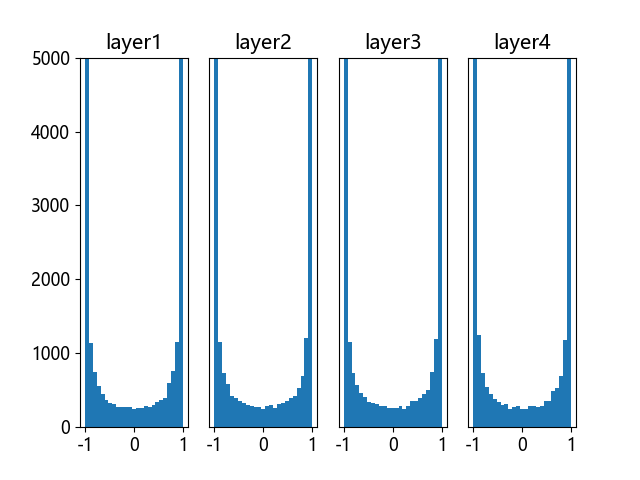
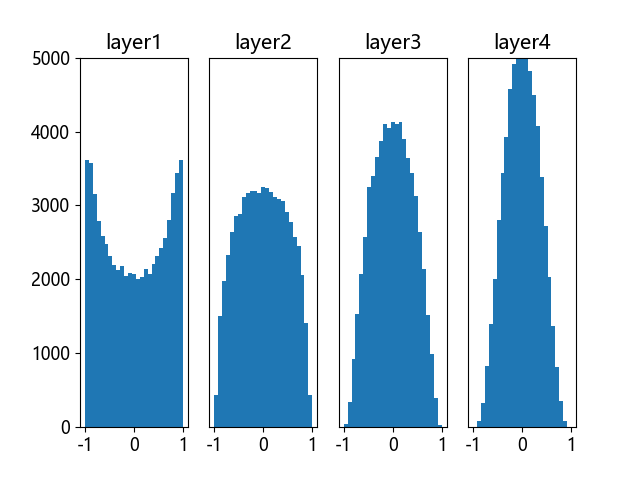
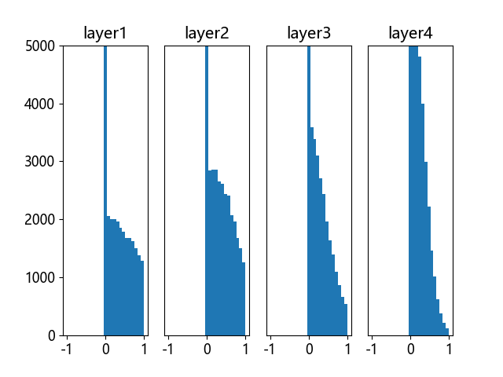
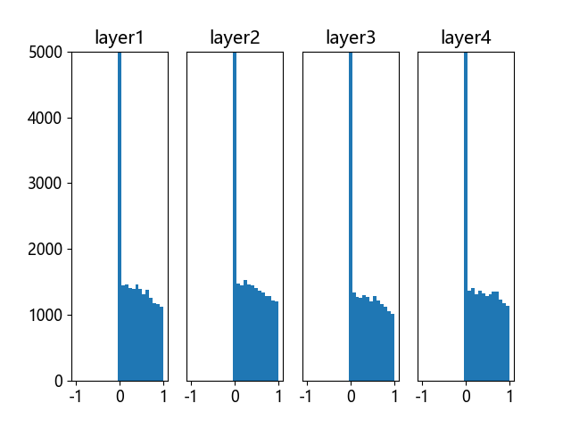

## 8.6 权重矩阵高级初始化

神经网络在 2006 年之前不能很理想地工作，很大原因在于权重矩阵初始化方法上。权重矩阵初始化是一个非常重要的环节，是训练神经网络的第一步，选择正确的初始化方法会带了事半功倍的效果。这就好比攀登喜马拉雅山，如果选择从南坡登山，会比从北坡容易很多。而初始化权重矩阵，相当于下山时选择不同的道路，在选择之前并不知道这条路的难易程度，只是知道它可以抵达山下。这种选择是随机的，即使你使用了正确的初始化算法，每次重新初始化时也会给训练结果带来很多影响。

比如：

- 第一次初始化时得到权重值为 (0.12847，0.36453)，用了 300 0次迭代达到准确率为 96% 的模型；
- 而第二次初始化为 (0.23334，0.24352)，经过试验，用了 2500 次迭代就达到了相同准确率。
 
这种情况在实践中是常见的。

### 8.6.1 标准初始化

图 8.6.1 标准初始化在Tanh激活函数上的表现

### 8.6.2 Xavier初始化方法

图 8.6.2 Xavier 初始化在 Tanh 激活函数上的表现

图 8.6.3 Xavier 初始化在 ReLU 激活函数上的表现

### 8.6.3 Kaiming 初始化方法

图 8.6.4 Kaiming 初始化在 ReLU 激活函数上的表现

### 8.6.4 小结
