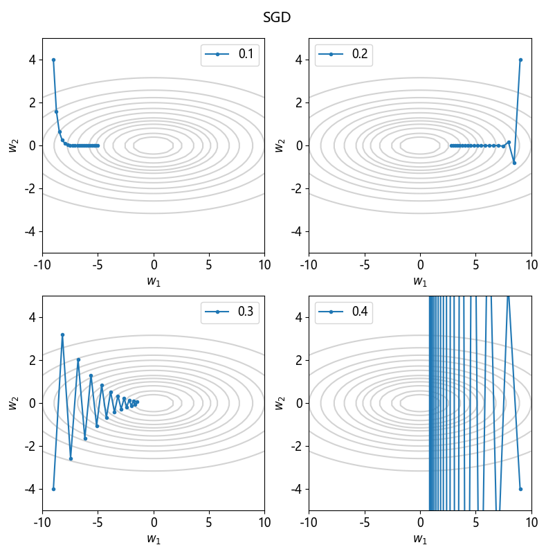
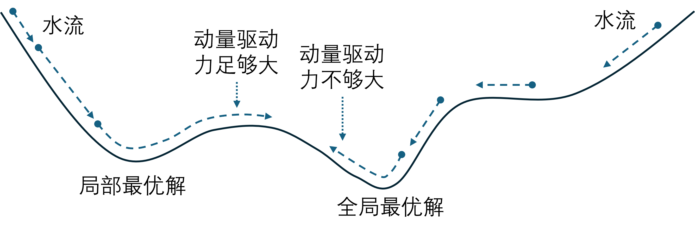
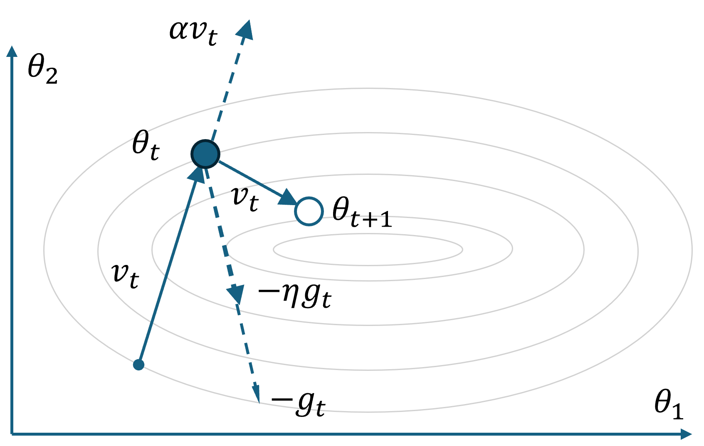
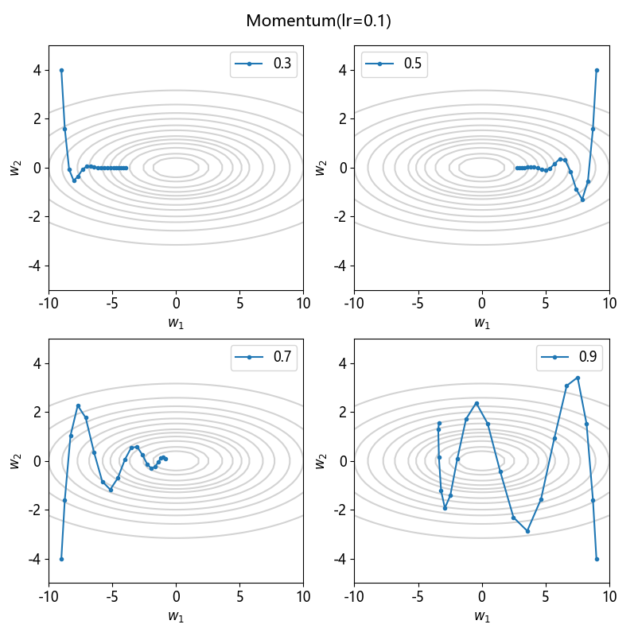
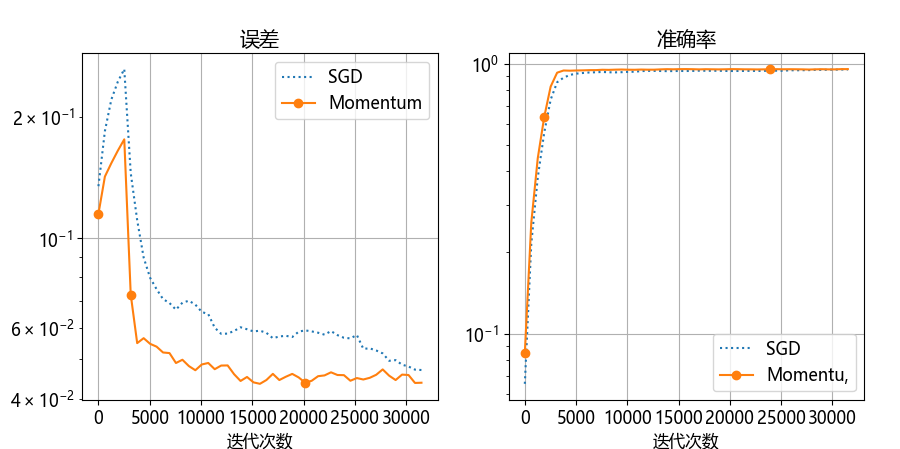

## 8.7 优化器之动量算法

利用本章的问题，我们简单研究一下梯度下降动量算法，在后续的章节会中会讨论其它优化算法。

### 8.7.1 随机梯度下降算法的缺点

图 8.7.1 随机梯度下降算法在不同的学习率上的表现

### 8.7.2 动量算法

图 8.7.2 左侧的水流可通过动量帮助越过驻点

#### 1. 算法

图 8.7.3 动量算法

#### 2. 实现

#### 3. 试验

图 8.7.4 学习率为 0.1 时不同动量参数的迭代轨迹

#### 4. 实例

图 8.7.5 SGD 与 Momentum 的比较
