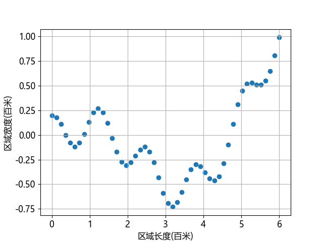
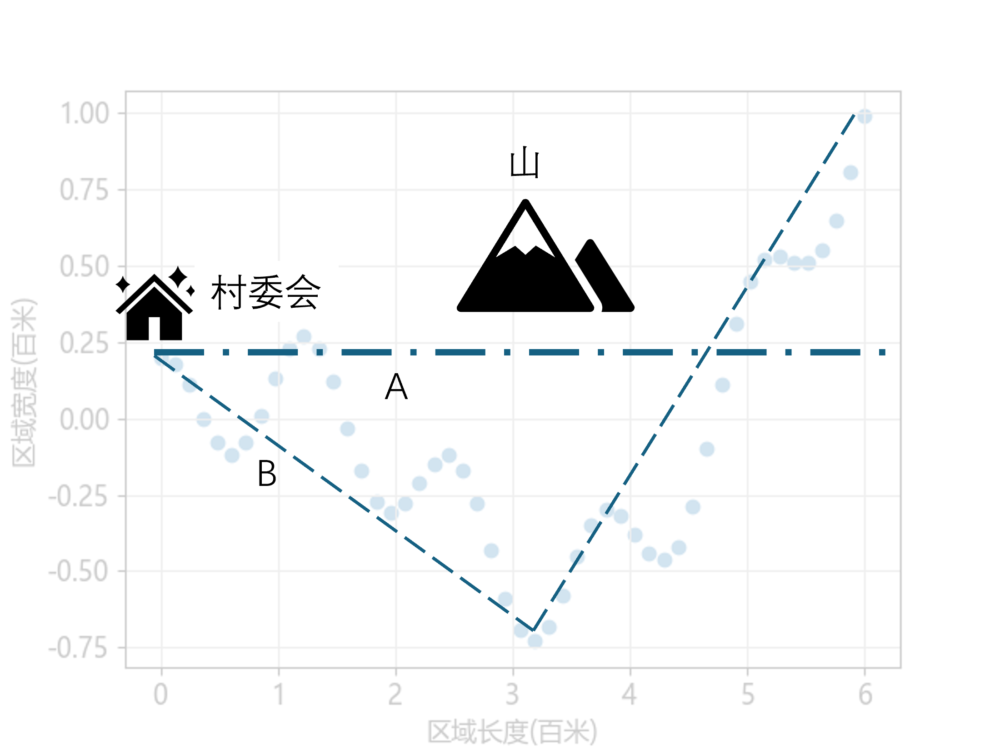

## 9.1 问题与建模

在一个比较偏僻的村庄里住着 50 户人家，每家都有自己的宅基地。随着经济收入的增加，村民们都盖起了新居，有的家还是二层小楼。但是，一直困扰村民们的一个问题是：村里一直没有一条柏油大马路，一到雨天，道路就变得非常泥泞。村委会经过调查研究后决定号召大家集资建路，村委会也出一部分资金，并负责规划、建设。

首先，村委会收集了所有民居的地理坐标，村委会的办公室建立在村口，以村口为 0 点开始向东 600 米内都是民居，位于村委会北侧的地理位置纵坐标用正数表示。表 9.1.1 是部分数据。

表 9.1.1 部分民居的位置数据

|村民样本|横坐标（百米）$x$|纵坐标（百米）$y$|
|-|-|-|
|张老汉|4.41 |-0.42 |
|刘大婶|1.71 | -0.17 |
|李叔|3.18 | -0.73 |
|赵翠翠|1.10 | 0.23 |
|隔壁老王|5.88 |0.81 |
|...|...|...|

**问题：如何规划这条路使得每户民居到该路的距离在 25 米以内，而且总长度尽量短以便省钱。**


### 问题分析

首先得到数据的基本信息。
```
--- X ---           --- Y ---
最大值: 6.0         最大值: 0.99
最小值: 0.0         最小值: -0.73
均值: 3.0           均值: -0.0412
标准差: 1.76782     标准差: 0.403
```
从表 9.1.1 得知是二维数据，该问题的数学含义就是用一条曲线去拟合所有的坐标点。如果用神经网络来解决这个问题的话，就是以横坐标 $x$ 做为训练样本特征，以纵坐标 $y$ 做为标签。把这些样本绘制在图 9.1.1 上 以得到感谢认识。



图 9.1.1 50户民居的地理位置

可以看到这是一个很曲折的轨迹，由于地处山区，村民们可能是根据山势来建的房。图 9.1.2 展示了两个方案，是村里的会计的侄子董大白想出来的，因为会计知道村里没什么钱修路，所以要求尽量又短又直。



图 9.1.2 简单的道路规划

关于这两个方案的说明如下。

- A 路，从村委会出发从西向东修一条又直又宽的大马路，双向四车道，可以同时跑四辆拖拉机。优点很明显：起点是村委会，路最短，修建省钱。缺点是南边的李叔和北边的隔壁老王不高兴，离他们家太远。
- B 路，用前面学习的（分段）线性回归方法可以得到此路，即前 25 户民居用一条直线拟合，后 25 户民居用另一条直线拟合。优点：有理论优势，是条直路，省钱。缺点：看上去离各家都很近，但实际上一多半以上的村民都不高兴，因为他们都出钱了，要求道路距离自己家门口不能大于 25 米。
