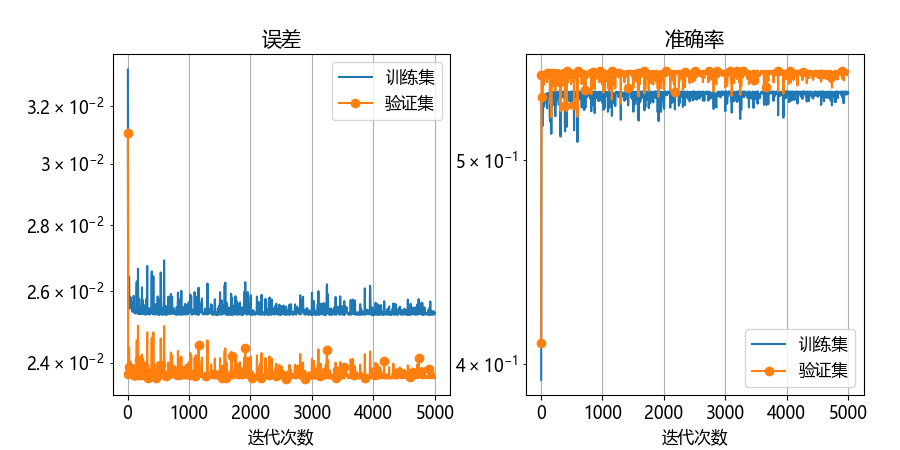

## 9.2 欠拟合的神经网络【电子资源】

欠拟合与过拟合，不只是在做回归任务时才会发生，在分类任务时也会发生，只不过在回归任务中可视化结果时很直观，所以，我们用回归任务来讲解。

### 9.2.1 欠拟合的概念

董大白的构想是一种欠拟合，这种情况在神经网络中经常出现，比如在图 9.2.1 描述了对北斗七星的平面位置的三种拟合情况。
- 左侧子图中是欠拟合的概念模型，样本点明显是有弯曲形态的，但是却用一根直线来做线性回归，天枢、天玑和开阳三星很不高兴，就是欠拟合。
- 中图是一种理想的拟合形态，它学习到了各个点形成的曲线，同时保持了拟合曲线的顺滑，只是尾部的瑶光星稍微有些不高兴。
- 右图是一种过度拟合（简称为过拟合）形态，我们在第 9.3 节学习。


图 9.2.1 回归任务中的三种拟合情况

产生欠拟合的原因如下：

- 特征量过少，比如本例中的特征只有一维，不能充分表达拟合意图；
- 模型复杂度过低，比如使用单层网络肯定不行。即使使用双层网络，也需要足够的宽度（神经元数量足够多），神经元的数量应该与特征数量以及问题的复杂度相匹配；
- 训练时间不够。在任何一个神经网络刚开始的训练中，误差总会很高。随着训练轮数的增加，误差有可能会下降，也有可能会高居不下；
- 训练参数有问题。比如过高的学习率会使得梯度下降找不到最佳拟合点，甚至会带来梯度爆炸。

### 9.2.2 隐形的欠拟合

用本章中的例子来展示欠拟合效果，图 9.2.2 是相应的神经网络模型。


图 9.2.2 对于第9章的任务欠拟合的神经网络模型

它在隐层采用了 16 个神经元，激活函数使用 ReLU。模型【代码：H9_2_under_fitting.py】如下：

```python
class NN(Module):
    def __init__(self):
        num_hidden_1 = 16
        self.linear1 = layer.Linear(1, num_hidden_1)
        self.tanh1 = activator.Relu()
        self.linear4 = layer.Linear(num_hidden_1, 1)
        self.loss = loss.MSE()
```
训练参数如下：

```python
if __name__=="__main__":
    data_loader = load_data()
    params = HyperParameters(max_epoch=1000, batch_size=10, learning_rate=0.1)
    model = NN()
    training_history = train_model(data_loader, model, params)
```
图 9.2.2 展示训练过程中的误差和准确率的变化，从表面上看还算正常，这是一种**不明显的欠拟合**。图 9.2.3 展示了拟合的效果。


图 9.2.2 训练过程中的误差和准确率的变化


图 9.2.3 不明显的欠拟合的效果

### 9.2.3 明显的欠拟合

如果是模型能力不够的情况，它的误差会一直高居不下，准确率最多到 50%，这属于**明显的欠拟合**。比如，把本例中的隐层神经元数量设置为 2，会得到如图 9.2.4 所示的拟合效果，而图 9.2.5 展示了训练过程中的糟糕情况。


图 9.2.4 明显的欠拟合的效果



图 9.2.5 明显欠拟合的训练过程中的误差和准确率的变化


### 9.2.4 如何解决欠拟合问题

#### 1. 提高模型的复杂度

可以在隐层增加神经元来提高宽度，比如使用 32 个神经元与 ReLU 激活函数匹配。如果用 Tanh 激活函数，那么神经元数量可以少一些。

使用更深的网络，甚至使用高级的网络，比如卷积层、循环层等，来处理有特殊特征的数据，如图像或文字。

#### 2. 增加特征维度

挖掘实际问题中的更多特征对于欠拟合是有帮助的。比如在本例中，如果村长指定两条规则，将会改善欠拟合情况：

- 对于家中有 70 岁以上老人的，修建的道路距离家门口不能超过 5 米。
- 对于修建道路出钱出力多的人家，道路距离家门口也不能超过 5 米。

这样的话就多增加了两个特征值。

#### 3. 调整训练参数

增加更多的训练轮数。有时候可能会遇到鞍点或平坦区域，尤其是有 ReLU 激活函数以及交叉熵损失函数的时候，这种情况更多。此时，“让子弹再飞一会儿”，可能会得到一个“柳暗花明”的结果。如图 9.2.6 所示。


图 9.2.6 耐心地多训练几轮可能会有突破

如果看到误差有明显的上下徘徊，则降低学习率进行尝试。比如下面的打印输出情况：

```
轮数 500, 迭代 1000, 训练集: loss 0.003295, accu 0.928397...学习率: 0.01
轮数 500, 迭代 1100, 训练集: loss 0.003308, accu 0.928124...学习率: 0.01
轮数 500, 迭代 1200, 训练集: loss 0.003297, accu 0.928397...学习率: 0.01
轮数 500, 迭代 1300, 训练集: loss 0.003309, accu 0.928124...学习率: 0.01
```
误差在 0.0033 附近徘徊很多次迭代，此时应该尝试把学习率从 0.01 降到 0.005 甚至更低，比如 0.001。如果误差在学习率为 0.001 有比较缓慢的下降，则可以提高到 0.005 再试试。

#### 4. 降低正则化约束

如果因为怕过拟合而增加了正则项（在本章 9.5、9.6 小节中讲解），则要减小正则项的惩罚力度，或者去掉正则项。
