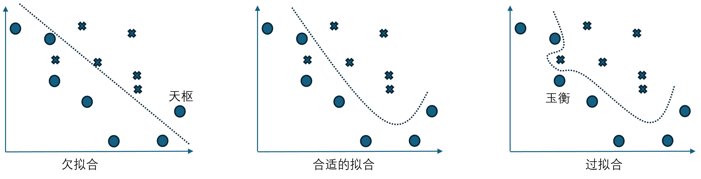
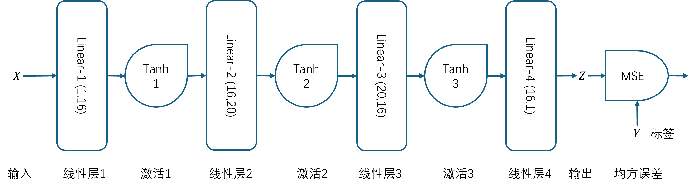
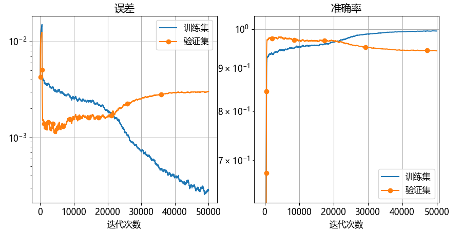
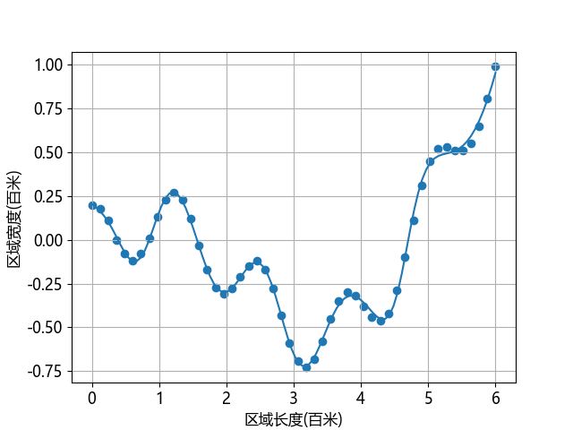
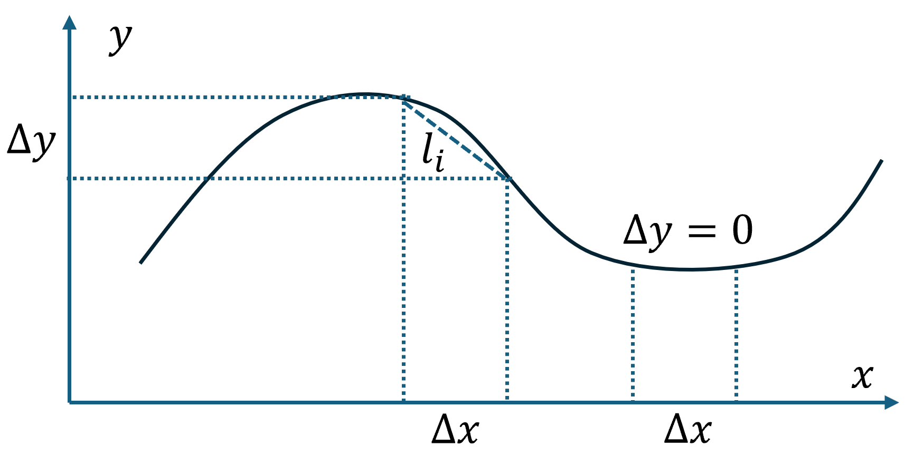

## 9.3 过拟合的神经网络

与欠拟合相对的概念是过度拟合，简称为过拟合，在图 9.2.1 中已经展示了，但是没有给与更多的说明。本章后面的章节都会讨论过你问题，因为这是在神经网络设计和训练中经常出现的问题。

### 9.3.1 过拟合的概念




图 9.3.1 分类任务中的三种情况

### 9.3.2 过拟合的尝试



图 9.3.2 完成复杂曲线过拟合的神经网络模型




图 9.3.3 训练过程中误差和准确率的变化



图 9.3.4 过拟合的效果

### 9.3.3 计算道路长度

看到图 9.3.4 的方案后，村民们都很满意，但是董大白又查看了《公路路线设计规范》，其中有两条值得注意：

- 直线的长度不宜过长（应该是怕引起驾驶时的视觉疲劳或车速过快）；

- 曲线半径不宜过小，以拖拉机 20 km/h 时速设计的道路，圆曲线最小半径不得低于 15 米。

第一条否定了图 9.1.2 的设计方案，第二条否定了图 9.3.4 的结果。所以，还需要降低耦合度（即过拟合），把过于弯曲的形状变得平滑一些。于是，董大白又计算了现行方案的道路长度，以确定修建费用。计算曲线长度，理论上用式（9.3.2）可以搞定：

$$
L = \int_a^b \sqrt{1+y'(x)^2} dx
\tag{9.3.2}
$$

由于我们不知道这条曲线的方程...哦，其实我们知道，它的方程是：

$$
y = \frac{x \cdot cos(x)}{6} + \frac{\cos(5x)}{5}
\tag{9.3.3}
$$

但是我们不想对它求导、求积分，所以，董大白采用了一个近似的办法：

$$
\begin{aligned}
l_i &= \Delta x \cdot \sqrt{1 + (\frac{\Delta y}{\Delta x})^2}
\\
L &= \sum_i l_i
\end{aligned}
\tag{9.3.4}
$$

如图 9.3.5 所示，用很小的一段 $\Delta x、\Delta y$ 所得的直线 $l_i$ 来近似模拟对应的曲线线段的长度。在平坦区域，当 $\Delta y=0$ 时，$l_i = \Delta x$。



图 9.3.5 曲线长度的近似计算方法

运行【代码：H9_3_Curve_Length.py】得到的结果是：

```
------ 模型 over_fitting_model -------
道路长度为 753 米
最大距离 = 4 米
最小距离 = 0 米
平均距离 = 1 米
```

即道路全长为 753 米。村会计是见过世面的，知道一般的市政工程的道路一公里的造价要好几千万人民币，村里的道路简陋很多，不需要排水、管道、拆迁等的费用，路面结构也不需要三层沥青，但这 753 米的路也要十几万元的。所以，要想办法改进。
