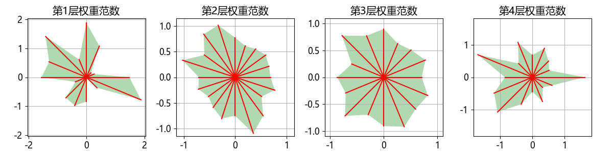
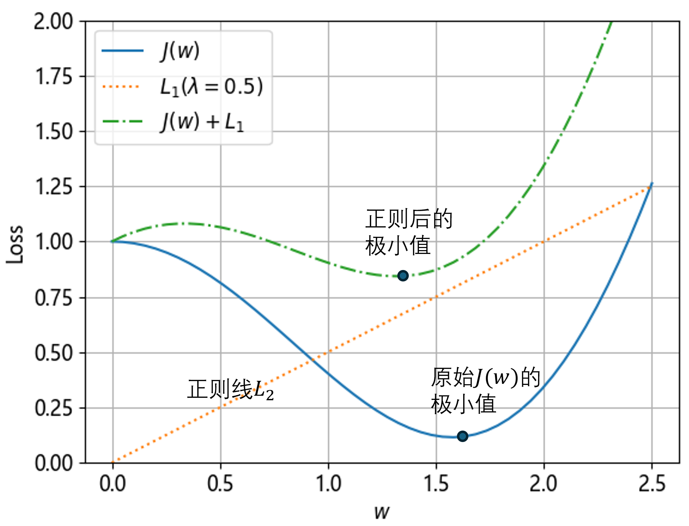
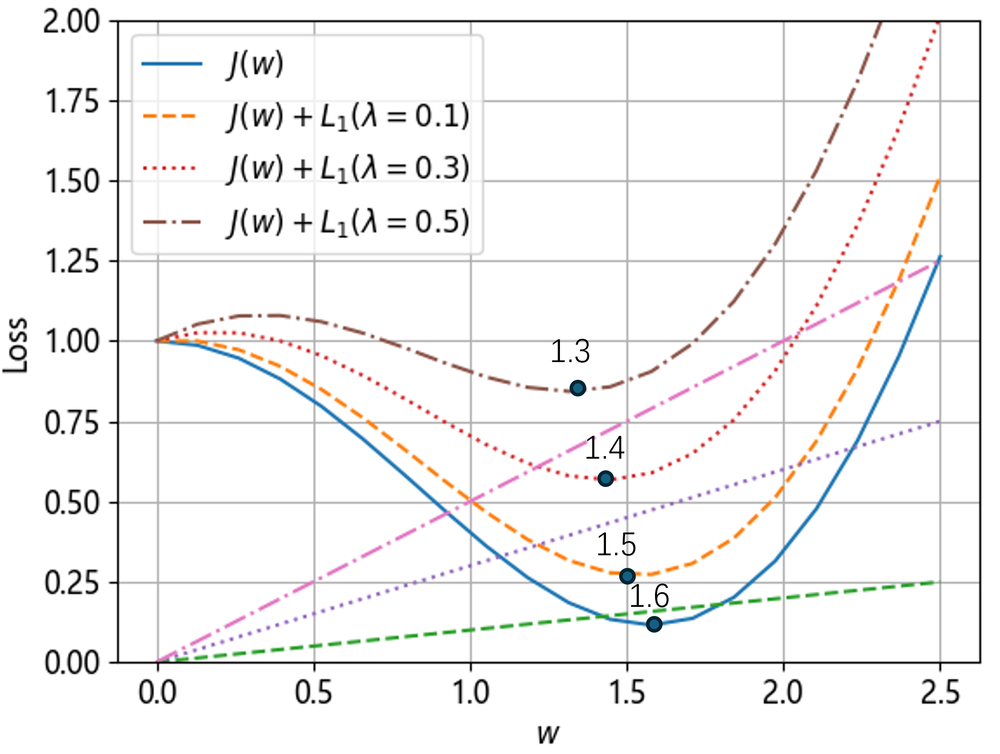
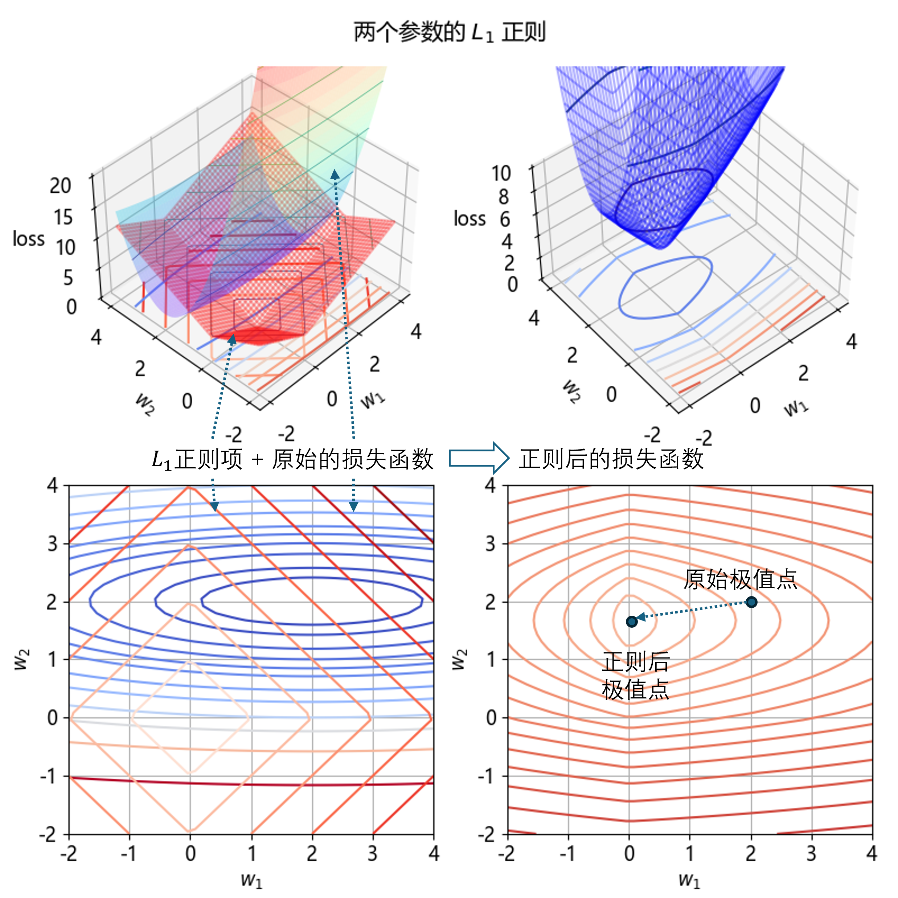
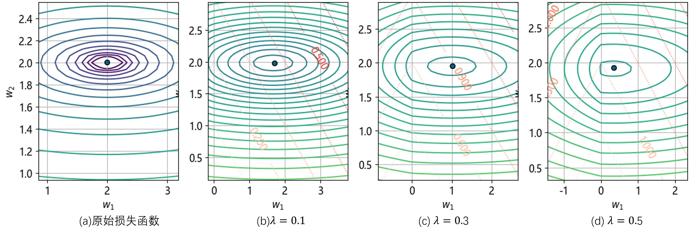

## 9.5 $L_1$ 正则的概念

图 9.5.1 过拟合网络的各层权重的一范数

### 9.5.1 一个参数时的 $L_1$ 正则

图 9.5.2 一个参数时的 $L_1$ 正则

图 9.5.3 不同的的 $\lambda$ 的正则效果比较

### 9.5.2 两个参数时的 $L_1$ 正则

图 9.5.4 两个参数时的 $L_1$ 正则

图 9.5.5 不同的 $\lambda$ 的取值的影响
