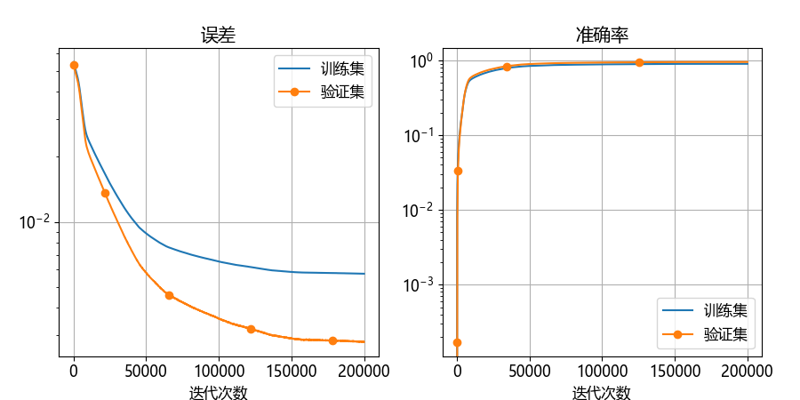
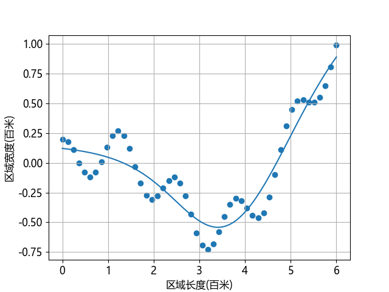
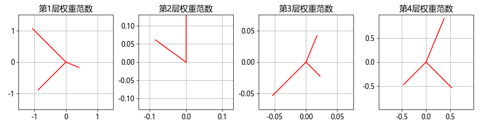
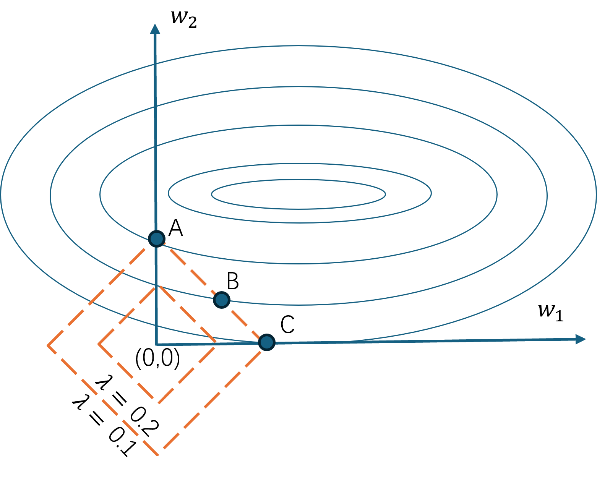

## 9.6 $L_1$ 正则应用

本节中将介绍如何在本章的问题中应用 $L_1$ 正则。

### 9.6.1 反向传播的变化

### 9.6.2 实现

### 9.6.3 运行结果

图 9.6.1 $L_1$ 正则法训练过程中误差和准确率的变化

图 9.6.2 $L_1$ 正则后的拟合结果

### 9.6.4 结果分析

图 9.6.3 正则后网络的各层权重的 $L_1$ 范数

图 9.6.4 $L_1$ 稀疏算子的理解

### 9.6.5 正则结果会小于 0 吗？【电子资源】

在图 9.6.4 的例子中，我们从函数图像上得知 $w_1$ 的值会被拉向 0，那么当 $\lambda$ 持续增大时，$w_1$ 的值会不会小于 0 呢？如何是这样的话，就与 $L_1$ 的正则效果有矛盾了。下面进行推导。

用第 9.5.2 节的例子，当 $\lambda=2$ 时，正则公式为：

$$
loss = 0.15(w_1-2)^2 + 3(w_2-2)^2 + 2(|w_1| + |w_2|)
\tag{9.6.8}
$$

令 $loss$ 对 $w_1$ 的导数为 0，由此得到极小值：

$$
\frac{\partial loss}{\partial w_1}=0 \to
\begin{cases}
0.3(w_1-2)+2=0, & w_1>0
\\
0.3(w_1-2)-2=0, & w_1<0
\end{cases}
\tag{9.6.9}
$$

由于 $|w_1|$ 在大于 0 和小于 0 时的导数不同，所以分成了两种情况。由式（9.6.9）可以解得两个值：

- 当 $w_1>0$ 时，$w_1=-\frac{14}{3}$，二者矛盾；
- 当 $w_1<0$ 时，$w_1=\frac{26}{3}$，二者矛盾。

所以 $w_1=0$，也就是说 $w_1$ 最小是 0，不可能小于 0。当 $\lambda >= 0.6$ 时，$w_1$ 就会等于 0。当 $\lambda < 0.6$ 时，$w_1$ 会趋近于 0。

当 $w_1=0$ 时，$loss=0.15(0-2)^2+3(w_2-2)^2+2|w_2|$，令其对 $w_2$ 的导数为 0 求极小值：

$$
\frac{\partial loss}{\partial w_2}=0 \to
\begin{cases}
6(w_2-2)+2=0, & w_2>0
\\
6(w_2-2)-2=0, & w_2<0
\end{cases}
\tag{9.6.10}
$$

由于 $|w_2|$ 在大于 0 和小于 0 时的导数不同，所以分成了两种情况。由式（9.6.10）可以解得两个值：

- 当 $w_2>0$ 时，$w_2=\frac{5}{3}$，二者不矛盾；
- 当 $w_2<0$ 时，$w_2=\frac{7}{3}$，二者矛盾。

所以 $w_2=\frac{5}{3}$。当 $\lambda >= 12$ 时，$w_2=0$。

最后的结论是，$L_1$ 正则会让 $w$ 值趋近于 0 或等于 0，而不会改变原来的符号。
