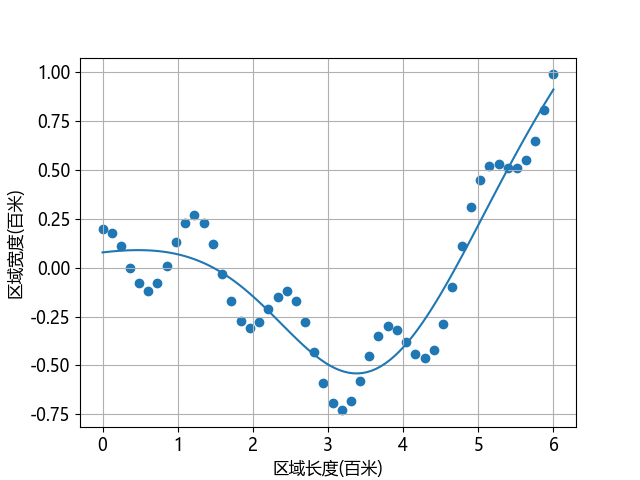

## 9.8 $L_2$ 正则的应用

### 9.8.1 反向传播的变化

### 9.8.2 实现

#### 关于偏置项的正则

### 9.8.3 运行结果

图 9.8.1 $L_2$ 正则法训练过程中误差和准确率的变化

图 9.8.2 $L_2$ 正则后的拟合结果

### 9.8.4 结果分析

图 9.8.3 正则后网络的各层权重的 $L_2$ 范数

图 9.8.4 $L_2$ 的理解

### 9.8.5 $L_1$ 和 $L_2$ 的比较

#### 1. $L_1$ 范数值的比较

#### 2. $L_2$ 范数值的比较
