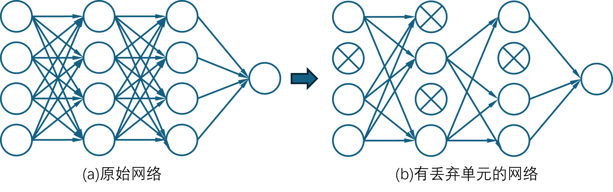
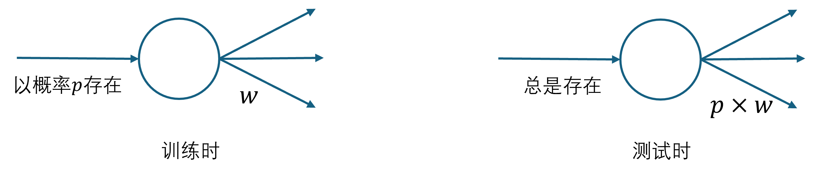
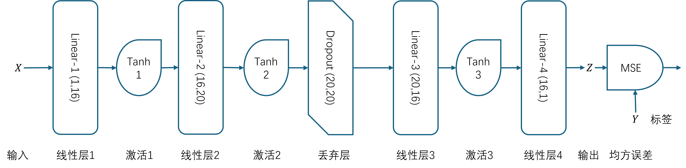
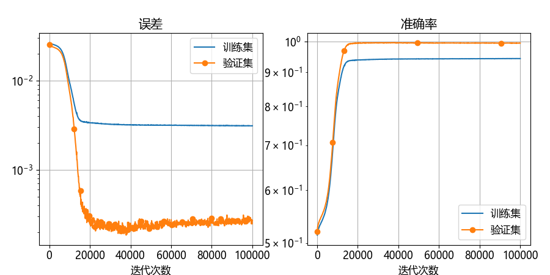
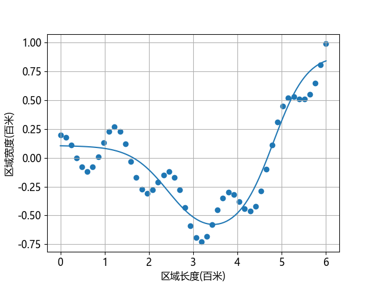

## 9.9 丢弃法

**丢弃法**（dropout）可以作为训练深度神经网络的一种正则方法供选择。在每个训练批次中，通过忽略一部分的神经元（让其隐层节点值为0），可以明显地减少过拟合现象。这种方式可以减少隐层节点间的相互作用，高层的神经元需要低层的神经元的输出才能发挥作用，如果高层神经元过分依赖某个低层神经元，就会有过拟合发生。在一次前向/反向的训练过程中，通过随机丢弃一些神经元，迫使高层神经元和其它的一些低层神经元协同工作，可以有效地防止神经元因为接收到过多的同类型参数而陷入过拟合的状态，来提高泛化程度。

我们假设原来的神经网络是图 9.9.1（a）的结构，采用丢弃法后形成图 9.9.1（b）的结构。

图 9.9.1 采用丢弃法前后的网络对比

其中有叉子的神经元在本次迭代训练中被暂时的封闭了，但并非永久性的。在下一次迭代训练中，再从所有神经元中随机地封闭一些神经元，同一个神经元也许被连续封闭两次，也许一次都没有被封闭。封闭多少个神经元是由一个超参来控制的，叫做丢弃率。

### 9.9.1 算法描述

#### 1. 前向计算

#### 2. 反向传播

#### 3. 训练和测试/阶段的不同

图 9.9.2 训练和测试时的不同的“丢弃”方法

### 9.9.2 代码实现

图 9.9.3 带`Dropout`层的模型结构图

图 9.9.4 训练过程中 loss 值和准确率的变化曲线

图 9.9.5 拟合后的曲线与训练数据的分布图

### 9.9.3 更好地理解丢弃法

### 9.9.4 结果比较
